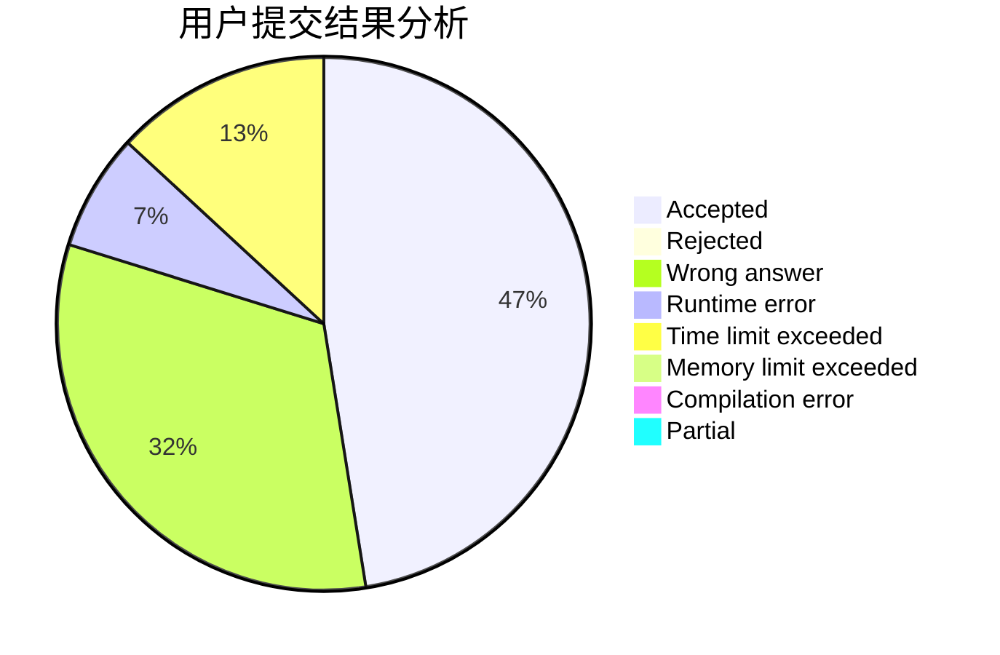
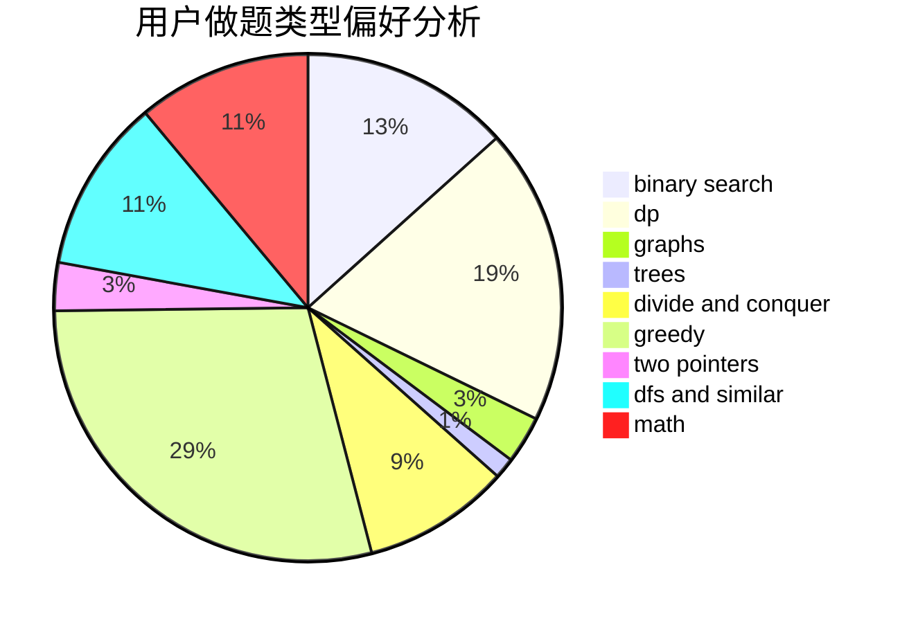

# 2018XWJXiWenjuan

<!-- tabs:start -->

#### **用户提交结果分析**

#### **用户做题类型偏好分析**

<!-- tabs:end -->
# 推荐题目
[1029C](https://codeforces.com/contest/1029/problem/C)
[1267I](https://codeforces.com/contest/1267/problem/I)
[1265B](https://codeforces.com/contest/1265/problem/B)
[1265C](https://codeforces.com/contest/1265/problem/C)
[1265D](https://codeforces.com/contest/1265/problem/D)
[107B](https://codeforces.com/contest/107/problem/B)
[1071A](https://codeforces.com/contest/1071/problem/A)
[1268E](https://codeforces.com/contest/1268/problem/E)
[1264A](https://codeforces.com/contest/1264/problem/A)
[1267F](https://codeforces.com/contest/1267/problem/F)
