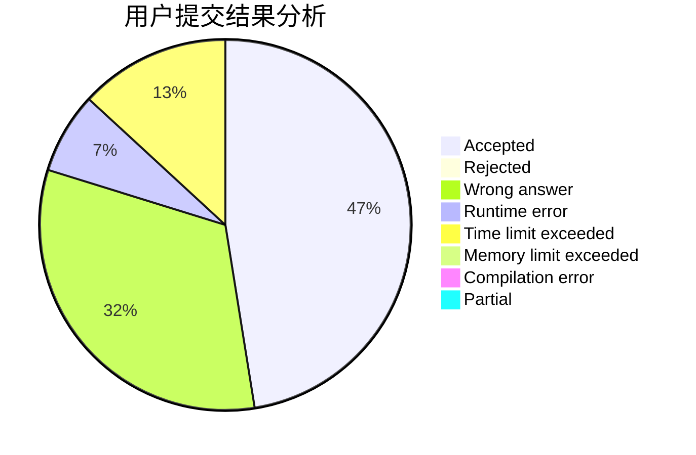
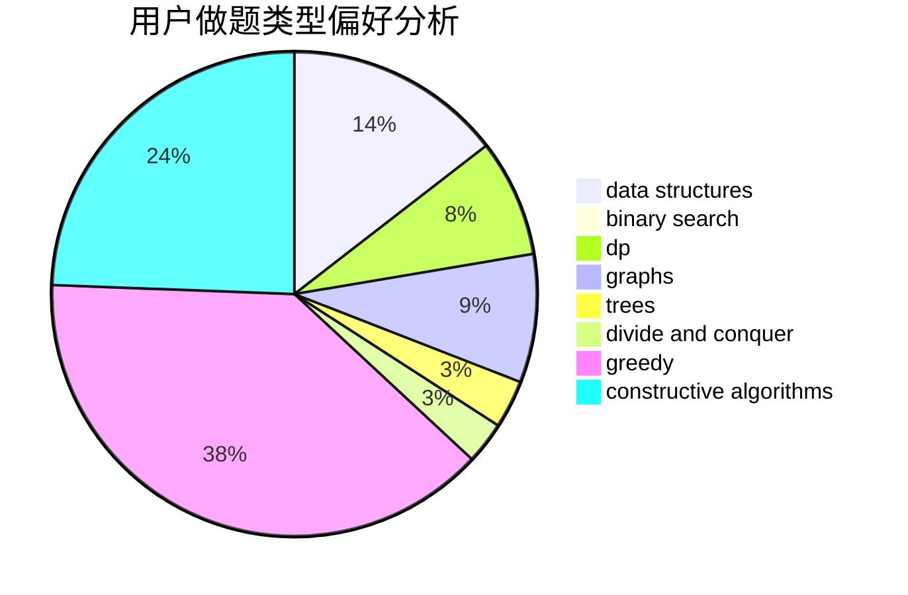
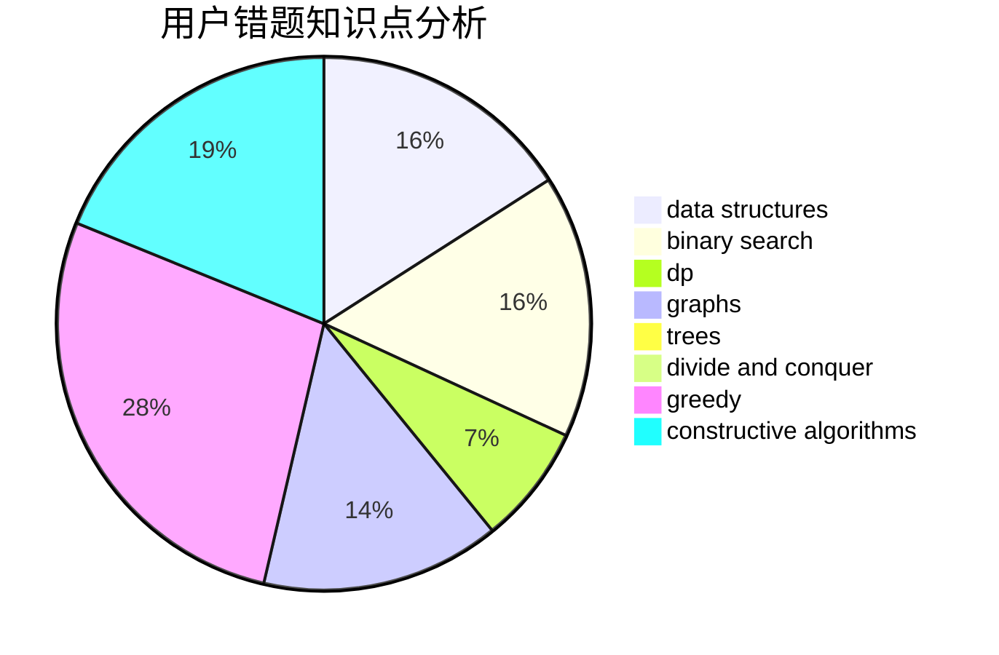

# 2018XWJXiWenjuan

<!-- tabs:start -->

#### **用户提交结果分析**

#### **用户做题类型偏好分析**

#### **用户错题知识点分析**

<!-- tabs:end -->
# 推荐题目
[1028H](https://codeforces.com/contest/1028/problem/H)		math		  
[1262A](https://codeforces.com/contest/1262/problem/A)		dsu,graphs,sortings,trees		  
[1257G](https://codeforces.com/contest/1257/problem/G)		divide and conquer,
                        fft,
                        greedy,
                        math,
                        number theory		  
[125A](https://codeforces.com/contest/125/problem/A)		math		  
[125D](https://codeforces.com/contest/125/problem/D)		constructive algorithms,
                        greedy		  
[1079C](https://codeforces.com/contest/1079/problem/C)		dsu,graphs,sortings,trees		  
[1070K](https://codeforces.com/contest/1070/problem/K)		implementation		  
[1263B](https://codeforces.com/contest/1263/problem/B)		greedy,
                        implementation		  
[1257A](https://codeforces.com/contest/1257/problem/A)		greedy,
                        math		  
[1261E](https://codeforces.com/contest/1261/problem/E)		dsu,graphs,sortings,trees		  
