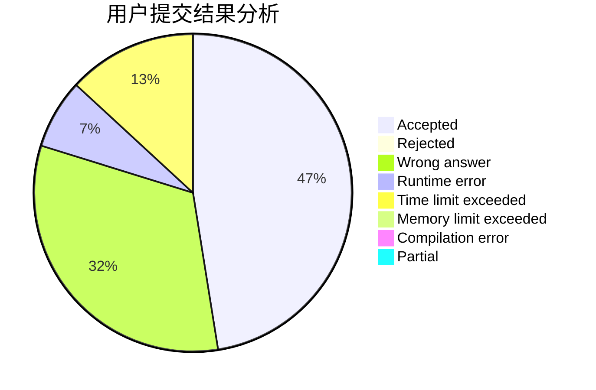
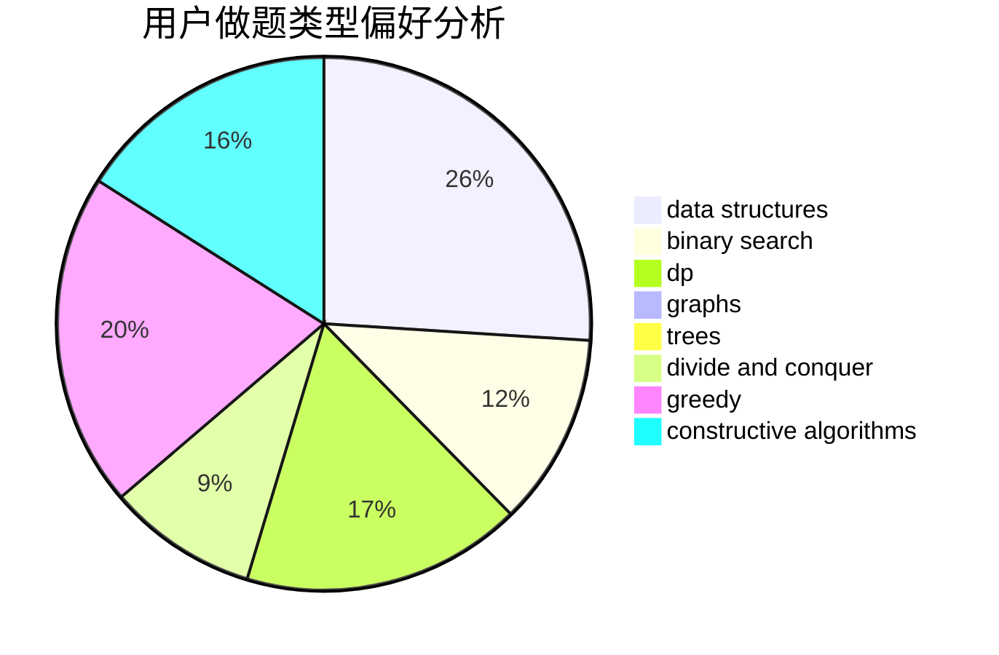
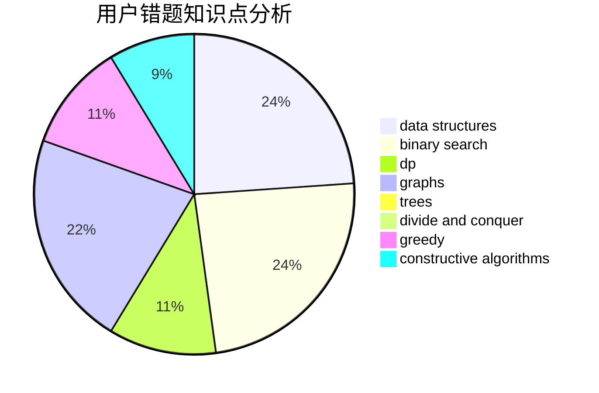

# 2018XWJXiWenjuan

<!-- tabs:start -->

#### **用户提交结果分析**

#### **用户做题类型偏好分析**

#### **用户错题知识点分析**

<!-- tabs:end -->
# 推荐题目
[1029C](https://codeforces.com/contest/1029/problem/C)		greedy,
                        math,
                        sortings		  
[1267I](https://codeforces.com/contest/1267/problem/I)		brute force,
                        constructive algorithms,
                        implementation,
                        interactive,
                        sortings		  
[1265B](https://codeforces.com/contest/1265/problem/B)		data structures,
                        implementation,
                        math,
                        two pointers		  
[1265C](https://codeforces.com/contest/1265/problem/C)		dsu,graphs,sortings,trees		  
[1265D](https://codeforces.com/contest/1265/problem/D)		dsu,graphs,sortings,trees		  
[107B](https://codeforces.com/contest/107/problem/B)		combinatorics,
                        dp,
                        math,
                        probabilities		  
[1071A](https://codeforces.com/contest/1071/problem/A)		dsu,graphs,sortings,trees		  
[1268E](https://codeforces.com/contest/1268/problem/E)		dp		  
[1264A](https://codeforces.com/contest/1264/problem/A)		greedy,
                        implementation		  
[1267F](https://codeforces.com/contest/1267/problem/F)		graphs		  
