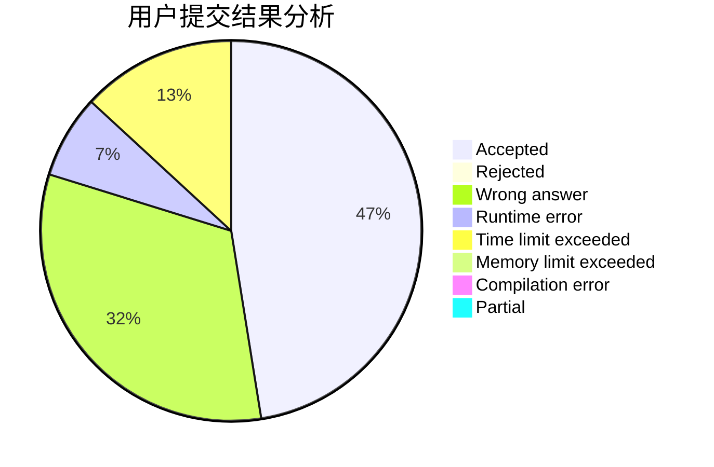
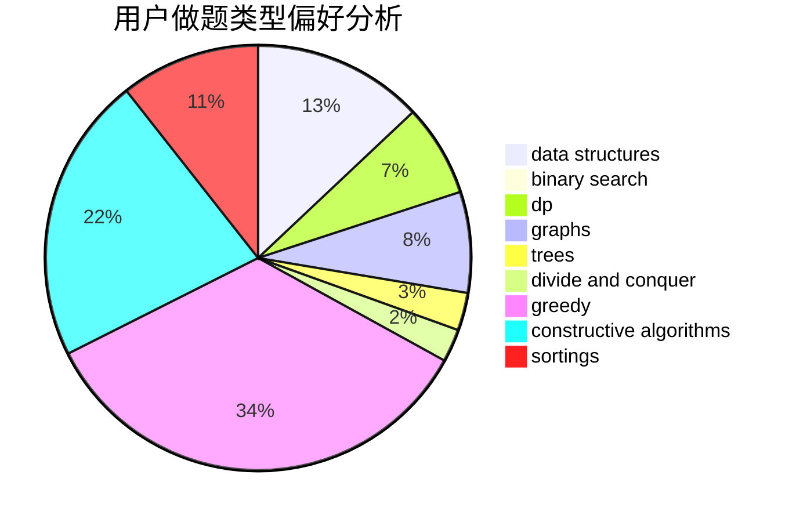
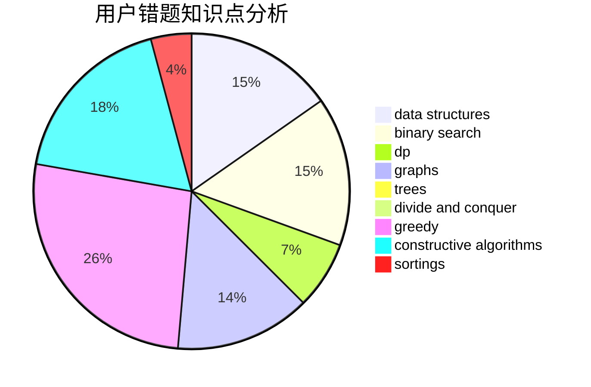

# 2018XWJXiWenjuan
<!-- tabs:start -->
#### **用户提交结果分析**

#### **用户做题类型偏好分析**

#### **用户错题知识点分析**

<!-- tabs:end -->
# 推荐题目
[1256A](http://codeforces.com/problemset/problem/1256/A)		math		  
[1263C](http://codeforces.com/problemset/problem/1263/C)		binary search,
                        math,
                        meet-in-the-middle,
                        number theory		  
[1257G](http://codeforces.com/problemset/problem/1257/G)		divide and conquer,
                        fft,
                        greedy,
                        math,
                        number theory		  
[1257C](http://codeforces.com/problemset/problem/1257/C)		greedy,
                        implementation,
                        sortings,
                        strings,
                        two pointers		  
[1262A](https://codeforces.com/contest/1262/problem/A)		math		  
[125A](http://codeforces.com/problemset/problem/125/A)		math		  
[1028H](http://codeforces.com/problemset/problem/1028/H)		math		  
[1079C](https://codeforces.com/contest/1079/problem/C)		constructive algorithms,
                        dp		  
[1117D](http://codeforces.com/problemset/problem/1117/D)		dp,
                        math,
                        matrices		  
[1255E1](https://codeforces.com/contest/1255/problem/E1)		constructive algorithms,
                        greedy,
                        math,
                        number theory,
                        ternary search,
                        two pointers		  
<!-- tabs:start -->
#### **data structures**
[1261B2](https://codeforces.com/contest/1261/problem/B2)		data structures,
                        greedy		  
[1257E](http://codeforces.com/problemset/problem/1257/E)		data structures,
                        dp,
                        greedy		  
[1263E](http://codeforces.com/problemset/problem/1263/E)		data structures,
                        implementation		  
[1139F](http://codeforces.com/problemset/problem/1139/F)		data structures,
                        divide and conquer		  
[1051G](http://codeforces.com/problemset/problem/1051/G)		data structures,
                        dsu,
                        greedy		  
[1261B1](https://codeforces.com/contest/1261/problem/B1)		data structures,
                        greedy		  
[1262D1](https://codeforces.com/contest/1262/problem/D1)		data structures,
                        greedy		  
[1262D2](https://codeforces.com/contest/1262/problem/D2)		data structures,
                        greedy		  
[1260F](http://codeforces.com/problemset/problem/1260/F)		data structures,
                        trees		  
[1257D](http://codeforces.com/problemset/problem/1257/D)		binary search,
                        data structures,
                        dp,
                        greedy,
                        sortings,
                        two pointers		  
#### **binary search**
[1263C](http://codeforces.com/problemset/problem/1263/C)		binary search,
                        math,
                        meet-in-the-middle,
                        number theory		  
[1261C](https://codeforces.com/contest/1261/problem/C)		binary search,
                        graphs,
                        graphs,
                        shortest paths		  
[1262E](https://codeforces.com/contest/1262/problem/E)		binary search,
                        graphs,
                        graphs,
                        shortest paths		  
[1170E](http://codeforces.com/problemset/problem/1170/E)		*special problem,
                        binary search		  
[1260D](http://codeforces.com/problemset/problem/1260/D)		binary search,
                        dp,
                        greedy,
                        sortings		  
[125E](http://codeforces.com/problemset/problem/125/E)		binary search,
                        graphs		  
[1257D](http://codeforces.com/problemset/problem/1257/D)		binary search,
                        data structures,
                        dp,
                        greedy,
                        sortings,
                        two pointers		  
[1260B](http://codeforces.com/problemset/problem/1260/B)		binary search,
                        math		  
[1492C](http://codeforces.com/problemset/problem/1492/C)		binary search,
                        data structures,
                        dp,
                        greedy,
                        two pointers		  
[1463D](http://codeforces.com/problemset/problem/1463/D)		binary search,
                        constructive algorithms,
                        greedy,
                        two pointers		  
#### **dp**
[1079C](https://codeforces.com/contest/1079/problem/C)		constructive algorithms,
                        dp		  
[1117D](http://codeforces.com/problemset/problem/1117/D)		dp,
                        math,
                        matrices		  
[1262F1](https://codeforces.com/contest/1262/problem/F1)		dp		  
[1015F](http://codeforces.com/problemset/problem/1015/F)		dp,
                        strings		  
[1257E](http://codeforces.com/problemset/problem/1257/E)		data structures,
                        dp,
                        greedy		  
[1256E](http://codeforces.com/problemset/problem/1256/E)		dp,
                        greedy,
                        sortings		  
[1261D1](https://codeforces.com/contest/1261/problem/D1)		dp		  
[1260D](http://codeforces.com/problemset/problem/1260/D)		binary search,
                        dp,
                        greedy,
                        sortings		  
[1260E](http://codeforces.com/problemset/problem/1260/E)		brute force,
                        dp,
                        greedy		  
[1097G](http://codeforces.com/problemset/problem/1097/G)		combinatorics,
                        dp,
                        trees		  
#### **graph**
[1261C](https://codeforces.com/contest/1261/problem/C)		binary search,
                        graphs,
                        graphs,
                        shortest paths		  
[1262E](https://codeforces.com/contest/1262/problem/E)		binary search,
                        graphs,
                        graphs,
                        shortest paths		  
[125E](http://codeforces.com/problemset/problem/125/E)		binary search,
                        graphs		  
[1263D](http://codeforces.com/problemset/problem/1263/D)		dfs and similar,
                        dsu,
                        graphs		  
[1487C](http://codeforces.com/problemset/problem/1487/C)		brute force,
                        constructive algorithms,
                        dfs and similar,
                        graphs,
                        greedy,
                        implementation,
                        math		  
[1437C](http://codeforces.com/problemset/problem/1437/C)		dp,
                        flows,
                        graph matchings,
                        greedy,
                        math,
                        sortings		  
[1470D](http://codeforces.com/problemset/problem/1470/D)		constructive algorithms,
                        dfs and similar,
                        graph matchings,
                        graphs,
                        greedy		  
[1476C](http://codeforces.com/problemset/problem/1476/C)		dp,
                        graphs,
                        greedy		  
[1304D](http://codeforces.com/problemset/problem/1304/D)		constructive algorithms,
                        graphs,
                        greedy,
                        two pointers		  
[1475C](http://codeforces.com/problemset/problem/1475/C)		combinatorics,
                        graphs,
                        math		  
#### **trees**
[1260F](http://codeforces.com/problemset/problem/1260/F)		data structures,
                        trees		  
[1097G](http://codeforces.com/problemset/problem/1097/G)		combinatorics,
                        dp,
                        trees		  
[1479D](http://codeforces.com/problemset/problem/1479/D)		binary search,
                        bitmasks,
                        brute force,
                        data structures,
                        probabilities,
                        trees		  
[1511C](http://codeforces.com/problemset/problem/1511/C)		brute force,
                        data structures,
                        implementation,
                        trees		  
[1499F](http://codeforces.com/problemset/problem/1499/F)		combinatorics,
                        dfs and similar,
                        dp,
                        trees		  
[1491E](http://codeforces.com/problemset/problem/1491/E)		brute force,
                        dfs and similar,
                        divide and conquer,
                        number theory,
                        trees		  
[1466D](http://codeforces.com/problemset/problem/1466/D)		data structures,
                        greedy,
                        sortings,
                        trees		  
[1495D](http://codeforces.com/problemset/problem/1495/D)		combinatorics,
                        dfs and similar,
                        graphs,
                        math,
                        shortest paths,
                        trees		  
[1303G](http://codeforces.com/problemset/problem/1303/G)		data structures,
                        divide and conquer,
                        geometry,
                        trees		  
[1454E](http://codeforces.com/problemset/problem/1454/E)		combinatorics,
                        dfs and similar,
                        graphs,
                        trees		  
#### **divide and conquer**
[1257G](http://codeforces.com/problemset/problem/1257/G)		divide and conquer,
                        fft,
                        greedy,
                        math,
                        number theory		  
[1261F](http://codeforces.com/problemset/problem/1261/F)		bitmasks,
                        divide and conquer,
                        math		  
[1139F](http://codeforces.com/problemset/problem/1139/F)		data structures,
                        divide and conquer		  
[1461D](http://codeforces.com/problemset/problem/1461/D)		binary search,
                        brute force,
                        data structures,
                        divide and conquer,
                        implementation,
                        sortings		  
[1466G](http://codeforces.com/problemset/problem/1466/G)		combinatorics,
                        divide and conquer,
                        hashing,
                        math,
                        string suffix structures,
                        strings		  
[1490D](http://codeforces.com/problemset/problem/1490/D)		dfs and similar,
                        divide and conquer,
                        implementation		  
[1483C](https://codeforces.com/contest/1483/problem/C)		data structures,
                        divide and conquer,
                        dp		  
[1491E](http://codeforces.com/problemset/problem/1491/E)		brute force,
                        dfs and similar,
                        divide and conquer,
                        number theory,
                        trees		  
[1303G](http://codeforces.com/problemset/problem/1303/G)		data structures,
                        divide and conquer,
                        geometry,
                        trees		  
[1494D](http://codeforces.com/problemset/problem/1494/D)		constructive algorithms,
                        data structures,
                        dfs and similar,
                        divide and conquer,
                        dsu,
                        greedy,
                        sortings,
                        trees		  
#### **greedy**
[1257G](http://codeforces.com/problemset/problem/1257/G)		divide and conquer,
                        fft,
                        greedy,
                        math,
                        number theory		  
[1257C](http://codeforces.com/problemset/problem/1257/C)		greedy,
                        implementation,
                        sortings,
                        strings,
                        two pointers		  
[1255E1](https://codeforces.com/contest/1255/problem/E1)		constructive algorithms,
                        greedy,
                        math,
                        number theory,
                        ternary search,
                        two pointers		  
[125D](http://codeforces.com/problemset/problem/125/D)		constructive algorithms,
                        greedy		  
[1261B2](https://codeforces.com/contest/1261/problem/B2)		data structures,
                        greedy		  
[1255E2](https://codeforces.com/contest/1255/problem/E2)		constructive algorithms,
                        greedy,
                        math,
                        number theory,
                        ternary search,
                        two pointers		  
[1257A](http://codeforces.com/problemset/problem/1257/A)		greedy,
                        math		  
[1263B](http://codeforces.com/problemset/problem/1263/B)		greedy,
                        implementation		  
[1257E](http://codeforces.com/problemset/problem/1257/E)		data structures,
                        dp,
                        greedy		  
[1256E](http://codeforces.com/problemset/problem/1256/E)		dp,
                        greedy,
                        sortings		  
#### **constructive algorithms**
[1079C](https://codeforces.com/contest/1079/problem/C)		constructive algorithms,
                        dp		  
[1255E1](https://codeforces.com/contest/1255/problem/E1)		constructive algorithms,
                        greedy,
                        math,
                        number theory,
                        ternary search,
                        two pointers		  
[1261E](https://codeforces.com/contest/1261/problem/E)		constructive algorithms		  
[125D](http://codeforces.com/problemset/problem/125/D)		constructive algorithms,
                        greedy		  
[1261A](https://codeforces.com/contest/1261/problem/A)		constructive algorithms		  
[1256F](http://codeforces.com/problemset/problem/1256/F)		constructive algorithms,
                        sortings,
                        strings		  
[1255E2](https://codeforces.com/contest/1255/problem/E2)		constructive algorithms,
                        greedy,
                        math,
                        number theory,
                        ternary search,
                        two pointers		  
[1262C](https://codeforces.com/contest/1262/problem/C)		constructive algorithms		  
[1262B](https://codeforces.com/contest/1262/problem/B)		constructive algorithms		  
[1493A](http://codeforces.com/problemset/problem/1493/A)		constructive algorithms,
                        greedy		  
#### **sortings**
[1257C](http://codeforces.com/problemset/problem/1257/C)		greedy,
                        implementation,
                        sortings,
                        strings,
                        two pointers		  
[1256F](http://codeforces.com/problemset/problem/1256/F)		constructive algorithms,
                        sortings,
                        strings		  
[1256E](http://codeforces.com/problemset/problem/1256/E)		dp,
                        greedy,
                        sortings		  
[1260D](http://codeforces.com/problemset/problem/1260/D)		binary search,
                        dp,
                        greedy,
                        sortings		  
[1005E2](http://codeforces.com/problemset/problem/1005/E2)		sortings		  
[1257D](http://codeforces.com/problemset/problem/1257/D)		binary search,
                        data structures,
                        dp,
                        greedy,
                        sortings,
                        two pointers		  
[1496C](https://codeforces.com/contest/1496/problem/C)		geometry,
                        greedy,
                        math,
                        sortings		  
[1495A](http://codeforces.com/problemset/problem/1495/A)		geometry,
                        greedy,
                        math,
                        sortings		  
[1497A](http://codeforces.com/problemset/problem/1497/A)		brute force,
                        data structures,
                        greedy,
                        sortings		  
[1427A](http://codeforces.com/problemset/problem/1427/A)		math,
                        sortings		  
<!-- tabs:end -->
