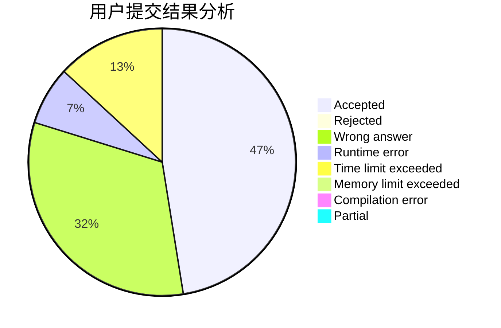
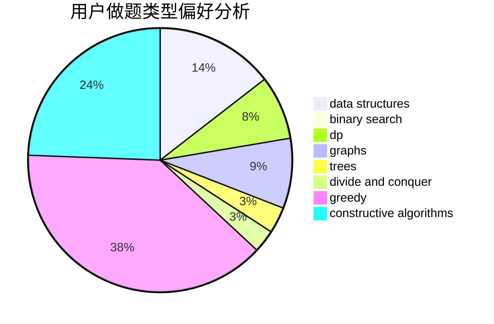
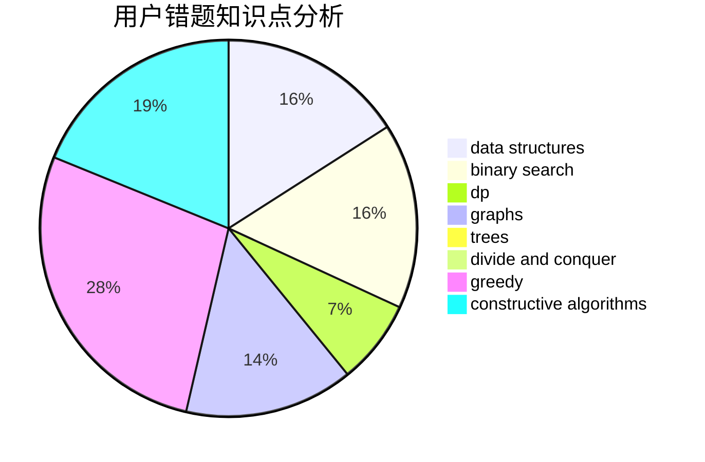

# 2018XWJXiWenjuan
<!-- tabs:start -->
#### **用户提交结果分析**

#### **用户做题类型偏好分析**

#### **用户错题知识点分析**

<!-- tabs:end -->
# 推荐题目
[Payment Without Change](http://codeforces.com/problemset/problem/1256/A)		math		  
[Everyone is a Winner!](http://codeforces.com/problemset/problem/1263/C)		binary search,
                        math,
                        meet-in-the-middle,
                        number theory		  
[Divisor Set](http://codeforces.com/problemset/problem/1257/G)		divide and conquer,
                        fft,
                        greedy,
                        math,
                        number theory		  
[Dominated Subarray](http://codeforces.com/problemset/problem/1257/C)		greedy,
                        implementation,
                        sortings,
                        strings,
                        two pointers		  
[Math Problem](https://codeforces.com/contest/1262/problem/A)		math		  
[Measuring Lengths in Baden](http://codeforces.com/problemset/problem/125/A)		math		  
[Make Square](http://codeforces.com/problemset/problem/1028/H)		math		  
[Playing Piano](https://codeforces.com/contest/1079/problem/C)		constructive algorithms,
                        dp		  
[Magic Gems](http://codeforces.com/problemset/problem/1117/D)		dp,
                        math,
                        matrices		  
[Send Boxes to Alice (Easy Version)](https://codeforces.com/contest/1255/problem/E1)		constructive algorithms,
                        greedy,
                        math,
                        number theory,
                        ternary search,
                        two pointers		  
<!-- tabs:start -->
#### **data structures**
[Payment Without Change](https://codeforces.com/contest/1261/problem/B2)		data structures,
                        greedy		  
[Everyone is a Winner!](http://codeforces.com/problemset/problem/1257/E)		data structures,
                        dp,
                        greedy		  
[Divisor Set](http://codeforces.com/problemset/problem/1263/E)		data structures,
                        implementation		  
[Dominated Subarray](http://codeforces.com/problemset/problem/1139/F)		data structures,
                        divide and conquer		  
[Math Problem](http://codeforces.com/problemset/problem/1051/G)		data structures,
                        dsu,
                        greedy		  
[Measuring Lengths in Baden](https://codeforces.com/contest/1261/problem/B1)		data structures,
                        greedy		  
[Make Square](https://codeforces.com/contest/1262/problem/D1)		data structures,
                        greedy		  
[Playing Piano](https://codeforces.com/contest/1262/problem/D2)		data structures,
                        greedy		  
[Magic Gems](http://codeforces.com/problemset/problem/1260/F)		data structures,
                        trees		  
[Send Boxes to Alice (Easy Version)](http://codeforces.com/problemset/problem/1257/D)		binary search,
                        data structures,
                        dp,
                        greedy,
                        sortings,
                        two pointers		  
#### **binary search**
[Payment Without Change](http://codeforces.com/problemset/problem/1263/C)		binary search,
                        math,
                        meet-in-the-middle,
                        number theory		  
[Everyone is a Winner!](https://codeforces.com/contest/1261/problem/C)		binary search,
                        graphs,
                        graphs,
                        shortest paths		  
[Divisor Set](https://codeforces.com/contest/1262/problem/E)		binary search,
                        graphs,
                        graphs,
                        shortest paths		  
[Dominated Subarray](http://codeforces.com/problemset/problem/1170/E)		*special problem,
                        binary search		  
[Math Problem](http://codeforces.com/problemset/problem/1260/D)		binary search,
                        dp,
                        greedy,
                        sortings		  
[Measuring Lengths in Baden](http://codeforces.com/problemset/problem/125/E)		binary search,
                        graphs		  
[Make Square](http://codeforces.com/problemset/problem/1257/D)		binary search,
                        data structures,
                        dp,
                        greedy,
                        sortings,
                        two pointers		  
[Playing Piano](http://codeforces.com/problemset/problem/1260/B)		binary search,
                        math		  
[Magic Gems](http://codeforces.com/problemset/problem/1492/C)		binary search,
                        data structures,
                        dp,
                        greedy,
                        two pointers		  
[Send Boxes to Alice (Easy Version)](http://codeforces.com/problemset/problem/1463/D)		binary search,
                        constructive algorithms,
                        greedy,
                        two pointers		  
#### **dp**
[Payment Without Change](https://codeforces.com/contest/1079/problem/C)		constructive algorithms,
                        dp		  
[Everyone is a Winner!](http://codeforces.com/problemset/problem/1117/D)		dp,
                        math,
                        matrices		  
[Divisor Set](https://codeforces.com/contest/1262/problem/F1)		dp		  
[Dominated Subarray](http://codeforces.com/problemset/problem/1015/F)		dp,
                        strings		  
[Math Problem](http://codeforces.com/problemset/problem/1257/E)		data structures,
                        dp,
                        greedy		  
[Measuring Lengths in Baden](http://codeforces.com/problemset/problem/1256/E)		dp,
                        greedy,
                        sortings		  
[Make Square](https://codeforces.com/contest/1261/problem/D1)		dp		  
[Playing Piano](http://codeforces.com/problemset/problem/1260/D)		binary search,
                        dp,
                        greedy,
                        sortings		  
[Magic Gems](http://codeforces.com/problemset/problem/1260/E)		brute force,
                        dp,
                        greedy		  
[Send Boxes to Alice (Easy Version)](http://codeforces.com/problemset/problem/1097/G)		combinatorics,
                        dp,
                        trees		  
#### **graph**
[Payment Without Change](https://codeforces.com/contest/1261/problem/C)		binary search,
                        graphs,
                        graphs,
                        shortest paths		  
[Everyone is a Winner!](https://codeforces.com/contest/1262/problem/E)		binary search,
                        graphs,
                        graphs,
                        shortest paths		  
[Divisor Set](http://codeforces.com/problemset/problem/125/E)		binary search,
                        graphs		  
[Dominated Subarray](http://codeforces.com/problemset/problem/1263/D)		dfs and similar,
                        dsu,
                        graphs		  
[Math Problem](http://codeforces.com/problemset/problem/1487/C)		brute force,
                        constructive algorithms,
                        dfs and similar,
                        graphs,
                        greedy,
                        implementation,
                        math		  
[Measuring Lengths in Baden](http://codeforces.com/problemset/problem/1437/C)		dp,
                        flows,
                        graph matchings,
                        greedy,
                        math,
                        sortings		  
[Make Square](http://codeforces.com/problemset/problem/1470/D)		constructive algorithms,
                        dfs and similar,
                        graph matchings,
                        graphs,
                        greedy		  
[Playing Piano](http://codeforces.com/problemset/problem/1476/C)		dp,
                        graphs,
                        greedy		  
[Magic Gems](http://codeforces.com/problemset/problem/1304/D)		constructive algorithms,
                        graphs,
                        greedy,
                        two pointers		  
[Send Boxes to Alice (Easy Version)](http://codeforces.com/problemset/problem/1475/C)		combinatorics,
                        graphs,
                        math		  
#### **trees**
[Payment Without Change](http://codeforces.com/problemset/problem/1260/F)		data structures,
                        trees		  
[Everyone is a Winner!](http://codeforces.com/problemset/problem/1097/G)		combinatorics,
                        dp,
                        trees		  
[Divisor Set](http://codeforces.com/problemset/problem/1479/D)		binary search,
                        bitmasks,
                        brute force,
                        data structures,
                        probabilities,
                        trees		  
[Dominated Subarray](http://codeforces.com/problemset/problem/1511/C)		brute force,
                        data structures,
                        implementation,
                        trees		  
[Math Problem](http://codeforces.com/problemset/problem/1499/F)		combinatorics,
                        dfs and similar,
                        dp,
                        trees		  
[Measuring Lengths in Baden](http://codeforces.com/problemset/problem/1491/E)		brute force,
                        dfs and similar,
                        divide and conquer,
                        number theory,
                        trees		  
[Make Square](http://codeforces.com/problemset/problem/1466/D)		data structures,
                        greedy,
                        sortings,
                        trees		  
[Playing Piano](http://codeforces.com/problemset/problem/1495/D)		combinatorics,
                        dfs and similar,
                        graphs,
                        math,
                        shortest paths,
                        trees		  
[Magic Gems](http://codeforces.com/problemset/problem/1303/G)		data structures,
                        divide and conquer,
                        geometry,
                        trees		  
[Send Boxes to Alice (Easy Version)](http://codeforces.com/problemset/problem/1454/E)		combinatorics,
                        dfs and similar,
                        graphs,
                        trees		  
#### **divide and conquer**
[Payment Without Change](http://codeforces.com/problemset/problem/1257/G)		divide and conquer,
                        fft,
                        greedy,
                        math,
                        number theory		  
[Everyone is a Winner!](http://codeforces.com/problemset/problem/1261/F)		bitmasks,
                        divide and conquer,
                        math		  
[Divisor Set](http://codeforces.com/problemset/problem/1139/F)		data structures,
                        divide and conquer		  
[Dominated Subarray](http://codeforces.com/problemset/problem/1461/D)		binary search,
                        brute force,
                        data structures,
                        divide and conquer,
                        implementation,
                        sortings		  
[Math Problem](http://codeforces.com/problemset/problem/1466/G)		combinatorics,
                        divide and conquer,
                        hashing,
                        math,
                        string suffix structures,
                        strings		  
[Measuring Lengths in Baden](http://codeforces.com/problemset/problem/1490/D)		dfs and similar,
                        divide and conquer,
                        implementation		  
[Make Square](https://codeforces.com/contest/1483/problem/C)		data structures,
                        divide and conquer,
                        dp		  
[Playing Piano](http://codeforces.com/problemset/problem/1491/E)		brute force,
                        dfs and similar,
                        divide and conquer,
                        number theory,
                        trees		  
[Magic Gems](http://codeforces.com/problemset/problem/1303/G)		data structures,
                        divide and conquer,
                        geometry,
                        trees		  
[Send Boxes to Alice (Easy Version)](http://codeforces.com/problemset/problem/1494/D)		constructive algorithms,
                        data structures,
                        dfs and similar,
                        divide and conquer,
                        dsu,
                        greedy,
                        sortings,
                        trees		  
#### **greedy**
[Payment Without Change](http://codeforces.com/problemset/problem/1257/G)		divide and conquer,
                        fft,
                        greedy,
                        math,
                        number theory		  
[Everyone is a Winner!](http://codeforces.com/problemset/problem/1257/C)		greedy,
                        implementation,
                        sortings,
                        strings,
                        two pointers		  
[Divisor Set](https://codeforces.com/contest/1255/problem/E1)		constructive algorithms,
                        greedy,
                        math,
                        number theory,
                        ternary search,
                        two pointers		  
[Dominated Subarray](http://codeforces.com/problemset/problem/125/D)		constructive algorithms,
                        greedy		  
[Math Problem](https://codeforces.com/contest/1261/problem/B2)		data structures,
                        greedy		  
[Measuring Lengths in Baden](https://codeforces.com/contest/1255/problem/E2)		constructive algorithms,
                        greedy,
                        math,
                        number theory,
                        ternary search,
                        two pointers		  
[Make Square](http://codeforces.com/problemset/problem/1257/A)		greedy,
                        math		  
[Playing Piano](http://codeforces.com/problemset/problem/1263/B)		greedy,
                        implementation		  
[Magic Gems](http://codeforces.com/problemset/problem/1257/E)		data structures,
                        dp,
                        greedy		  
[Send Boxes to Alice (Easy Version)](http://codeforces.com/problemset/problem/1256/E)		dp,
                        greedy,
                        sortings		  
#### **constructive algorithms**
[Payment Without Change](https://codeforces.com/contest/1079/problem/C)		constructive algorithms,
                        dp		  
[Everyone is a Winner!](https://codeforces.com/contest/1255/problem/E1)		constructive algorithms,
                        greedy,
                        math,
                        number theory,
                        ternary search,
                        two pointers		  
[Divisor Set](https://codeforces.com/contest/1261/problem/E)		constructive algorithms		  
[Dominated Subarray](http://codeforces.com/problemset/problem/125/D)		constructive algorithms,
                        greedy		  
[Math Problem](https://codeforces.com/contest/1261/problem/A)		constructive algorithms		  
[Measuring Lengths in Baden](http://codeforces.com/problemset/problem/1256/F)		constructive algorithms,
                        sortings,
                        strings		  
[Make Square](https://codeforces.com/contest/1255/problem/E2)		constructive algorithms,
                        greedy,
                        math,
                        number theory,
                        ternary search,
                        two pointers		  
[Playing Piano](https://codeforces.com/contest/1262/problem/C)		constructive algorithms		  
[Magic Gems](https://codeforces.com/contest/1262/problem/B)		constructive algorithms		  
[Send Boxes to Alice (Easy Version)](http://codeforces.com/problemset/problem/1493/A)		constructive algorithms,
                        greedy		  
#### **sortings**
[Payment Without Change](http://codeforces.com/problemset/problem/1257/C)		greedy,
                        implementation,
                        sortings,
                        strings,
                        two pointers		  
[Everyone is a Winner!](http://codeforces.com/problemset/problem/1256/F)		constructive algorithms,
                        sortings,
                        strings		  
[Divisor Set](http://codeforces.com/problemset/problem/1256/E)		dp,
                        greedy,
                        sortings		  
[Dominated Subarray](http://codeforces.com/problemset/problem/1260/D)		binary search,
                        dp,
                        greedy,
                        sortings		  
[Math Problem](http://codeforces.com/problemset/problem/1005/E2)		sortings		  
[Measuring Lengths in Baden](http://codeforces.com/problemset/problem/1257/D)		binary search,
                        data structures,
                        dp,
                        greedy,
                        sortings,
                        two pointers		  
[Make Square](https://codeforces.com/contest/1496/problem/C)		geometry,
                        greedy,
                        math,
                        sortings		  
[Playing Piano](http://codeforces.com/problemset/problem/1495/A)		geometry,
                        greedy,
                        math,
                        sortings		  
[Magic Gems](http://codeforces.com/problemset/problem/1497/A)		brute force,
                        data structures,
                        greedy,
                        sortings		  
[Send Boxes to Alice (Easy Version)](http://codeforces.com/problemset/problem/1427/A)		math,
                        sortings		  
<!-- tabs:end -->
