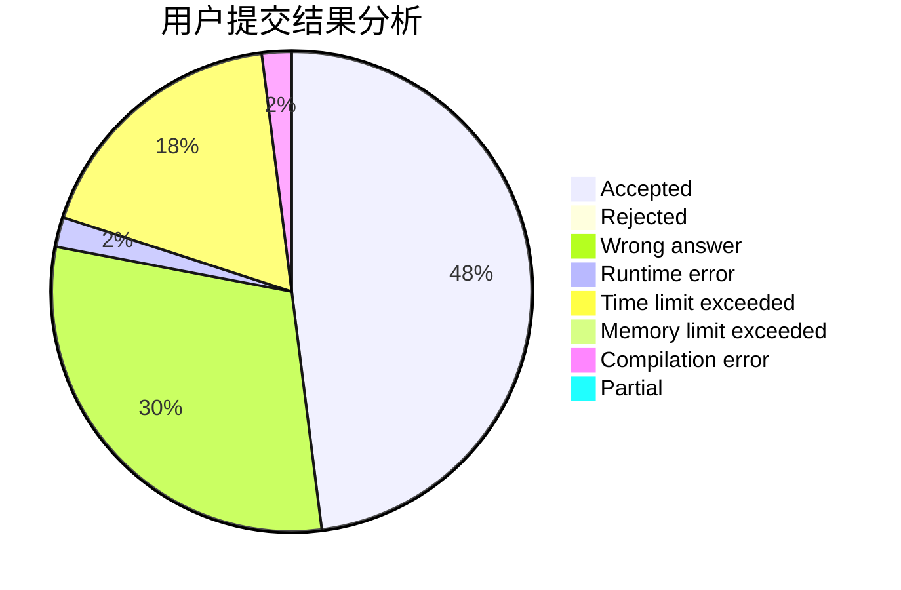
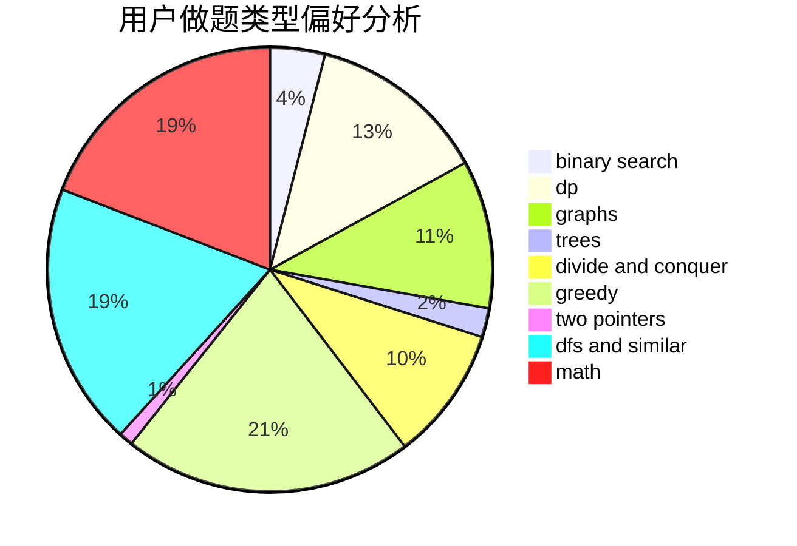

# F_know

<!-- tabs:start -->

#### **用户提交结果分析**

#### **用户做题类型偏好分析**

<!-- tabs:end -->
# 推荐题目
[1350C](https://codeforces.com/contest/1350/problem/C)
[1100A](https://codeforces.com/contest/1100/problem/A)
[1215B](https://codeforces.com/contest/1215/problem/B)
[1343E](https://codeforces.com/contest/1343/problem/E)
[600B](https://codeforces.com/contest/600/problem/B)
[1174F](https://codeforces.com/contest/1174/problem/F)
[17C](https://codeforces.com/contest/17/problem/C)
[221B](https://codeforces.com/contest/221/problem/B)
[13701](https://codeforces.com/contest/1370/problem/1)
[861C](https://codeforces.com/contest/861/problem/C)
