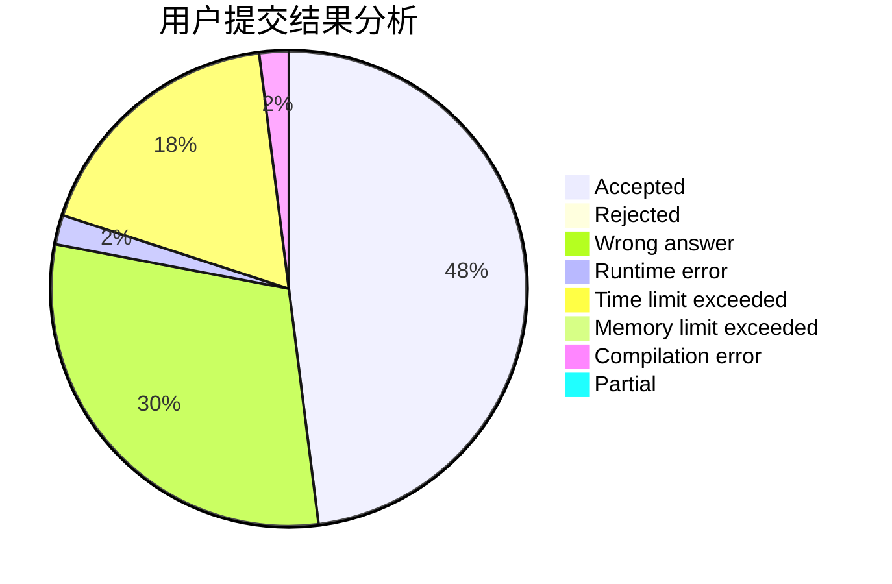
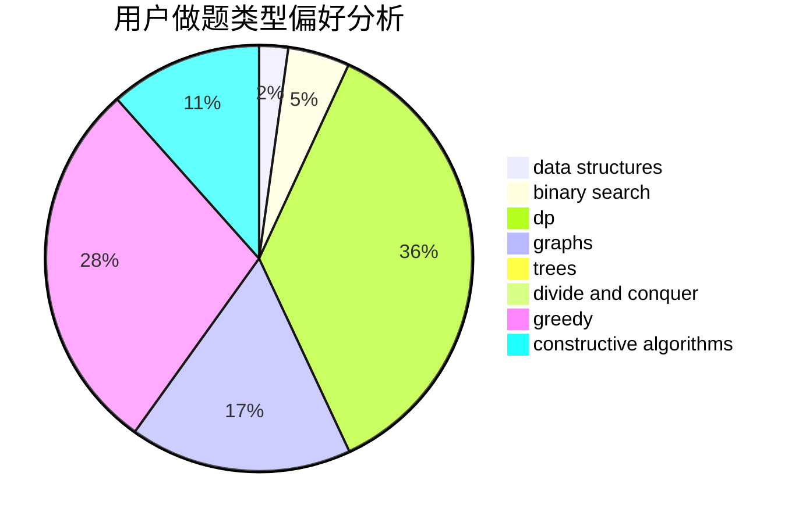

# F_know

<!-- tabs:start -->

#### **用户提交结果分析**

#### **用户做题类型偏好分析**

#### **用户错题知识点分析**

<!-- tabs:end -->
# 推荐题目
[1343E](https://codeforces.com/contest/1343/problem/E)		brute force,
                        graphs,
                        greedy,
                        shortest paths,
                        sortings		  
[10C](https://codeforces.com/contest/10/problem/C)		number theory		  
[1209E2](https://codeforces.com/contest/1209E/problem/2)		bitmasks,
                        dp,
                        greedy,
                        sortings		  
[1336D](https://codeforces.com/contest/1336/problem/D)		constructive algorithms,
                        interactive		  
[57D](https://codeforces.com/contest/57/problem/D)		dp,
                        math		  
[1172C2](https://codeforces.com/contest/1172C/problem/2)		dp,
                        probabilities		  
[158A](https://codeforces.com/contest/158/problem/A)		*special problem,
                        implementation		  
[19A](https://codeforces.com/contest/19/problem/A)		implementation		  
[1362F](https://codeforces.com/contest/1362/problem/F)		dsu,graphs,sortings,trees		  
[842D](https://codeforces.com/contest/842/problem/D)		binary search,
                        data structures		  
