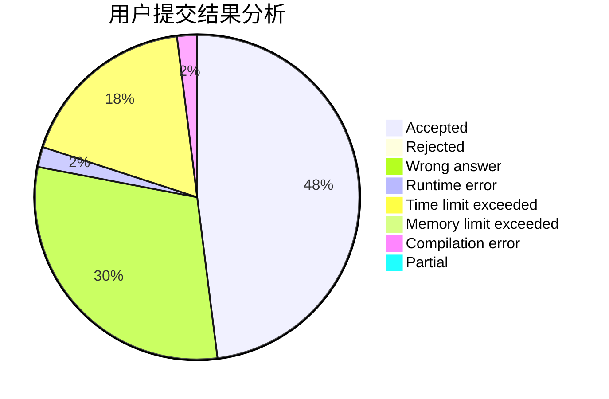
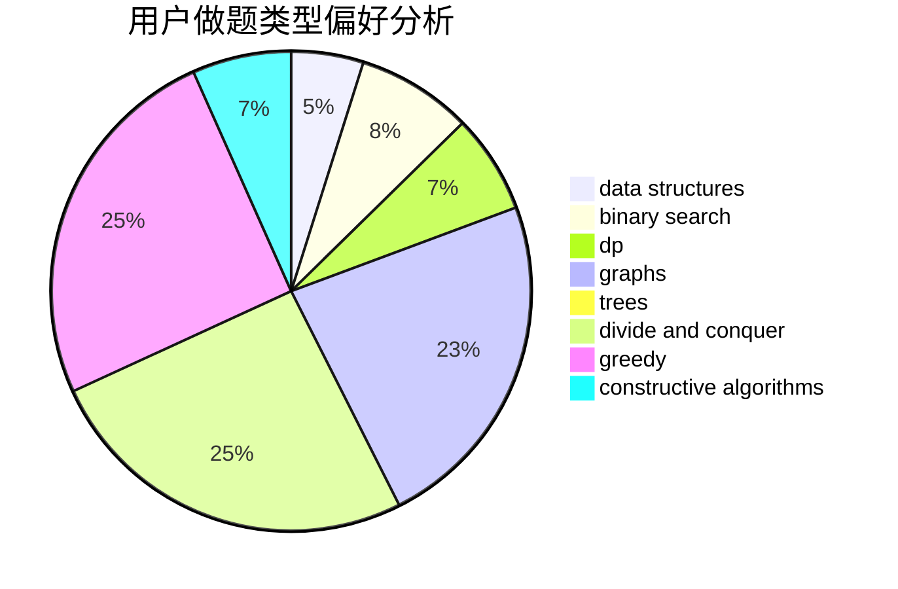

# F_know

<!-- tabs:start -->

#### **用户提交结果分析**

#### **用户做题类型偏好分析**

#### **用户错题知识点分析**

<!-- tabs:end -->
# 推荐题目
[1350C](https://codeforces.com/contest/1350/problem/C)		dsu,graphs,sortings,trees		  
[1100A](https://codeforces.com/contest/1100/problem/A)		implementation		  
[1215B](https://codeforces.com/contest/1215/problem/B)		combinatorics,
                        dp,
                        implementation		  
[1343E](https://codeforces.com/contest/1343/problem/E)		brute force,
                        graphs,
                        greedy,
                        shortest paths,
                        sortings		  
[600B](https://codeforces.com/contest/600/problem/B)		binary search,
                        data structures,
                        sortings,
                        two pointers		  
[1174F](https://codeforces.com/contest/1174/problem/F)		constructive algorithms,
                        divide and conquer,
                        graphs,
                        implementation,
                        interactive,
                        trees		  
[17C](https://codeforces.com/contest/17/problem/C)		dp		  
[221B](https://codeforces.com/contest/221/problem/B)		implementation		  
[13701](https://codeforces.com/contest/1370/problem/1)		dsu,graphs,sortings,trees		  
[861C](https://codeforces.com/contest/861/problem/C)		dsu,graphs,sortings,trees		  
