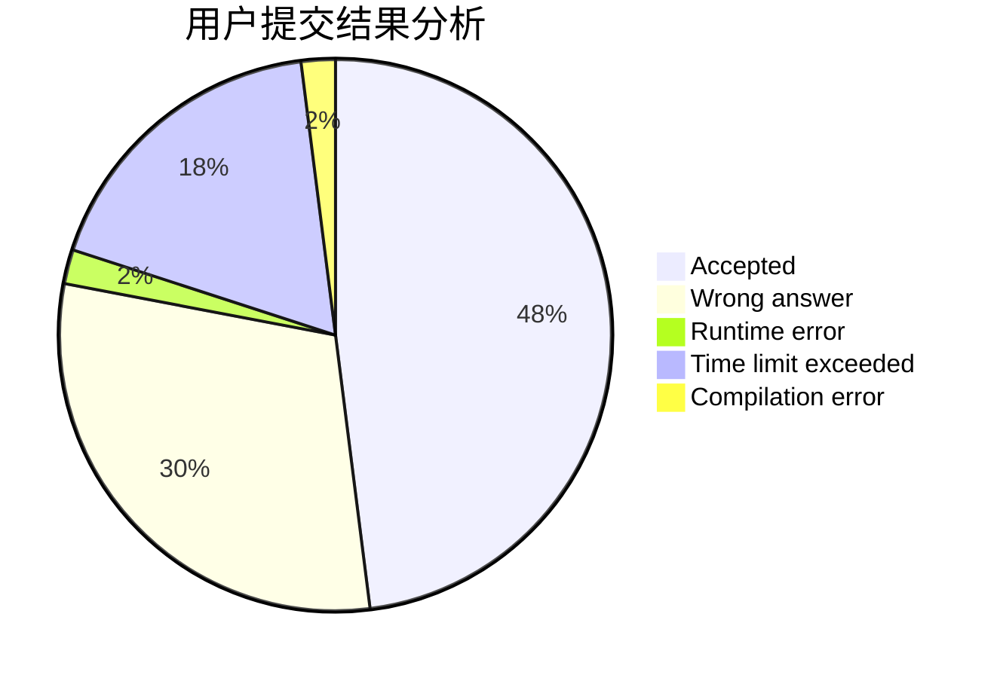
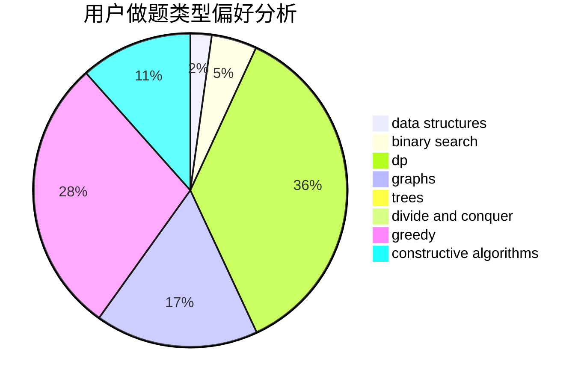

# F_know
<!-- tabs:start -->
#### **用户提交结果分析**

#### **用户做题类型偏好分析**

#### **用户错题知识点分析**

<!-- tabs:end -->
# 推荐题目
[Rotate Columns (hard version)](http://codeforces.com/problemset/problem/1209/E2)		bitmasks,
                        dp,
                        greedy,
                        sortings		  
[Minimum Integer](http://codeforces.com/problemset/problem/1101/A)		math		  
[Vitya and Strange Lesson](http://codeforces.com/problemset/problem/842/D)		binary search,
                        data structures		  
[Digital Root](http://codeforces.com/problemset/problem/10/C)		number theory		  
[Elections](https://codeforces.com/contest/1020/problem/C)		greedy		  
[Sereja and Table](http://codeforces.com/problemset/problem/425/B)		bitmasks,
                        greedy		  
[Three Religions](http://codeforces.com/problemset/problem/1149/B)		dp,
                        implementation,
                        strings		  
[Monotonic Renumeration](http://codeforces.com/problemset/problem/1102/E)		combinatorics,
                        sortings		  
[Launch of Collider](http://codeforces.com/problemset/problem/699/A)		implementation		  
[MUH and House of Cards](http://codeforces.com/problemset/problem/471/C)		binary search,
                        brute force,
                        greedy,
                        math		  
<!-- tabs:start -->
#### **data structures**
[Vitya and Strange Lesson](http://codeforces.com/problemset/problem/842/D)		binary search,
                        data structures		  
[Build a Contest](http://codeforces.com/problemset/problem/1100/B)		data structures,
                        implementation		  
[Sereja and Suffixes](http://codeforces.com/problemset/problem/368/B)		data structures,
                        dp		  
[DZY Loves Colors](http://codeforces.com/problemset/problem/444/C)		data structures		  
[Balance the Cards](http://codeforces.com/problemset/problem/1503/F)		constructive algorithms,
                        data structures,
                        divide and conquer,
                        geometry,
                        graphs,
                        implementation		  
[Maximum width](http://codeforces.com/problemset/problem/1492/C)		binary search,
                        data structures,
                        dp,
                        greedy,
                        two pointers		  
[Old Floppy Drive](http://codeforces.com/problemset/problem/1490/G)		binary search,
                        data structures,
                        math		  
[Odd Mineral Resource](http://codeforces.com/problemset/problem/1479/D)		binary search,
                        bitmasks,
                        brute force,
                        data structures,
                        probabilities,
                        trees		  
[Meximization](http://codeforces.com/problemset/problem/1497/A)		brute force,
                        data structures,
                        greedy,
                        sortings		  
[Pekora and Trampoline](http://codeforces.com/problemset/problem/1491/C)		brute force,
                        data structures,
                        dp,
                        greedy,
                        implementation		  
#### **binary search**
[Vitya and Strange Lesson](http://codeforces.com/problemset/problem/842/D)		binary search,
                        data structures		  
[MUH and House of Cards](http://codeforces.com/problemset/problem/471/C)		binary search,
                        brute force,
                        greedy,
                        math		  
[Johnny and Megan's Necklace](https://codeforces.com/contest/1362/problem/F)		binary search,
                        bitmasks,
                        constructive algorithms,
                        dfs and similar,
                        dsu,
                        graphs		  
[DZY Loves Planting](http://codeforces.com/problemset/problem/444/E)		binary search,
                        dsu,
                        trees		  
[Monitor](http://codeforces.com/problemset/problem/16/C)		binary search,
                        number theory		  
[Nikita and game](http://codeforces.com/problemset/problem/842/E)		binary search,
                        dfs and similar,
                        divide and conquer,
                        graphs,
                        trees		  
[Maximum width](http://codeforces.com/problemset/problem/1492/C)		binary search,
                        data structures,
                        dp,
                        greedy,
                        two pointers		  
[Pairs](http://codeforces.com/problemset/problem/1463/D)		binary search,
                        constructive algorithms,
                        greedy,
                        two pointers		  
[Old Floppy Drive](http://codeforces.com/problemset/problem/1490/G)		binary search,
                        data structures,
                        math		  
[Odd Mineral Resource](http://codeforces.com/problemset/problem/1479/D)		binary search,
                        bitmasks,
                        brute force,
                        data structures,
                        probabilities,
                        trees		  
#### **dp**
[Rotate Columns (hard version)](http://codeforces.com/problemset/problem/1209/E2)		bitmasks,
                        dp,
                        greedy,
                        sortings		  
[Three Religions](http://codeforces.com/problemset/problem/1149/B)		dp,
                        implementation,
                        strings		  
[Representative Sampling](http://codeforces.com/problemset/problem/178/F2)		dp,
                        sortings,
                        strings		  
[Block Adventure](http://codeforces.com/problemset/problem/1200/B)		dp,
                        greedy		  
[Nauuo and Pictures (hard version)](http://codeforces.com/problemset/problem/1172/C2)		dp,
                        probabilities		  
[Journey](http://codeforces.com/problemset/problem/57/D)		dp,
                        math		  
[Playlist for Polycarp (hard version)](http://codeforces.com/problemset/problem/1185/G2)		combinatorics,
                        dp		  
[Sereja and Suffixes](http://codeforces.com/problemset/problem/368/B)		data structures,
                        dp		  
[Devu and Birthday Celebration](http://codeforces.com/problemset/problem/439/E)		combinatorics,
                        dp,
                        math		  
[A Lot of Games](http://codeforces.com/problemset/problem/455/B)		dfs and similar,
                        dp,
                        games,
                        implementation,
                        strings,
                        trees		  
#### **graph**
[Bribes](http://codeforces.com/problemset/problem/575/B)		dfs and similar,
                        graphs,
                        trees		  
[Johnny and Megan's Necklace](https://codeforces.com/contest/1362/problem/F)		binary search,
                        bitmasks,
                        constructive algorithms,
                        dfs and similar,
                        dsu,
                        graphs		  
[Weights Distributing](http://codeforces.com/problemset/problem/1343/E)		brute force,
                        graphs,
                        greedy,
                        shortest paths,
                        sortings		  
[Foolprüf Security](http://codeforces.com/problemset/problem/1267/F)		graphs		  
[Dynamic Shortest Path](http://codeforces.com/problemset/problem/843/D)		graphs,
                        shortest paths		  
[Nikita and game](http://codeforces.com/problemset/problem/842/E)		binary search,
                        dfs and similar,
                        divide and conquer,
                        graphs,
                        trees		  
[Balance the Cards](http://codeforces.com/problemset/problem/1503/F)		constructive algorithms,
                        data structures,
                        divide and conquer,
                        geometry,
                        graphs,
                        implementation		  
[Minimum Ties](http://codeforces.com/problemset/problem/1487/C)		brute force,
                        constructive algorithms,
                        dfs and similar,
                        graphs,
                        greedy,
                        implementation,
                        math		  
[Chef Monocarp](http://codeforces.com/problemset/problem/1437/C)		dp,
                        flows,
                        graph matchings,
                        greedy,
                        math,
                        sortings		  
[Strange Housing](http://codeforces.com/problemset/problem/1470/D)		constructive algorithms,
                        dfs and similar,
                        graph matchings,
                        graphs,
                        greedy		  
#### **trees**
[Bribes](http://codeforces.com/problemset/problem/575/B)		dfs and similar,
                        graphs,
                        trees		  
[DZY Loves Planting](http://codeforces.com/problemset/problem/444/E)		binary search,
                        dsu,
                        trees		  
[A Lot of Games](http://codeforces.com/problemset/problem/455/B)		dfs and similar,
                        dp,
                        games,
                        implementation,
                        strings,
                        trees		  
[Nikita and game](http://codeforces.com/problemset/problem/842/E)		binary search,
                        dfs and similar,
                        divide and conquer,
                        graphs,
                        trees		  
[Odd Mineral Resource](http://codeforces.com/problemset/problem/1479/D)		binary search,
                        bitmasks,
                        brute force,
                        data structures,
                        probabilities,
                        trees		  
[Yet Another Card Deck](http://codeforces.com/problemset/problem/1511/C)		brute force,
                        data structures,
                        implementation,
                        trees		  
[Diameter Cuts](http://codeforces.com/problemset/problem/1499/F)		combinatorics,
                        dfs and similar,
                        dp,
                        trees		  
[Fib-tree](http://codeforces.com/problemset/problem/1491/E)		brute force,
                        dfs and similar,
                        divide and conquer,
                        number theory,
                        trees		  
[13th Labour of Heracles](http://codeforces.com/problemset/problem/1466/D)		data structures,
                        greedy,
                        sortings,
                        trees		  
[BFS Trees](http://codeforces.com/problemset/problem/1495/D)		combinatorics,
                        dfs and similar,
                        graphs,
                        math,
                        shortest paths,
                        trees		  
#### **divide and conquer**
[Nikita and game](http://codeforces.com/problemset/problem/842/E)		binary search,
                        dfs and similar,
                        divide and conquer,
                        graphs,
                        trees		  
[Balance the Cards](http://codeforces.com/problemset/problem/1503/F)		constructive algorithms,
                        data structures,
                        divide and conquer,
                        geometry,
                        graphs,
                        implementation		  
[Divide and Summarize](http://codeforces.com/problemset/problem/1461/D)		binary search,
                        brute force,
                        data structures,
                        divide and conquer,
                        implementation,
                        sortings		  
[Song of the Sirens](http://codeforces.com/problemset/problem/1466/G)		combinatorics,
                        divide and conquer,
                        hashing,
                        math,
                        string suffix structures,
                        strings		  
[Permutation Transformation](http://codeforces.com/problemset/problem/1490/D)		dfs and similar,
                        divide and conquer,
                        implementation		  
[Skyline Photo](https://codeforces.com/contest/1483/problem/C)		data structures,
                        divide and conquer,
                        dp		  
[Fib-tree](http://codeforces.com/problemset/problem/1491/E)		brute force,
                        dfs and similar,
                        divide and conquer,
                        number theory,
                        trees		  
[Sum of Prefix Sums](http://codeforces.com/problemset/problem/1303/G)		data structures,
                        divide and conquer,
                        geometry,
                        trees		  
[Dogeforces](http://codeforces.com/problemset/problem/1494/D)		constructive algorithms,
                        data structures,
                        dfs and similar,
                        divide and conquer,
                        dsu,
                        greedy,
                        sortings,
                        trees		  
[Logistical Questions](http://codeforces.com/problemset/problem/566/C)		dfs and similar,
                        divide and conquer,
                        trees		  
#### **greedy**
[Rotate Columns (hard version)](http://codeforces.com/problemset/problem/1209/E2)		bitmasks,
                        dp,
                        greedy,
                        sortings		  
[Elections](https://codeforces.com/contest/1020/problem/C)		greedy		  
[Sereja and Table](http://codeforces.com/problemset/problem/425/B)		bitmasks,
                        greedy		  
[MUH and House of Cards](http://codeforces.com/problemset/problem/471/C)		binary search,
                        brute force,
                        greedy,
                        math		  
[Block Adventure](http://codeforces.com/problemset/problem/1200/B)		dp,
                        greedy		  
[Emotes](http://codeforces.com/problemset/problem/1117/B)		greedy,
                        math,
                        sortings		  
[Weights Distributing](http://codeforces.com/problemset/problem/1343/E)		brute force,
                        graphs,
                        greedy,
                        shortest paths,
                        sortings		  
[Diversity](http://codeforces.com/problemset/problem/844/A)		greedy,
                        implementation,
                        strings		  
[The Light Square](http://codeforces.com/problemset/problem/1218/I)		2-sat,
                        dfs and similar,
                        greedy		  
[The Child and Set](http://codeforces.com/problemset/problem/437/B)		bitmasks,
                        greedy,
                        implementation,
                        sortings		  
#### **constructive algorithms**
[Johnny and Megan's Necklace](https://codeforces.com/contest/1362/problem/F)		binary search,
                        bitmasks,
                        constructive algorithms,
                        dfs and similar,
                        dsu,
                        graphs		  
[Yui and Mahjong Set](http://codeforces.com/problemset/problem/1336/D)		constructive algorithms,
                        interactive		  
[Balance the Cards](http://codeforces.com/problemset/problem/1503/F)		constructive algorithms,
                        data structures,
                        divide and conquer,
                        geometry,
                        graphs,
                        implementation		  
[Anti-knapsack](http://codeforces.com/problemset/problem/1493/A)		constructive algorithms,
                        greedy		  
[Pairs](http://codeforces.com/problemset/problem/1463/D)		binary search,
                        constructive algorithms,
                        greedy,
                        two pointers		  
[XOR-gun](https://codeforces.com/contest/1456/problem/B)		bitmasks,
                        brute force,
                        constructive algorithms		  
[Genius's Gambit](http://codeforces.com/problemset/problem/1492/D)		bitmasks,
                        constructive algorithms,
                        greedy,
                        math		  
[3-Coloring](https://codeforces.com/contest/1504/problem/D)		constructive algorithms,
                        games,
                        interactive		  
[Basic Diplomacy](https://codeforces.com/contest/1483/problem/A)		brute force,
                        constructive algorithms,
                        greedy,
                        implementation		  
[Array and Peaks](http://codeforces.com/problemset/problem/1513/A)		constructive algorithms,
                        implementation		  
#### **sortings**
[Rotate Columns (hard version)](http://codeforces.com/problemset/problem/1209/E2)		bitmasks,
                        dp,
                        greedy,
                        sortings		  
[Monotonic Renumeration](http://codeforces.com/problemset/problem/1102/E)		combinatorics,
                        sortings		  
[Representative Sampling](http://codeforces.com/problemset/problem/178/F2)		dp,
                        sortings,
                        strings		  
[Chess Tourney](http://codeforces.com/problemset/problem/845/A)		implementation,
                        sortings		  
[Emotes](http://codeforces.com/problemset/problem/1117/B)		greedy,
                        math,
                        sortings		  
[Weights Distributing](http://codeforces.com/problemset/problem/1343/E)		brute force,
                        graphs,
                        greedy,
                        shortest paths,
                        sortings		  
[The Child and Set](http://codeforces.com/problemset/problem/437/B)		bitmasks,
                        greedy,
                        implementation,
                        sortings		  
[Sorting by Subsequences](http://codeforces.com/problemset/problem/843/A)		dfs and similar,
                        dsu,
                        implementation,
                        math,
                        sortings		  
[Divide and Sum](https://codeforces.com/contest/1445/problem/D)		combinatorics,
                        math,
                        sortings		  
[Doggo Recoloring](http://codeforces.com/problemset/problem/1025/A)		implementation,
                        sortings		  
<!-- tabs:end -->
