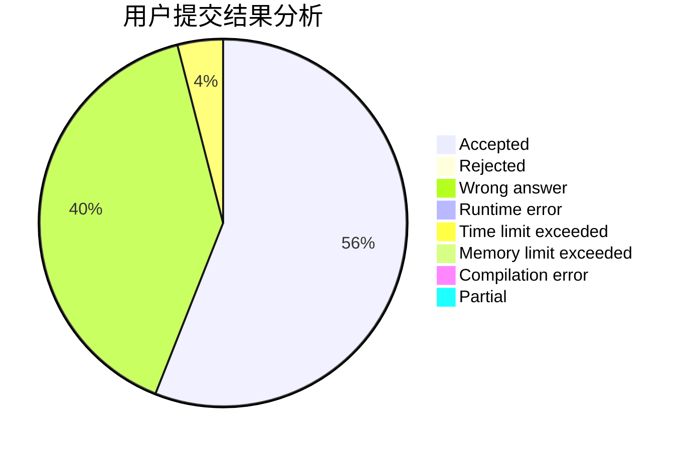
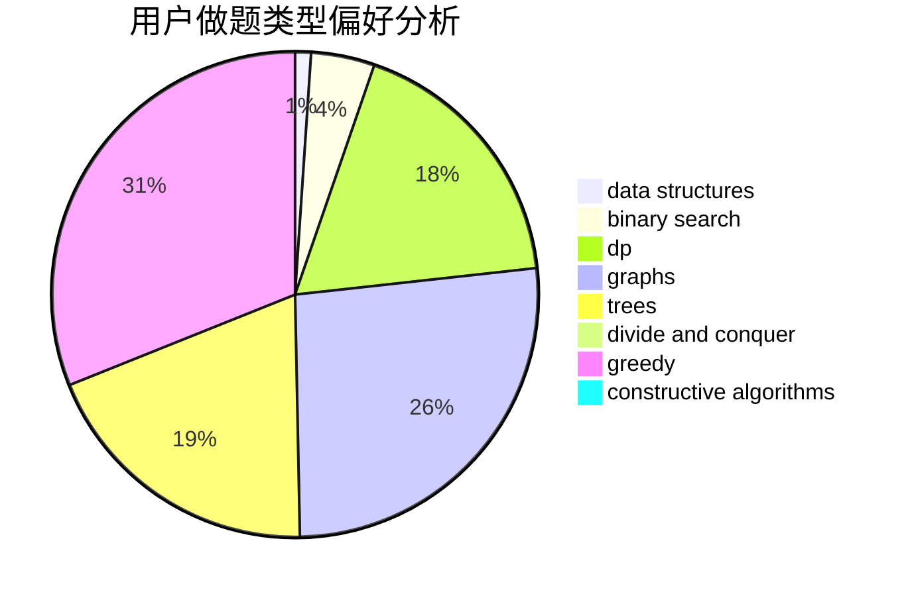

# FadingAway

<!-- tabs:start -->

#### **用户提交结果分析**

#### **用户做题类型偏好分析**

#### **用户错题知识点分析**

<!-- tabs:end -->
# 推荐题目
[1446E](https://codeforces.com/contest/1446/problem/E)		constructive algorithms,
                        dfs and similar		  
[1372F](https://codeforces.com/contest/1372/problem/F)		binary search,
                        divide and conquer,
                        interactive		  
[863D](https://codeforces.com/contest/863/problem/D)		data structures,
                        implementation		  
[863C](https://codeforces.com/contest/863/problem/C)		graphs,
                        implementation		  
[597A](https://codeforces.com/contest/597/problem/A)		math		  
[424B](https://codeforces.com/contest/424/problem/B)		binary search,
                        greedy,
                        implementation,
                        sortings		  
[593A](https://codeforces.com/contest/593/problem/A)		brute force,
                        implementation		  
[464B](https://codeforces.com/contest/464/problem/B)		brute force,
                        geometry		  
[1146E](https://codeforces.com/contest/1146/problem/E)		bitmasks,
                        data structures,
                        divide and conquer,
                        implementation		  
[630R](https://codeforces.com/contest/630/problem/R)		games,
                        math		  
