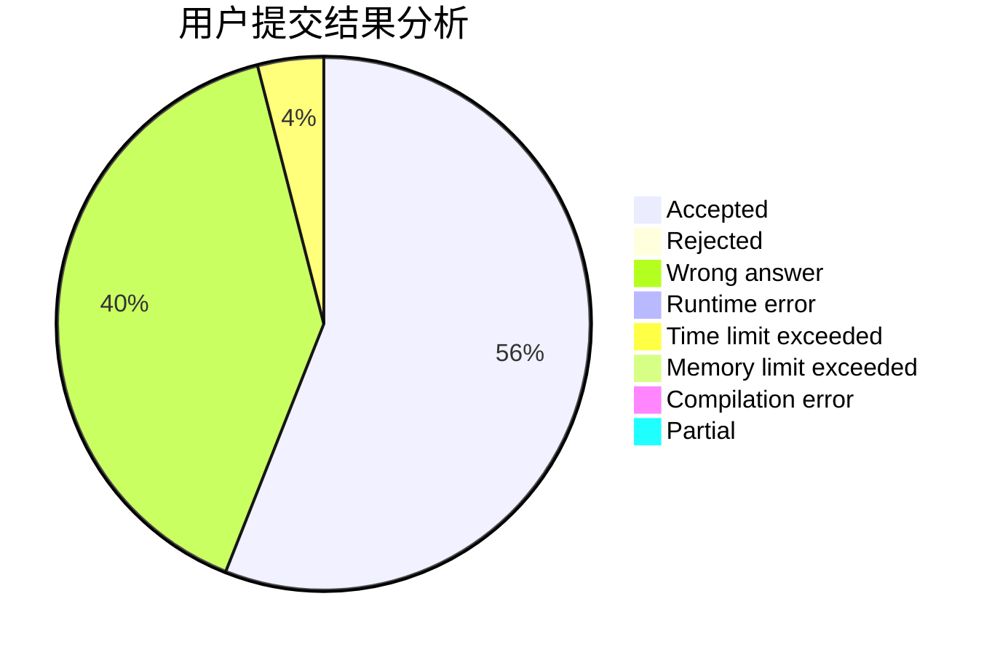
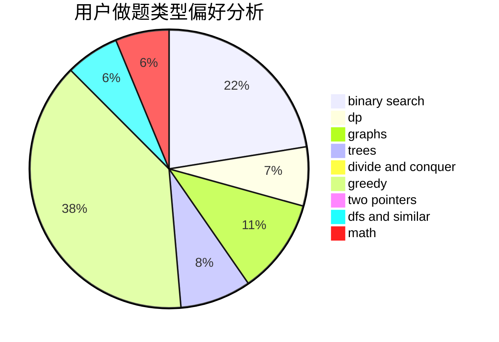

# FadingAway

<!-- tabs:start -->

#### **用户提交结果分析**

#### **用户做题类型偏好分析**

<!-- tabs:end -->
# 推荐题目
[1446E](https://codeforces.com/contest/1446/problem/E)
[1372F](https://codeforces.com/contest/1372/problem/F)
[863D](https://codeforces.com/contest/863/problem/D)
[863C](https://codeforces.com/contest/863/problem/C)
[597A](https://codeforces.com/contest/597/problem/A)
[424B](https://codeforces.com/contest/424/problem/B)
[593A](https://codeforces.com/contest/593/problem/A)
[464B](https://codeforces.com/contest/464/problem/B)
[1146E](https://codeforces.com/contest/1146/problem/E)
[630R](https://codeforces.com/contest/630/problem/R)
