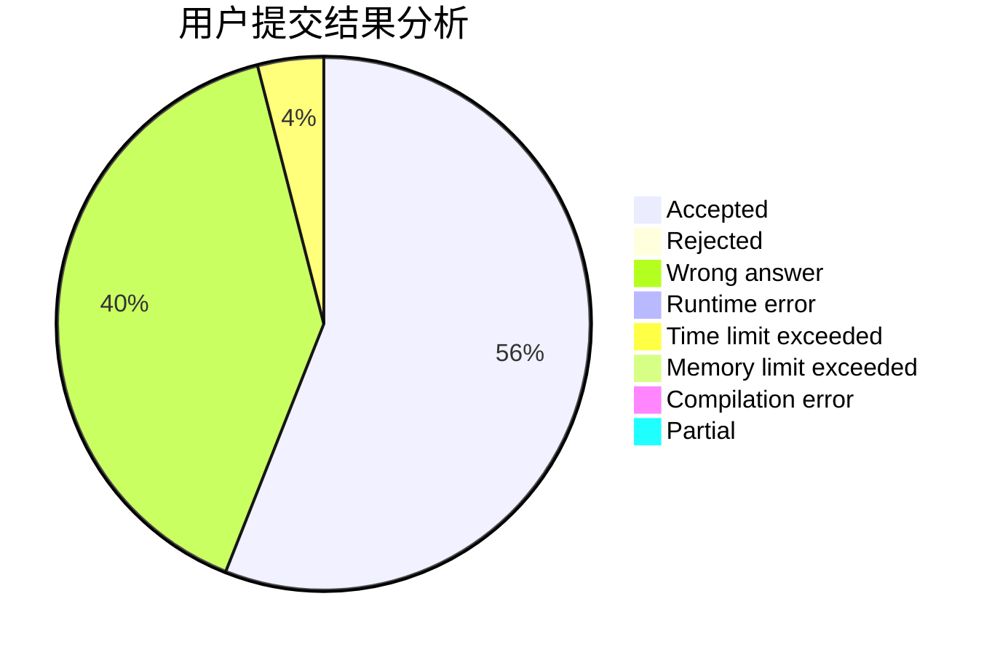
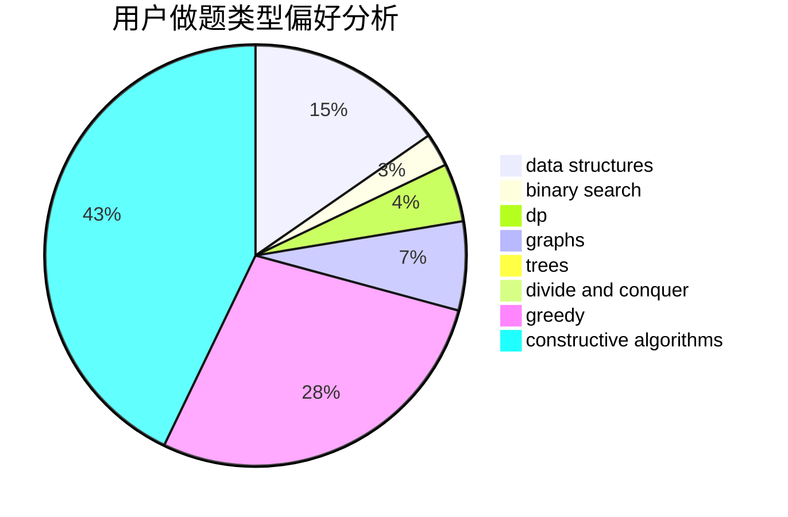

# FadingAway

<!-- tabs:start -->

#### **用户提交结果分析**

#### **用户做题类型偏好分析**

#### **用户错题知识点分析**

<!-- tabs:end -->
# 推荐题目
[1436F](https://codeforces.com/contest/1436/problem/F)		combinatorics,
                        math,
                        number theory		  
[1366A](https://codeforces.com/contest/1366/problem/A)		binary search,
                        greedy,
                        math		  
[845C](https://codeforces.com/contest/845/problem/C)		data structures,
                        greedy,
                        sortings		  
[845B](https://codeforces.com/contest/845/problem/B)		brute force,
                        greedy,
                        implementation		  
[575E](https://codeforces.com/contest/575/problem/E)		geometry		  
[396C](https://codeforces.com/contest/396/problem/C)		data structures,
                        graphs,
                        trees		  
[573C](https://codeforces.com/contest/573/problem/C)		constructive algorithms,
                        dfs and similar,
                        trees		  
[444C](https://codeforces.com/contest/444/problem/C)		data structures		  
[1144D](https://codeforces.com/contest/1144/problem/D)		constructive algorithms,
                        greedy		  
[611G](https://codeforces.com/contest/611/problem/G)		geometry,
                        two pointers		  
