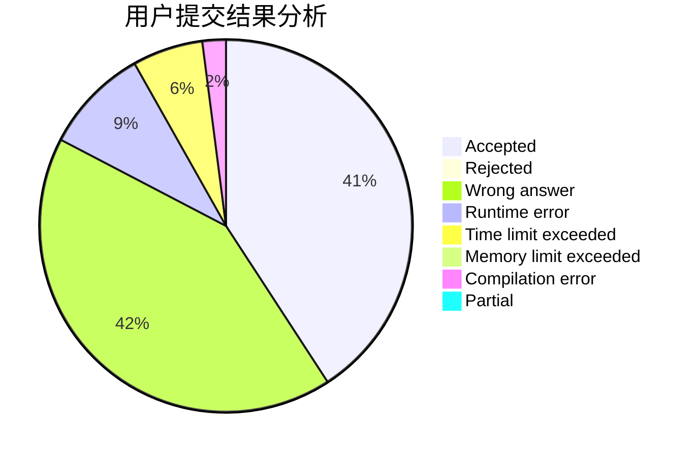
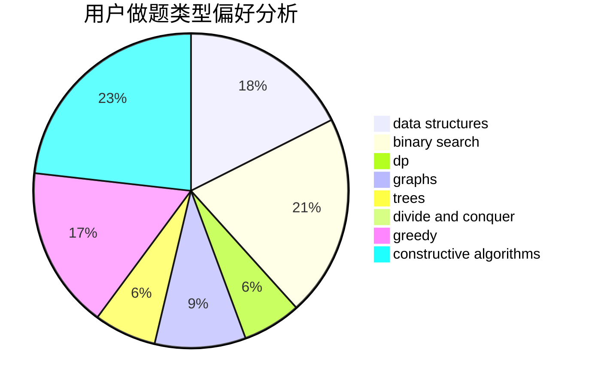
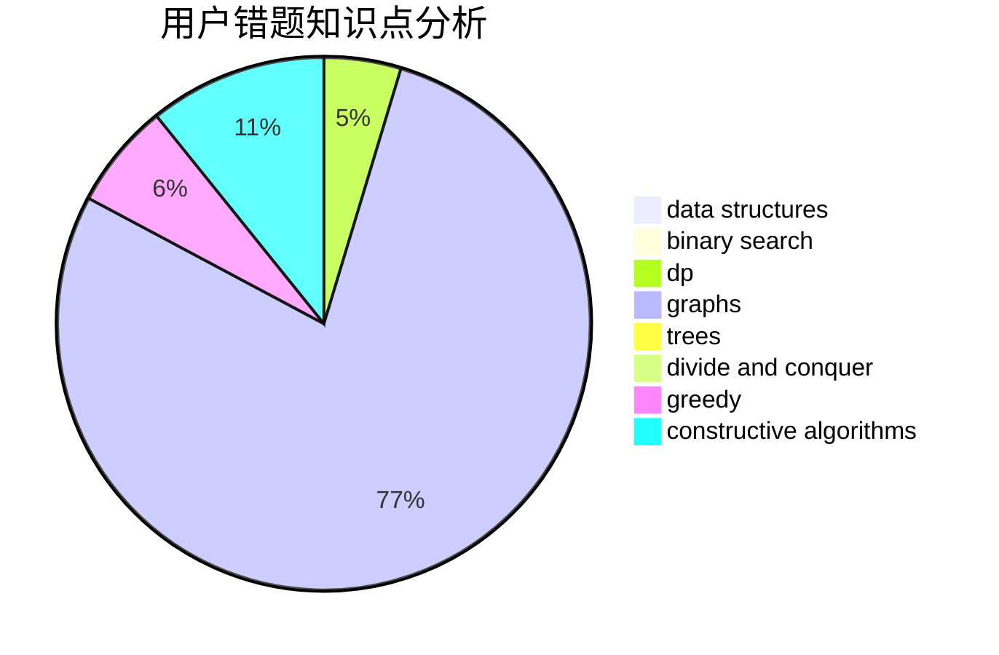

# FengWithoutDancing
<!-- tabs:start -->
#### **用户提交结果分析**

#### **用户做题类型偏好分析**

#### **用户错题知识点分析**

<!-- tabs:end -->
# 推荐题目
[Almost Sorted](http://codeforces.com/problemset/problem/1508/B)		binary search,
                        bitmasks,
                        combinatorics,
                        constructive algorithms,
                        implementation,
                        math		  
[Nastya and Scoreboard](http://codeforces.com/problemset/problem/1340/B)		bitmasks,
                        dp,
                        graphs,
                        greedy		  
[Minimum Difference](http://codeforces.com/problemset/problem/1476/G)		data structures,
                        hashing,
                        sortings,
                        two pointers		  
[Isolation](http://codeforces.com/problemset/problem/1129/D)		data structures,
                        dp		  
[Drazil and Tiles](http://codeforces.com/problemset/problem/515/D)		constructive algorithms,
                        greedy		  
[Fire in the City](http://codeforces.com/problemset/problem/845/E)		binary search,
                        data structures		  
[Even Substrings](http://codeforces.com/problemset/problem/1139/A)		implementation,
                        strings		  
[Om Nom and Spiders](http://codeforces.com/problemset/problem/436/B)		implementation,
                        math		  
[Books](http://codeforces.com/problemset/problem/279/B)		binary search,
                        brute force,
                        implementation,
                        two pointers		  
[Curriculum Vitae](http://codeforces.com/problemset/problem/846/A)		brute force,
                        implementation		  
<!-- tabs:start -->
#### **data structures**
[Almost Sorted](http://codeforces.com/problemset/problem/1476/G)		data structures,
                        hashing,
                        sortings,
                        two pointers		  
[Nastya and Scoreboard](http://codeforces.com/problemset/problem/1129/D)		data structures,
                        dp		  
[Minimum Difference](http://codeforces.com/problemset/problem/845/E)		binary search,
                        data structures		  
[Isolation](http://codeforces.com/problemset/problem/846/C)		brute force,
                        data structures,
                        dp		  
[Drazil and Tiles](https://codeforces.com/contest/281/problem/D)		data structures,
                        implementation,
                        two pointers		  
[Fire in the City](http://codeforces.com/problemset/problem/377/B)		binary search,
                        data structures,
                        greedy,
                        sortings		  
[Even Substrings](http://codeforces.com/problemset/problem/833/D)		data structures,
                        divide and conquer,
                        implementation,
                        trees		  
[Om Nom and Spiders](http://codeforces.com/problemset/problem/845/D)		data structures,
                        dp,
                        greedy		  
[Books](http://codeforces.com/problemset/problem/1455/G)		data structures,
                        dp		  
[Curriculum Vitae](http://codeforces.com/problemset/problem/1194/E)		bitmasks,
                        brute force,
                        data structures,
                        geometry,
                        sortings		  
#### **binary search**
[Almost Sorted](http://codeforces.com/problemset/problem/1508/B)		binary search,
                        bitmasks,
                        combinatorics,
                        constructive algorithms,
                        implementation,
                        math		  
[Nastya and Scoreboard](http://codeforces.com/problemset/problem/845/E)		binary search,
                        data structures		  
[Minimum Difference](http://codeforces.com/problemset/problem/279/B)		binary search,
                        brute force,
                        implementation,
                        two pointers		  
[Isolation](http://codeforces.com/problemset/problem/377/B)		binary search,
                        data structures,
                        greedy,
                        sortings		  
[Drazil and Tiles](http://codeforces.com/problemset/problem/166/A)		binary search,
                        implementation,
                        sortings		  
[Fire in the City](http://codeforces.com/problemset/problem/1492/C)		binary search,
                        data structures,
                        dp,
                        greedy,
                        two pointers		  
[Even Substrings](http://codeforces.com/problemset/problem/1463/D)		binary search,
                        constructive algorithms,
                        greedy,
                        two pointers		  
[Om Nom and Spiders](http://codeforces.com/problemset/problem/1490/G)		binary search,
                        data structures,
                        math		  
[Books](http://codeforces.com/problemset/problem/1479/D)		binary search,
                        bitmasks,
                        brute force,
                        data structures,
                        probabilities,
                        trees		  
[Curriculum Vitae](http://codeforces.com/problemset/problem/1436/E)		binary search,
                        data structures,
                        two pointers		  
#### **dp**
[Almost Sorted](http://codeforces.com/problemset/problem/1340/B)		bitmasks,
                        dp,
                        graphs,
                        greedy		  
[Nastya and Scoreboard](http://codeforces.com/problemset/problem/1129/D)		data structures,
                        dp		  
[Minimum Difference](http://codeforces.com/problemset/problem/846/C)		brute force,
                        data structures,
                        dp		  
[Isolation](http://codeforces.com/problemset/problem/845/F)		bitmasks,
                        dp		  
[Drazil and Tiles](http://codeforces.com/problemset/problem/513/G1)		brute force,
                        dfs and similar,
                        dp,
                        meet-in-the-middle		  
[Fire in the City](http://codeforces.com/problemset/problem/1245/F)		bitmasks,
                        brute force,
                        combinatorics,
                        dp		  
[Even Substrings](http://codeforces.com/problemset/problem/166/E)		dp,
                        math,
                        matrices		  
[Om Nom and Spiders](http://codeforces.com/problemset/problem/845/D)		data structures,
                        dp,
                        greedy		  
[Books](http://codeforces.com/problemset/problem/1455/G)		data structures,
                        dp		  
[Curriculum Vitae](http://codeforces.com/problemset/problem/1437/F)		combinatorics,
                        dp,
                        math,
                        two pointers		  
#### **graph**
[Almost Sorted](http://codeforces.com/problemset/problem/1340/B)		bitmasks,
                        dp,
                        graphs,
                        greedy		  
[Nastya and Scoreboard](http://codeforces.com/problemset/problem/402/E)		graphs,
                        math		  
[Minimum Difference](https://codeforces.com/contest/742/problem/E)		constructive algorithms,
                        dfs and similar,
                        graphs		  
[Isolation](http://codeforces.com/problemset/problem/845/G)		dfs and similar,
                        graphs,
                        math		  
[Drazil and Tiles](http://codeforces.com/problemset/problem/1278/D)		data structures,
                        dsu,
                        graphs,
                        trees		  
[Fire in the City](http://codeforces.com/problemset/problem/1487/C)		brute force,
                        constructive algorithms,
                        dfs and similar,
                        graphs,
                        greedy,
                        implementation,
                        math		  
[Even Substrings](http://codeforces.com/problemset/problem/1437/C)		dp,
                        flows,
                        graph matchings,
                        greedy,
                        math,
                        sortings		  
[Om Nom and Spiders](http://codeforces.com/problemset/problem/1470/D)		constructive algorithms,
                        dfs and similar,
                        graph matchings,
                        graphs,
                        greedy		  
[Books](http://codeforces.com/problemset/problem/1476/C)		dp,
                        graphs,
                        greedy		  
[Curriculum Vitae](http://codeforces.com/problemset/problem/1304/D)		constructive algorithms,
                        graphs,
                        greedy,
                        two pointers		  
#### **trees**
[Almost Sorted](http://codeforces.com/problemset/problem/696/B)		dfs and similar,
                        math,
                        probabilities,
                        trees		  
[Nastya and Scoreboard](http://codeforces.com/problemset/problem/833/D)		data structures,
                        divide and conquer,
                        implementation,
                        trees		  
[Minimum Difference](http://codeforces.com/problemset/problem/846/E)		dfs and similar,
                        greedy,
                        trees		  
[Isolation](http://codeforces.com/problemset/problem/1278/D)		data structures,
                        dsu,
                        graphs,
                        trees		  
[Drazil and Tiles](http://codeforces.com/problemset/problem/472/D)		dfs and similar,
                        dsu,
                        shortest paths,
                        trees		  
[Fire in the City](http://codeforces.com/problemset/problem/1479/D)		binary search,
                        bitmasks,
                        brute force,
                        data structures,
                        probabilities,
                        trees		  
[Even Substrings](http://codeforces.com/problemset/problem/1511/C)		brute force,
                        data structures,
                        implementation,
                        trees		  
[Om Nom and Spiders](http://codeforces.com/problemset/problem/1499/F)		combinatorics,
                        dfs and similar,
                        dp,
                        trees		  
[Books](http://codeforces.com/problemset/problem/1491/E)		brute force,
                        dfs and similar,
                        divide and conquer,
                        number theory,
                        trees		  
[Curriculum Vitae](http://codeforces.com/problemset/problem/1466/D)		data structures,
                        greedy,
                        sortings,
                        trees		  
#### **divide and conquer**
[Almost Sorted](http://codeforces.com/problemset/problem/833/D)		data structures,
                        divide and conquer,
                        implementation,
                        trees		  
[Nastya and Scoreboard](http://codeforces.com/problemset/problem/1461/D)		binary search,
                        brute force,
                        data structures,
                        divide and conquer,
                        implementation,
                        sortings		  
[Minimum Difference](http://codeforces.com/problemset/problem/1466/G)		combinatorics,
                        divide and conquer,
                        hashing,
                        math,
                        string suffix structures,
                        strings		  
[Isolation](http://codeforces.com/problemset/problem/1490/D)		dfs and similar,
                        divide and conquer,
                        implementation		  
[Drazil and Tiles](https://codeforces.com/contest/1483/problem/C)		data structures,
                        divide and conquer,
                        dp		  
[Fire in the City](http://codeforces.com/problemset/problem/1491/E)		brute force,
                        dfs and similar,
                        divide and conquer,
                        number theory,
                        trees		  
[Even Substrings](http://codeforces.com/problemset/problem/1303/G)		data structures,
                        divide and conquer,
                        geometry,
                        trees		  
[Om Nom and Spiders](http://codeforces.com/problemset/problem/1494/D)		constructive algorithms,
                        data structures,
                        dfs and similar,
                        divide and conquer,
                        dsu,
                        greedy,
                        sortings,
                        trees		  
[Books](http://codeforces.com/problemset/problem/1482/E)		data structures,
                        divide and conquer,
                        dp		  
[Curriculum Vitae](http://codeforces.com/problemset/problem/566/C)		dfs and similar,
                        divide and conquer,
                        trees		  
#### **greedy**
[Almost Sorted](http://codeforces.com/problemset/problem/1340/B)		bitmasks,
                        dp,
                        graphs,
                        greedy		  
[Nastya and Scoreboard](http://codeforces.com/problemset/problem/515/D)		constructive algorithms,
                        greedy		  
[Minimum Difference](https://codeforces.com/contest/1465/problem/F)		greedy,
                        math		  
[Isolation](http://codeforces.com/problemset/problem/377/B)		binary search,
                        data structures,
                        greedy,
                        sortings		  
[Drazil and Tiles](http://codeforces.com/problemset/problem/846/E)		dfs and similar,
                        greedy,
                        trees		  
[Fire in the City](http://codeforces.com/problemset/problem/845/D)		data structures,
                        dp,
                        greedy		  
[Even Substrings](http://codeforces.com/problemset/problem/1256/C)		greedy		  
[Om Nom and Spiders](http://codeforces.com/problemset/problem/1077/B)		greedy		  
[Books](http://codeforces.com/problemset/problem/846/B)		brute force,
                        greedy		  
[Curriculum Vitae](http://codeforces.com/problemset/problem/1216/B)		greedy,
                        implementation,
                        sortings		  
#### **constructive algorithms**
[Almost Sorted](http://codeforces.com/problemset/problem/1508/B)		binary search,
                        bitmasks,
                        combinatorics,
                        constructive algorithms,
                        implementation,
                        math		  
[Nastya and Scoreboard](http://codeforces.com/problemset/problem/515/D)		constructive algorithms,
                        greedy		  
[Minimum Difference](http://codeforces.com/problemset/problem/1090/F)		constructive algorithms,
                        interactive		  
[Isolation](http://codeforces.com/problemset/problem/487/C)		constructive algorithms,
                        math,
                        number theory		  
[Drazil and Tiles](https://codeforces.com/contest/742/problem/E)		constructive algorithms,
                        dfs and similar,
                        graphs		  
[Fire in the City](http://codeforces.com/problemset/problem/1477/C)		constructive algorithms,
                        geometry,
                        greedy,
                        math,
                        sortings		  
[Even Substrings](http://codeforces.com/problemset/problem/1493/A)		constructive algorithms,
                        greedy		  
[Om Nom and Spiders](http://codeforces.com/problemset/problem/1463/D)		binary search,
                        constructive algorithms,
                        greedy,
                        two pointers		  
[Books](https://codeforces.com/contest/1456/problem/B)		bitmasks,
                        brute force,
                        constructive algorithms		  
[Curriculum Vitae](http://codeforces.com/problemset/problem/1492/D)		bitmasks,
                        constructive algorithms,
                        greedy,
                        math		  
#### **sortings**
[Almost Sorted](http://codeforces.com/problemset/problem/1476/G)		data structures,
                        hashing,
                        sortings,
                        two pointers		  
[Nastya and Scoreboard](http://codeforces.com/problemset/problem/377/B)		binary search,
                        data structures,
                        greedy,
                        sortings		  
[Minimum Difference](http://codeforces.com/problemset/problem/166/A)		binary search,
                        implementation,
                        sortings		  
[Isolation](http://codeforces.com/problemset/problem/1194/E)		bitmasks,
                        brute force,
                        data structures,
                        geometry,
                        sortings		  
[Drazil and Tiles](http://codeforces.com/problemset/problem/1216/B)		greedy,
                        implementation,
                        sortings		  
[Fire in the City](http://codeforces.com/problemset/problem/1477/C)		constructive algorithms,
                        geometry,
                        greedy,
                        math,
                        sortings		  
[Even Substrings](https://codeforces.com/contest/1496/problem/C)		geometry,
                        greedy,
                        math,
                        sortings		  
[Om Nom and Spiders](http://codeforces.com/problemset/problem/1495/A)		geometry,
                        greedy,
                        math,
                        sortings		  
[Books](http://codeforces.com/problemset/problem/1497/A)		brute force,
                        data structures,
                        greedy,
                        sortings		  
[Curriculum Vitae](http://codeforces.com/problemset/problem/1427/A)		math,
                        sortings		  
<!-- tabs:end -->
