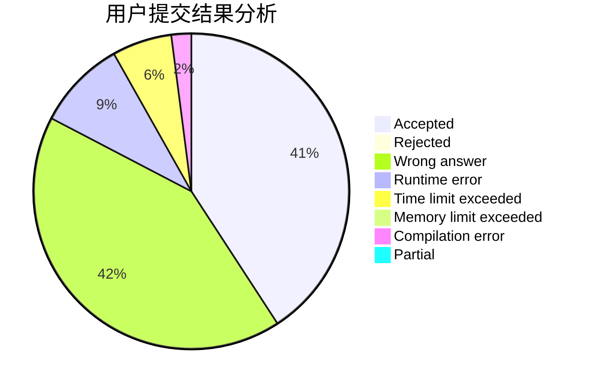
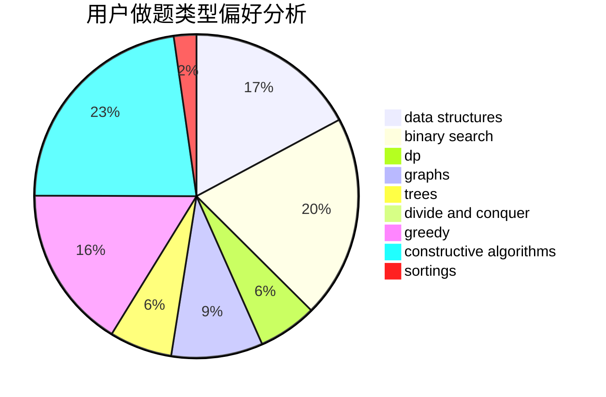
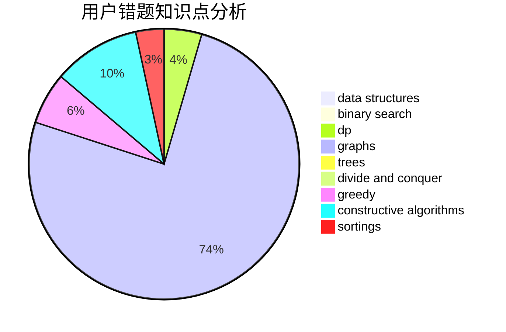

# FengWithoutDancing
<!-- tabs:start -->
#### **用户提交结果分析**

#### **用户做题类型偏好分析**

#### **用户错题知识点分析**

<!-- tabs:end -->
# 推荐题目
[1508B](http://codeforces.com/problemset/problem/1508/B)		binary search,
                        bitmasks,
                        combinatorics,
                        constructive algorithms,
                        implementation,
                        math		  
[1340B](http://codeforces.com/problemset/problem/1340/B)		bitmasks,
                        dp,
                        graphs,
                        greedy		  
[1476G](http://codeforces.com/problemset/problem/1476/G)		data structures,
                        hashing,
                        sortings,
                        two pointers		  
[1129D](http://codeforces.com/problemset/problem/1129/D)		data structures,
                        dp		  
[515D](http://codeforces.com/problemset/problem/515/D)		constructive algorithms,
                        greedy		  
[845E](http://codeforces.com/problemset/problem/845/E)		binary search,
                        data structures		  
[1139A](http://codeforces.com/problemset/problem/1139/A)		implementation,
                        strings		  
[436B](http://codeforces.com/problemset/problem/436/B)		implementation,
                        math		  
[279B](http://codeforces.com/problemset/problem/279/B)		binary search,
                        brute force,
                        implementation,
                        two pointers		  
[846A](http://codeforces.com/problemset/problem/846/A)		brute force,
                        implementation		  
<!-- tabs:start -->
#### **data structures**
[1476G](http://codeforces.com/problemset/problem/1476/G)		data structures,
                        hashing,
                        sortings,
                        two pointers		  
[1129D](http://codeforces.com/problemset/problem/1129/D)		data structures,
                        dp		  
[845E](http://codeforces.com/problemset/problem/845/E)		binary search,
                        data structures		  
[846C](http://codeforces.com/problemset/problem/846/C)		brute force,
                        data structures,
                        dp		  
[281D](https://codeforces.com/contest/281/problem/D)		data structures,
                        implementation,
                        two pointers		  
[377B](http://codeforces.com/problemset/problem/377/B)		binary search,
                        data structures,
                        greedy,
                        sortings		  
[833D](http://codeforces.com/problemset/problem/833/D)		data structures,
                        divide and conquer,
                        implementation,
                        trees		  
[845D](http://codeforces.com/problemset/problem/845/D)		data structures,
                        dp,
                        greedy		  
[1455G](http://codeforces.com/problemset/problem/1455/G)		data structures,
                        dp		  
[1194E](http://codeforces.com/problemset/problem/1194/E)		bitmasks,
                        brute force,
                        data structures,
                        geometry,
                        sortings		  
#### **binary search**
[1508B](http://codeforces.com/problemset/problem/1508/B)		binary search,
                        bitmasks,
                        combinatorics,
                        constructive algorithms,
                        implementation,
                        math		  
[845E](http://codeforces.com/problemset/problem/845/E)		binary search,
                        data structures		  
[279B](http://codeforces.com/problemset/problem/279/B)		binary search,
                        brute force,
                        implementation,
                        two pointers		  
[377B](http://codeforces.com/problemset/problem/377/B)		binary search,
                        data structures,
                        greedy,
                        sortings		  
[166A](http://codeforces.com/problemset/problem/166/A)		binary search,
                        implementation,
                        sortings		  
[1492C](http://codeforces.com/problemset/problem/1492/C)		binary search,
                        data structures,
                        dp,
                        greedy,
                        two pointers		  
[1463D](http://codeforces.com/problemset/problem/1463/D)		binary search,
                        constructive algorithms,
                        greedy,
                        two pointers		  
[1490G](http://codeforces.com/problemset/problem/1490/G)		binary search,
                        data structures,
                        math		  
[1479D](http://codeforces.com/problemset/problem/1479/D)		binary search,
                        bitmasks,
                        brute force,
                        data structures,
                        probabilities,
                        trees		  
[1436E](http://codeforces.com/problemset/problem/1436/E)		binary search,
                        data structures,
                        two pointers		  
#### **dp**
[1340B](http://codeforces.com/problemset/problem/1340/B)		bitmasks,
                        dp,
                        graphs,
                        greedy		  
[1129D](http://codeforces.com/problemset/problem/1129/D)		data structures,
                        dp		  
[846C](http://codeforces.com/problemset/problem/846/C)		brute force,
                        data structures,
                        dp		  
[845F](http://codeforces.com/problemset/problem/845/F)		bitmasks,
                        dp		  
[513G1](http://codeforces.com/problemset/problem/513/G1)		brute force,
                        dfs and similar,
                        dp,
                        meet-in-the-middle		  
[1245F](http://codeforces.com/problemset/problem/1245/F)		bitmasks,
                        brute force,
                        combinatorics,
                        dp		  
[166E](http://codeforces.com/problemset/problem/166/E)		dp,
                        math,
                        matrices		  
[845D](http://codeforces.com/problemset/problem/845/D)		data structures,
                        dp,
                        greedy		  
[1455G](http://codeforces.com/problemset/problem/1455/G)		data structures,
                        dp		  
[1437F](http://codeforces.com/problemset/problem/1437/F)		combinatorics,
                        dp,
                        math,
                        two pointers		  
#### **graph**
[1340B](http://codeforces.com/problemset/problem/1340/B)		bitmasks,
                        dp,
                        graphs,
                        greedy		  
[402E](http://codeforces.com/problemset/problem/402/E)		graphs,
                        math		  
[742E](https://codeforces.com/contest/742/problem/E)		constructive algorithms,
                        dfs and similar,
                        graphs		  
[845G](http://codeforces.com/problemset/problem/845/G)		dfs and similar,
                        graphs,
                        math		  
[1278D](http://codeforces.com/problemset/problem/1278/D)		data structures,
                        dsu,
                        graphs,
                        trees		  
[1487C](http://codeforces.com/problemset/problem/1487/C)		brute force,
                        constructive algorithms,
                        dfs and similar,
                        graphs,
                        greedy,
                        implementation,
                        math		  
[1437C](http://codeforces.com/problemset/problem/1437/C)		dp,
                        flows,
                        graph matchings,
                        greedy,
                        math,
                        sortings		  
[1470D](http://codeforces.com/problemset/problem/1470/D)		constructive algorithms,
                        dfs and similar,
                        graph matchings,
                        graphs,
                        greedy		  
[1476C](http://codeforces.com/problemset/problem/1476/C)		dp,
                        graphs,
                        greedy		  
[1304D](http://codeforces.com/problemset/problem/1304/D)		constructive algorithms,
                        graphs,
                        greedy,
                        two pointers		  
#### **trees**
[696B](http://codeforces.com/problemset/problem/696/B)		dfs and similar,
                        math,
                        probabilities,
                        trees		  
[833D](http://codeforces.com/problemset/problem/833/D)		data structures,
                        divide and conquer,
                        implementation,
                        trees		  
[846E](http://codeforces.com/problemset/problem/846/E)		dfs and similar,
                        greedy,
                        trees		  
[1278D](http://codeforces.com/problemset/problem/1278/D)		data structures,
                        dsu,
                        graphs,
                        trees		  
[472D](http://codeforces.com/problemset/problem/472/D)		dfs and similar,
                        dsu,
                        shortest paths,
                        trees		  
[1479D](http://codeforces.com/problemset/problem/1479/D)		binary search,
                        bitmasks,
                        brute force,
                        data structures,
                        probabilities,
                        trees		  
[1511C](http://codeforces.com/problemset/problem/1511/C)		brute force,
                        data structures,
                        implementation,
                        trees		  
[1499F](http://codeforces.com/problemset/problem/1499/F)		combinatorics,
                        dfs and similar,
                        dp,
                        trees		  
[1491E](http://codeforces.com/problemset/problem/1491/E)		brute force,
                        dfs and similar,
                        divide and conquer,
                        number theory,
                        trees		  
[1466D](http://codeforces.com/problemset/problem/1466/D)		data structures,
                        greedy,
                        sortings,
                        trees		  
#### **divide and conquer**
[833D](http://codeforces.com/problemset/problem/833/D)		data structures,
                        divide and conquer,
                        implementation,
                        trees		  
[1461D](http://codeforces.com/problemset/problem/1461/D)		binary search,
                        brute force,
                        data structures,
                        divide and conquer,
                        implementation,
                        sortings		  
[1466G](http://codeforces.com/problemset/problem/1466/G)		combinatorics,
                        divide and conquer,
                        hashing,
                        math,
                        string suffix structures,
                        strings		  
[1490D](http://codeforces.com/problemset/problem/1490/D)		dfs and similar,
                        divide and conquer,
                        implementation		  
[1483C](https://codeforces.com/contest/1483/problem/C)		data structures,
                        divide and conquer,
                        dp		  
[1491E](http://codeforces.com/problemset/problem/1491/E)		brute force,
                        dfs and similar,
                        divide and conquer,
                        number theory,
                        trees		  
[1303G](http://codeforces.com/problemset/problem/1303/G)		data structures,
                        divide and conquer,
                        geometry,
                        trees		  
[1494D](http://codeforces.com/problemset/problem/1494/D)		constructive algorithms,
                        data structures,
                        dfs and similar,
                        divide and conquer,
                        dsu,
                        greedy,
                        sortings,
                        trees		  
[1482E](http://codeforces.com/problemset/problem/1482/E)		data structures,
                        divide and conquer,
                        dp		  
[566C](http://codeforces.com/problemset/problem/566/C)		dfs and similar,
                        divide and conquer,
                        trees		  
#### **greedy**
[1340B](http://codeforces.com/problemset/problem/1340/B)		bitmasks,
                        dp,
                        graphs,
                        greedy		  
[515D](http://codeforces.com/problemset/problem/515/D)		constructive algorithms,
                        greedy		  
[1465F](https://codeforces.com/contest/1465/problem/F)		greedy,
                        math		  
[377B](http://codeforces.com/problemset/problem/377/B)		binary search,
                        data structures,
                        greedy,
                        sortings		  
[846E](http://codeforces.com/problemset/problem/846/E)		dfs and similar,
                        greedy,
                        trees		  
[845D](http://codeforces.com/problemset/problem/845/D)		data structures,
                        dp,
                        greedy		  
[1256C](http://codeforces.com/problemset/problem/1256/C)		greedy		  
[1077B](http://codeforces.com/problemset/problem/1077/B)		greedy		  
[846B](http://codeforces.com/problemset/problem/846/B)		brute force,
                        greedy		  
[1216B](http://codeforces.com/problemset/problem/1216/B)		greedy,
                        implementation,
                        sortings		  
#### **constructive algorithms**
[1508B](http://codeforces.com/problemset/problem/1508/B)		binary search,
                        bitmasks,
                        combinatorics,
                        constructive algorithms,
                        implementation,
                        math		  
[515D](http://codeforces.com/problemset/problem/515/D)		constructive algorithms,
                        greedy		  
[1090F](http://codeforces.com/problemset/problem/1090/F)		constructive algorithms,
                        interactive		  
[487C](http://codeforces.com/problemset/problem/487/C)		constructive algorithms,
                        math,
                        number theory		  
[742E](https://codeforces.com/contest/742/problem/E)		constructive algorithms,
                        dfs and similar,
                        graphs		  
[1477C](http://codeforces.com/problemset/problem/1477/C)		constructive algorithms,
                        geometry,
                        greedy,
                        math,
                        sortings		  
[1493A](http://codeforces.com/problemset/problem/1493/A)		constructive algorithms,
                        greedy		  
[1463D](http://codeforces.com/problemset/problem/1463/D)		binary search,
                        constructive algorithms,
                        greedy,
                        two pointers		  
[1456B](https://codeforces.com/contest/1456/problem/B)		bitmasks,
                        brute force,
                        constructive algorithms		  
[1492D](http://codeforces.com/problemset/problem/1492/D)		bitmasks,
                        constructive algorithms,
                        greedy,
                        math		  
#### **sortings**
[1476G](http://codeforces.com/problemset/problem/1476/G)		data structures,
                        hashing,
                        sortings,
                        two pointers		  
[377B](http://codeforces.com/problemset/problem/377/B)		binary search,
                        data structures,
                        greedy,
                        sortings		  
[166A](http://codeforces.com/problemset/problem/166/A)		binary search,
                        implementation,
                        sortings		  
[1194E](http://codeforces.com/problemset/problem/1194/E)		bitmasks,
                        brute force,
                        data structures,
                        geometry,
                        sortings		  
[1216B](http://codeforces.com/problemset/problem/1216/B)		greedy,
                        implementation,
                        sortings		  
[1477C](http://codeforces.com/problemset/problem/1477/C)		constructive algorithms,
                        geometry,
                        greedy,
                        math,
                        sortings		  
[1496C](https://codeforces.com/contest/1496/problem/C)		geometry,
                        greedy,
                        math,
                        sortings		  
[1495A](http://codeforces.com/problemset/problem/1495/A)		geometry,
                        greedy,
                        math,
                        sortings		  
[1497A](http://codeforces.com/problemset/problem/1497/A)		brute force,
                        data structures,
                        greedy,
                        sortings		  
[1427A](http://codeforces.com/problemset/problem/1427/A)		math,
                        sortings		  
<!-- tabs:end -->
