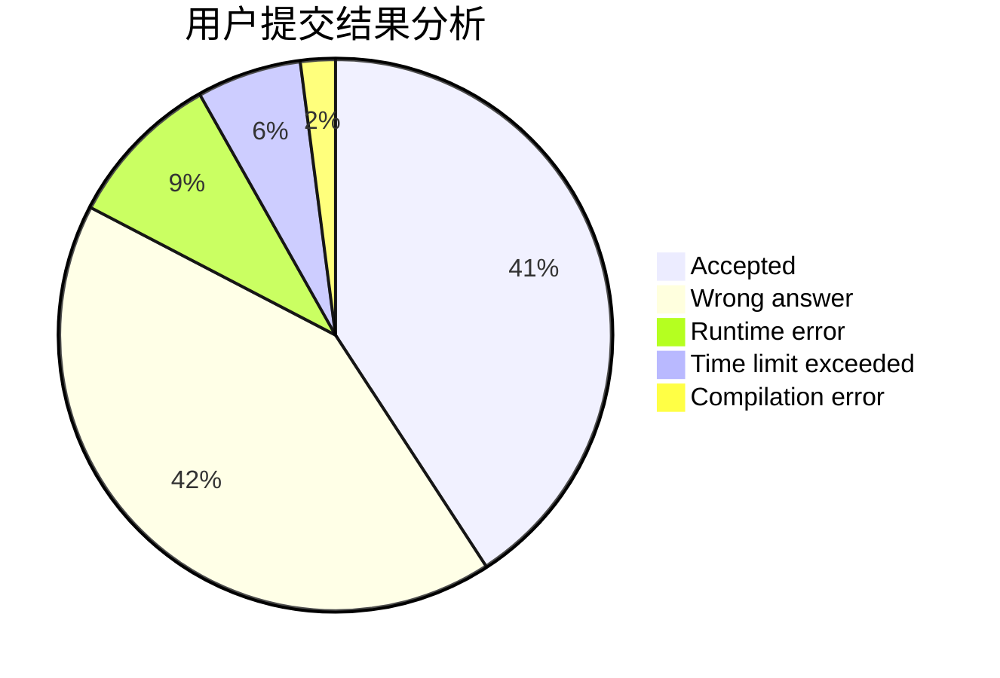
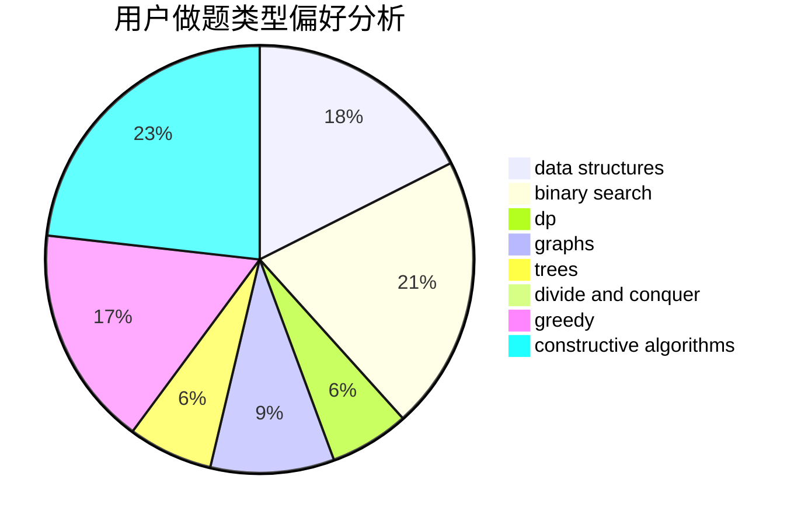
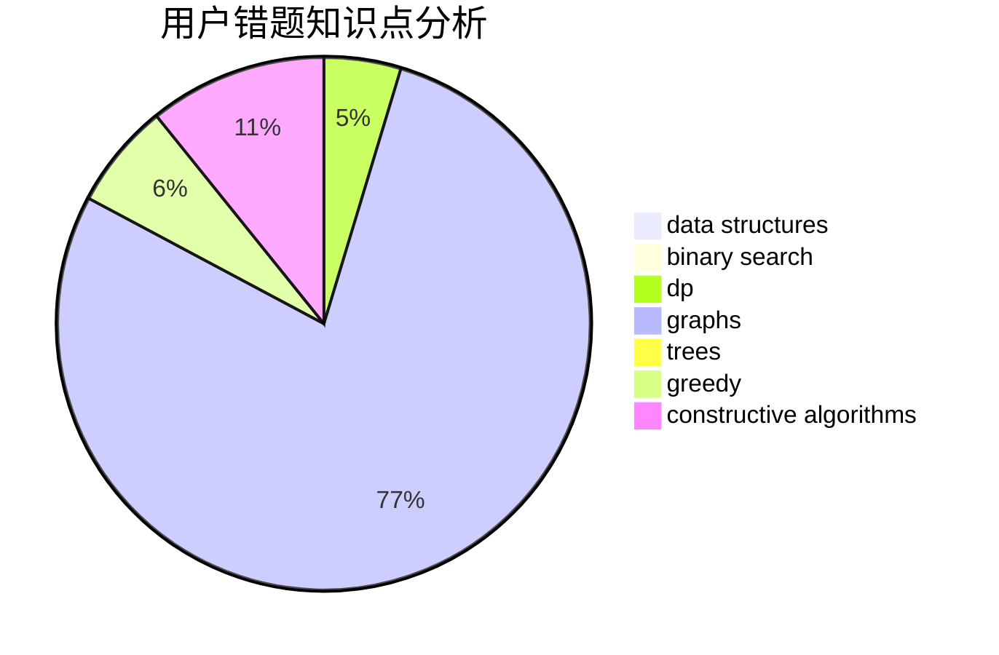

# FengWithoutDancing
<!-- tabs:start -->
#### **用户提交结果分析**

#### **用户做题类型偏好分析**

#### **用户错题知识点分析**

<!-- tabs:end -->
# 推荐题目
[Almost Sorted](http://codeforces.com/problemset/problem/1508/B)		binary search,
                        bitmasks,
                        combinatorics,
                        constructive algorithms,
                        implementation,
                        math		  
[Nastya and Scoreboard](http://codeforces.com/problemset/problem/1340/B)		bitmasks,
                        dp,
                        graphs,
                        greedy		  
[Minimum Difference](http://codeforces.com/problemset/problem/1476/G)		data structures,
                        hashing,
                        sortings,
                        two pointers		  
[Isolation](http://codeforces.com/problemset/problem/1129/D)		data structures,
                        dp		  
[Drazil and Tiles](http://codeforces.com/problemset/problem/515/D)		constructive algorithms,
                        greedy		  
[Fire in the City](http://codeforces.com/problemset/problem/845/E)		binary search,
                        data structures		  
[Even Substrings](http://codeforces.com/problemset/problem/1139/A)		implementation,
                        strings		  
[Om Nom and Spiders](http://codeforces.com/problemset/problem/436/B)		implementation,
                        math		  
[Books](http://codeforces.com/problemset/problem/279/B)		binary search,
                        brute force,
                        implementation,
                        two pointers		  
[Curriculum Vitae](http://codeforces.com/problemset/problem/846/A)		brute force,
                        implementation		  
<!-- tabs:start -->
#### **data structures**
[Minimum Difference](http://codeforces.com/problemset/problem/1476/G)		data structures,
                        hashing,
                        sortings,
                        two pointers		  
[Isolation](http://codeforces.com/problemset/problem/1129/D)		data structures,
                        dp		  
[Fire in the City](http://codeforces.com/problemset/problem/845/E)		binary search,
                        data structures		  
[Four Segments](http://codeforces.com/problemset/problem/846/C)		brute force,
                        data structures,
                        dp		  
[Maximum Xor Secondary](https://codeforces.com/contest/281/problem/D)		data structures,
                        implementation,
                        two pointers		  
[Preparing for the Contest](http://codeforces.com/problemset/problem/377/B)		binary search,
                        data structures,
                        greedy,
                        sortings		  
[Red-Black Cobweb](http://codeforces.com/problemset/problem/833/D)		data structures,
                        divide and conquer,
                        implementation,
                        trees		  
[Driving Test](http://codeforces.com/problemset/problem/845/D)		data structures,
                        dp,
                        greedy		  
[Forbidden Value](http://codeforces.com/problemset/problem/1455/G)		data structures,
                        dp		  
[Count The Rectangles](http://codeforces.com/problemset/problem/1194/E)		bitmasks,
                        brute force,
                        data structures,
                        geometry,
                        sortings		  
#### **binary search**
[Almost Sorted](http://codeforces.com/problemset/problem/1508/B)		binary search,
                        bitmasks,
                        combinatorics,
                        constructive algorithms,
                        implementation,
                        math		  
[Fire in the City](http://codeforces.com/problemset/problem/845/E)		binary search,
                        data structures		  
[Books](http://codeforces.com/problemset/problem/279/B)		binary search,
                        brute force,
                        implementation,
                        two pointers		  
[Preparing for the Contest](http://codeforces.com/problemset/problem/377/B)		binary search,
                        data structures,
                        greedy,
                        sortings		  
[Rank List](http://codeforces.com/problemset/problem/166/A)		binary search,
                        implementation,
                        sortings		  
[Maximum width](http://codeforces.com/problemset/problem/1492/C)		binary search,
                        data structures,
                        dp,
                        greedy,
                        two pointers		  
[Pairs](http://codeforces.com/problemset/problem/1463/D)		binary search,
                        constructive algorithms,
                        greedy,
                        two pointers		  
[Old Floppy Drive](http://codeforces.com/problemset/problem/1490/G)		binary search,
                        data structures,
                        math		  
[Odd Mineral Resource](http://codeforces.com/problemset/problem/1479/D)		binary search,
                        bitmasks,
                        brute force,
                        data structures,
                        probabilities,
                        trees		  
[Complicated Computations](http://codeforces.com/problemset/problem/1436/E)		binary search,
                        data structures,
                        two pointers		  
#### **dp**
[Nastya and Scoreboard](http://codeforces.com/problemset/problem/1340/B)		bitmasks,
                        dp,
                        graphs,
                        greedy		  
[Isolation](http://codeforces.com/problemset/problem/1129/D)		data structures,
                        dp		  
[Four Segments](http://codeforces.com/problemset/problem/846/C)		brute force,
                        data structures,
                        dp		  
[Guards In The Storehouse](http://codeforces.com/problemset/problem/845/F)		bitmasks,
                        dp		  
[Inversions problem](http://codeforces.com/problemset/problem/513/G1)		brute force,
                        dfs and similar,
                        dp,
                        meet-in-the-middle		  
[Daniel and Spring Cleaning](http://codeforces.com/problemset/problem/1245/F)		bitmasks,
                        brute force,
                        combinatorics,
                        dp		  
[Tetrahedron](http://codeforces.com/problemset/problem/166/E)		dp,
                        math,
                        matrices		  
[Driving Test](http://codeforces.com/problemset/problem/845/D)		data structures,
                        dp,
                        greedy		  
[Forbidden Value](http://codeforces.com/problemset/problem/1455/G)		data structures,
                        dp		  
[Emotional Fishermen](http://codeforces.com/problemset/problem/1437/F)		combinatorics,
                        dp,
                        math,
                        two pointers		  
#### **graph**
[Nastya and Scoreboard](http://codeforces.com/problemset/problem/1340/B)		bitmasks,
                        dp,
                        graphs,
                        greedy		  
[Strictly Positive Matrix](http://codeforces.com/problemset/problem/402/E)		graphs,
                        math		  
[Arpa’s overnight party and Mehrdad’s silent entering](https://codeforces.com/contest/742/problem/E)		constructive algorithms,
                        dfs and similar,
                        graphs		  
[Shortest Path Problem?](http://codeforces.com/problemset/problem/845/G)		dfs and similar,
                        graphs,
                        math		  
[Segment Tree](http://codeforces.com/problemset/problem/1278/D)		data structures,
                        dsu,
                        graphs,
                        trees		  
[Minimum Ties](http://codeforces.com/problemset/problem/1487/C)		brute force,
                        constructive algorithms,
                        dfs and similar,
                        graphs,
                        greedy,
                        implementation,
                        math		  
[Chef Monocarp](http://codeforces.com/problemset/problem/1437/C)		dp,
                        flows,
                        graph matchings,
                        greedy,
                        math,
                        sortings		  
[Strange Housing](http://codeforces.com/problemset/problem/1470/D)		constructive algorithms,
                        dfs and similar,
                        graph matchings,
                        graphs,
                        greedy		  
[Longest Simple Cycle](http://codeforces.com/problemset/problem/1476/C)		dp,
                        graphs,
                        greedy		  
[Shortest and Longest LIS](http://codeforces.com/problemset/problem/1304/D)		constructive algorithms,
                        graphs,
                        greedy,
                        two pointers		  
#### **trees**
[Puzzles](http://codeforces.com/problemset/problem/696/B)		dfs and similar,
                        math,
                        probabilities,
                        trees		  
[Red-Black Cobweb](http://codeforces.com/problemset/problem/833/D)		data structures,
                        divide and conquer,
                        implementation,
                        trees		  
[Chemistry in Berland](http://codeforces.com/problemset/problem/846/E)		dfs and similar,
                        greedy,
                        trees		  
[Segment Tree](http://codeforces.com/problemset/problem/1278/D)		data structures,
                        dsu,
                        graphs,
                        trees		  
[Design Tutorial: Inverse the Problem](http://codeforces.com/problemset/problem/472/D)		dfs and similar,
                        dsu,
                        shortest paths,
                        trees		  
[Odd Mineral Resource](http://codeforces.com/problemset/problem/1479/D)		binary search,
                        bitmasks,
                        brute force,
                        data structures,
                        probabilities,
                        trees		  
[Yet Another Card Deck](http://codeforces.com/problemset/problem/1511/C)		brute force,
                        data structures,
                        implementation,
                        trees		  
[Diameter Cuts](http://codeforces.com/problemset/problem/1499/F)		combinatorics,
                        dfs and similar,
                        dp,
                        trees		  
[Fib-tree](http://codeforces.com/problemset/problem/1491/E)		brute force,
                        dfs and similar,
                        divide and conquer,
                        number theory,
                        trees		  
[13th Labour of Heracles](http://codeforces.com/problemset/problem/1466/D)		data structures,
                        greedy,
                        sortings,
                        trees		  
#### **divide and conquer**
[Red-Black Cobweb](http://codeforces.com/problemset/problem/833/D)		data structures,
                        divide and conquer,
                        implementation,
                        trees		  
[Divide and Summarize](http://codeforces.com/problemset/problem/1461/D)		binary search,
                        brute force,
                        data structures,
                        divide and conquer,
                        implementation,
                        sortings		  
[Song of the Sirens](http://codeforces.com/problemset/problem/1466/G)		combinatorics,
                        divide and conquer,
                        hashing,
                        math,
                        string suffix structures,
                        strings		  
[Permutation Transformation](http://codeforces.com/problemset/problem/1490/D)		dfs and similar,
                        divide and conquer,
                        implementation		  
[Skyline Photo](https://codeforces.com/contest/1483/problem/C)		data structures,
                        divide and conquer,
                        dp		  
[Fib-tree](http://codeforces.com/problemset/problem/1491/E)		brute force,
                        dfs and similar,
                        divide and conquer,
                        number theory,
                        trees		  
[Sum of Prefix Sums](http://codeforces.com/problemset/problem/1303/G)		data structures,
                        divide and conquer,
                        geometry,
                        trees		  
[Dogeforces](http://codeforces.com/problemset/problem/1494/D)		constructive algorithms,
                        data structures,
                        dfs and similar,
                        divide and conquer,
                        dsu,
                        greedy,
                        sortings,
                        trees		  
[Logistical Questions](http://codeforces.com/problemset/problem/566/C)		dfs and similar,
                        divide and conquer,
                        trees		  
[Fruit Sequences](http://codeforces.com/problemset/problem/1428/F)		binary search,
                        data structures,
                        divide and conquer,
                        dp,
                        two pointers		  
#### **greedy**
[Nastya and Scoreboard](http://codeforces.com/problemset/problem/1340/B)		bitmasks,
                        dp,
                        graphs,
                        greedy		  
[Drazil and Tiles](http://codeforces.com/problemset/problem/515/D)		constructive algorithms,
                        greedy		  
[The Thorny Path](https://codeforces.com/contest/1465/problem/F)		greedy,
                        math		  
[Preparing for the Contest](http://codeforces.com/problemset/problem/377/B)		binary search,
                        data structures,
                        greedy,
                        sortings		  
[Chemistry in Berland](http://codeforces.com/problemset/problem/846/E)		dfs and similar,
                        greedy,
                        trees		  
[Driving Test](http://codeforces.com/problemset/problem/845/D)		data structures,
                        dp,
                        greedy		  
[Platforms Jumping](http://codeforces.com/problemset/problem/1256/C)		greedy		  
[Disturbed People](http://codeforces.com/problemset/problem/1077/B)		greedy		  
[Math Show](http://codeforces.com/problemset/problem/846/B)		brute force,
                        greedy		  
[Shooting](http://codeforces.com/problemset/problem/1216/B)		greedy,
                        implementation,
                        sortings		  
#### **constructive algorithms**
[Almost Sorted](http://codeforces.com/problemset/problem/1508/B)		binary search,
                        bitmasks,
                        combinatorics,
                        constructive algorithms,
                        implementation,
                        math		  
[Drazil and Tiles](http://codeforces.com/problemset/problem/515/D)		constructive algorithms,
                        greedy		  
[How to Learn You Score](http://codeforces.com/problemset/problem/1090/F)		constructive algorithms,
                        interactive		  
[Prefix Product Sequence](http://codeforces.com/problemset/problem/487/C)		constructive algorithms,
                        math,
                        number theory		  
[Arpa’s overnight party and Mehrdad’s silent entering](https://codeforces.com/contest/742/problem/E)		constructive algorithms,
                        dfs and similar,
                        graphs		  
[Nezzar and Nice Beatmap](http://codeforces.com/problemset/problem/1477/C)		constructive algorithms,
                        geometry,
                        greedy,
                        math,
                        sortings		  
[Anti-knapsack](http://codeforces.com/problemset/problem/1493/A)		constructive algorithms,
                        greedy		  
[Pairs](http://codeforces.com/problemset/problem/1463/D)		binary search,
                        constructive algorithms,
                        greedy,
                        two pointers		  
[XOR-gun](https://codeforces.com/contest/1456/problem/B)		bitmasks,
                        brute force,
                        constructive algorithms		  
[Genius's Gambit](http://codeforces.com/problemset/problem/1492/D)		bitmasks,
                        constructive algorithms,
                        greedy,
                        math		  
#### **sortings**
[Minimum Difference](http://codeforces.com/problemset/problem/1476/G)		data structures,
                        hashing,
                        sortings,
                        two pointers		  
[Preparing for the Contest](http://codeforces.com/problemset/problem/377/B)		binary search,
                        data structures,
                        greedy,
                        sortings		  
[Rank List](http://codeforces.com/problemset/problem/166/A)		binary search,
                        implementation,
                        sortings		  
[Count The Rectangles](http://codeforces.com/problemset/problem/1194/E)		bitmasks,
                        brute force,
                        data structures,
                        geometry,
                        sortings		  
[Shooting](http://codeforces.com/problemset/problem/1216/B)		greedy,
                        implementation,
                        sortings		  
[Nezzar and Nice Beatmap](http://codeforces.com/problemset/problem/1477/C)		constructive algorithms,
                        geometry,
                        greedy,
                        math,
                        sortings		  
[Diamond Miner](https://codeforces.com/contest/1496/problem/C)		geometry,
                        greedy,
                        math,
                        sortings		  
[Meximization](http://codeforces.com/problemset/problem/1497/A)		brute force,
                        data structures,
                        greedy,
                        sortings		  
[Avoiding Zero](http://codeforces.com/problemset/problem/1427/A)		math,
                        sortings		  
[Divide and Summarize](http://codeforces.com/problemset/problem/1461/D)		binary search,
                        brute force,
                        data structures,
                        divide and conquer,
                        implementation,
                        sortings		  
<!-- tabs:end -->
