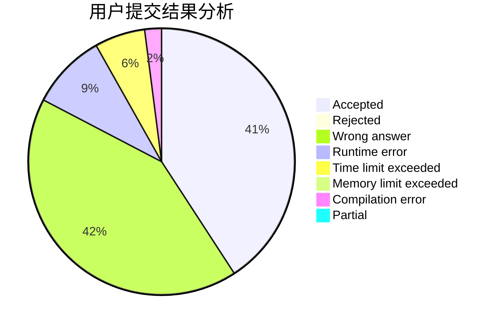
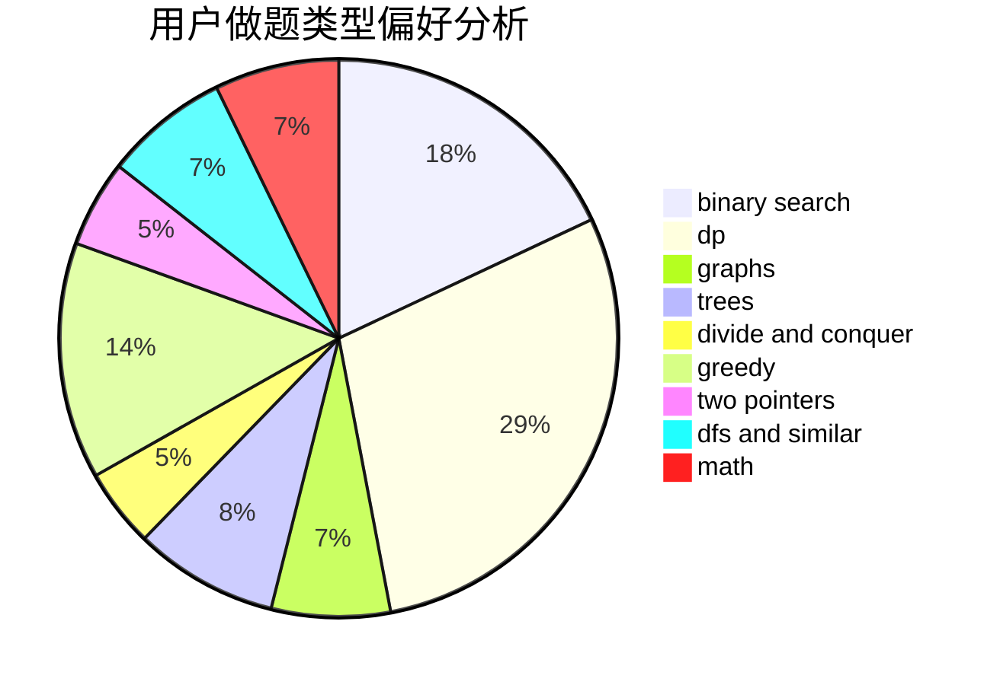

# FengWithoutDancing

<!-- tabs:start -->

#### **用户提交结果分析**

#### **用户做题类型偏好分析**

<!-- tabs:end -->
# 推荐题目
[1375E](https://codeforces.com/contest/1375/problem/E)
[1485E](https://codeforces.com/contest/1485/problem/E)
[864C](https://codeforces.com/contest/864/problem/C)
[1482E](https://codeforces.com/contest/1482/problem/E)
[1365A](https://codeforces.com/contest/1365/problem/A)
[1199A](https://codeforces.com/contest/1199/problem/A)
[1373A](https://codeforces.com/contest/1373/problem/A)
[294B](https://codeforces.com/contest/294/problem/B)
[863E](https://codeforces.com/contest/863/problem/E)
[1091B](https://codeforces.com/contest/1091/problem/B)
