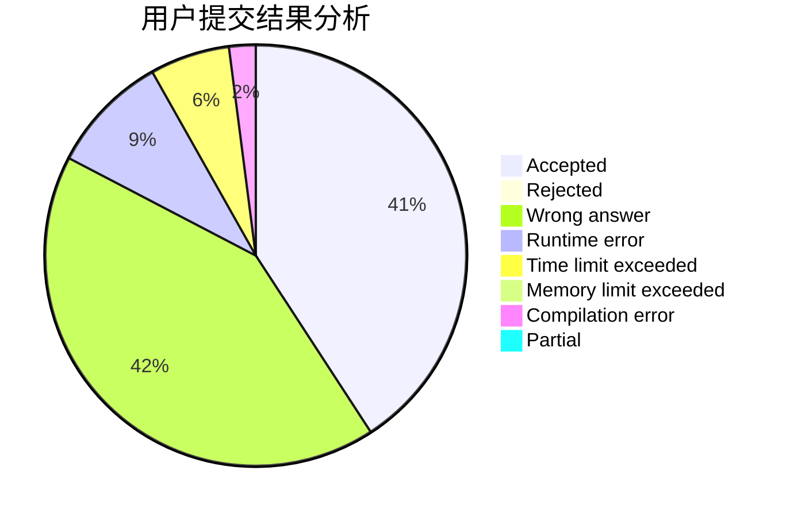
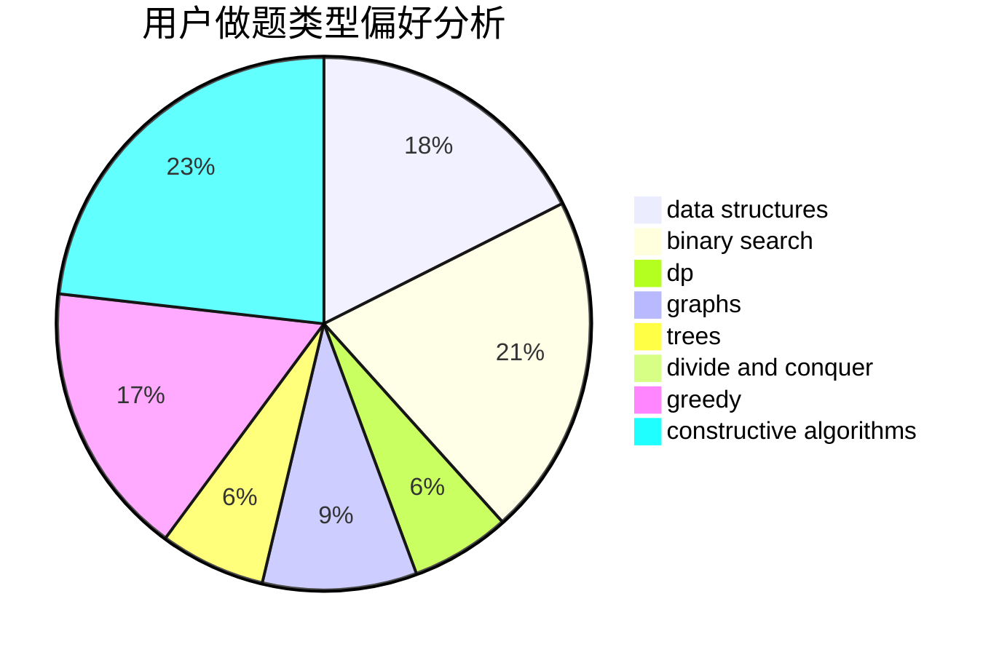
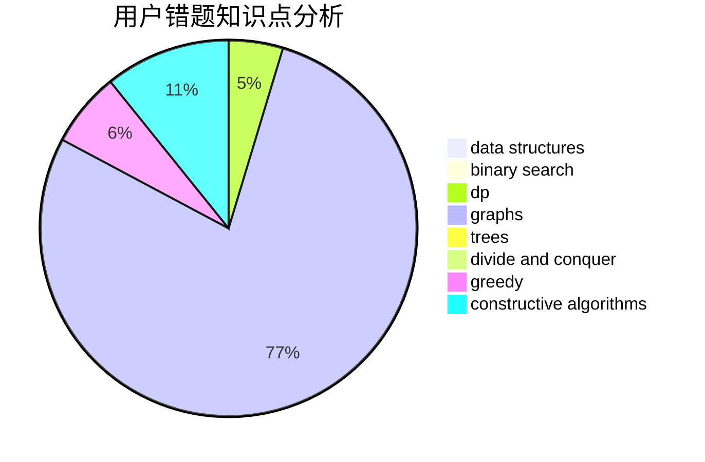

# FengWithoutDancing

<!-- tabs:start -->

#### **用户提交结果分析**

#### **用户做题类型偏好分析**

#### **用户错题知识点分析**

<!-- tabs:end -->
# 推荐题目
[1368F](https://codeforces.com/contest/1368/problem/F)		games,
                        implementation,
                        interactive,
                        math		  
[1476G](https://codeforces.com/contest/1476/problem/G)		data structures,
                        hashing,
                        sortings,
                        two pointers		  
[846A](https://codeforces.com/contest/846/problem/A)		brute force,
                        implementation		  
[1474A](https://codeforces.com/contest/1474/problem/A)		greedy		  
[1357C1](https://codeforces.com/contest/1357C/problem/1)		nan		  
[1194E](https://codeforces.com/contest/1194/problem/E)		bitmasks,
                        brute force,
                        data structures,
                        geometry,
                        sortings		  
[1366B](https://codeforces.com/contest/1366/problem/B)		math,
                        two pointers		  
[279B](https://codeforces.com/contest/279/problem/B)		binary search,
                        brute force,
                        implementation,
                        two pointers		  
[845D](https://codeforces.com/contest/845/problem/D)		data structures,
                        dp,
                        greedy		  
[1090F](https://codeforces.com/contest/1090/problem/F)		constructive algorithms,
                        interactive		  
