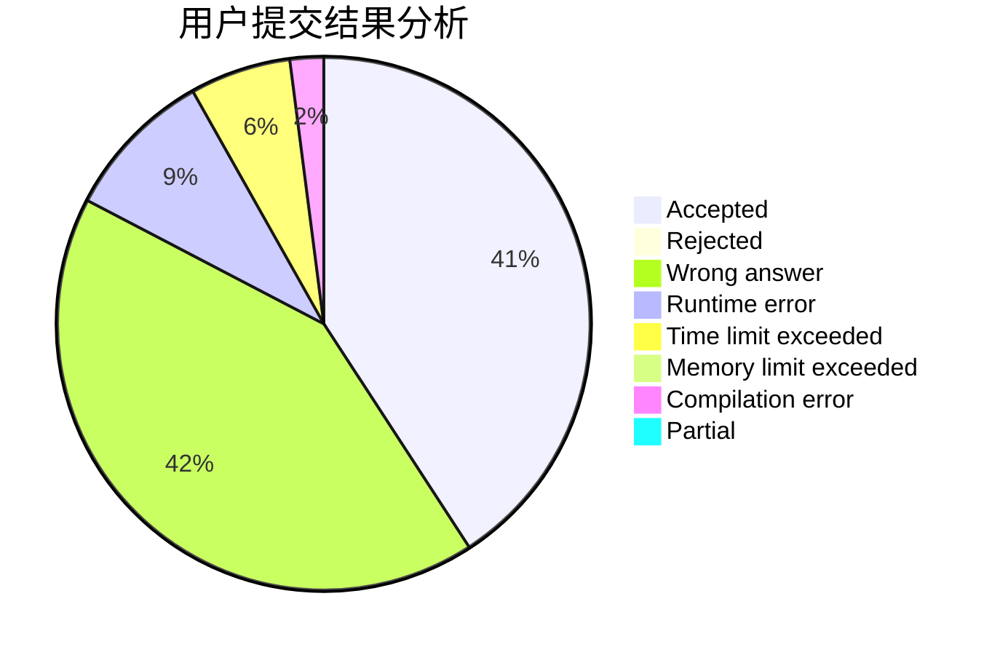
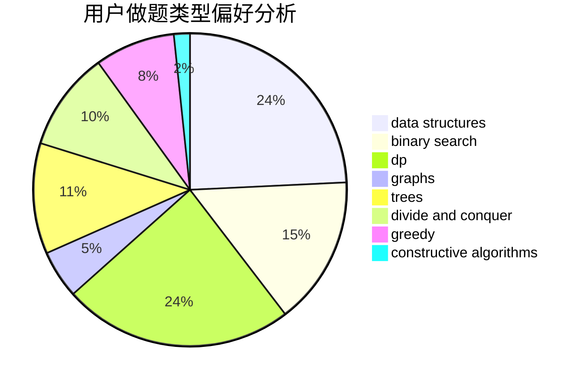
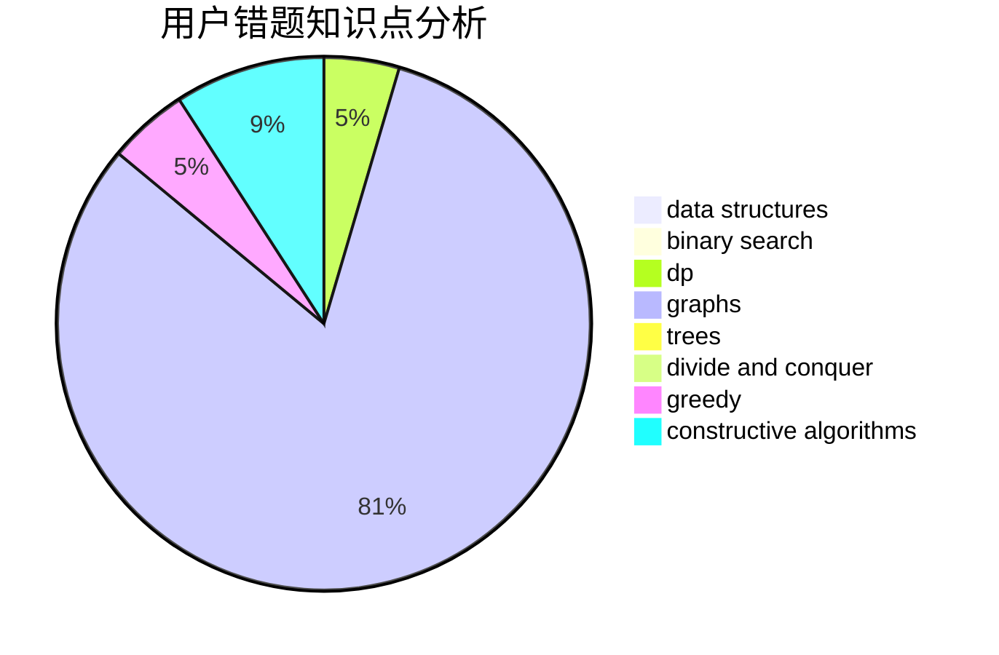

# FengWithoutDancing

<!-- tabs:start -->

#### **用户提交结果分析**

#### **用户做题类型偏好分析**

#### **用户错题知识点分析**

<!-- tabs:end -->
# 推荐题目
[1375E](https://codeforces.com/contest/1375/problem/E)		constructive algorithms,
                        greedy,
                        sortings		  
[1485E](https://codeforces.com/contest/1485/problem/E)		dfs and similar,
                        dp,
                        greedy,
                        trees		  
[864C](https://codeforces.com/contest/864/problem/C)		greedy,
                        implementation,
                        math		  
[1482E](https://codeforces.com/contest/1482/problem/E)		data structures,
                        divide and conquer,
                        dp		  
[1365A](https://codeforces.com/contest/1365/problem/A)		games,
                        greedy,
                        implementation		  
[1199A](https://codeforces.com/contest/1199/problem/A)		implementation		  
[1373A](https://codeforces.com/contest/1373/problem/A)		greedy,
                        implementation,
                        math		  
[294B](https://codeforces.com/contest/294/problem/B)		dp,
                        greedy		  
[863E](https://codeforces.com/contest/863/problem/E)		data structures,
                        sortings		  
[1091B](https://codeforces.com/contest/1091/problem/B)		brute force,
                        constructive algorithms,
                        greedy,
                        implementation		  
