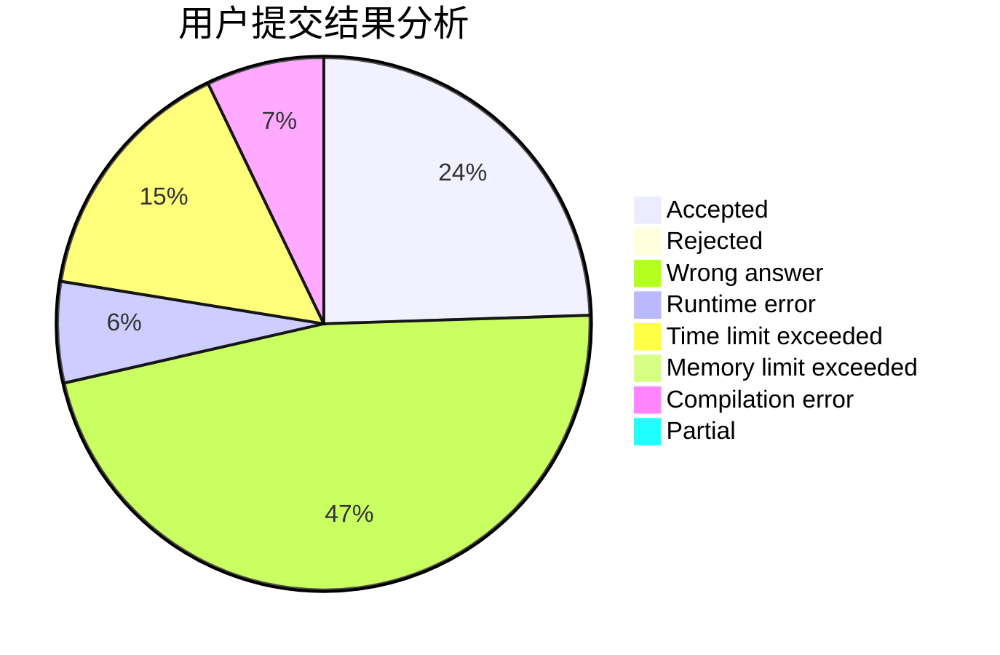
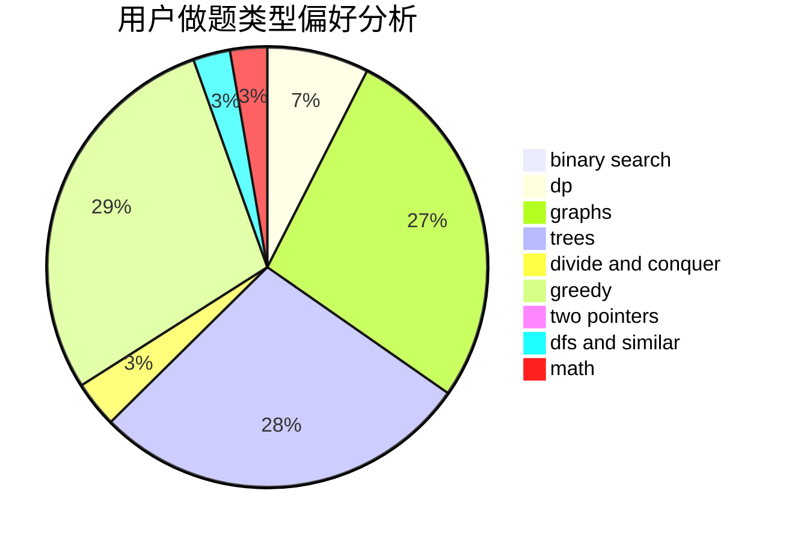

# FengZ

<!-- tabs:start -->

#### **用户提交结果分析**

#### **用户做题类型偏好分析**

<!-- tabs:end -->
# 推荐题目
[749A](https://codeforces.com/contest/749/problem/A)
[632E](https://codeforces.com/contest/632/problem/E)
[1408E](https://codeforces.com/contest/1408/problem/E)
[1373C](https://codeforces.com/contest/1373/problem/C)
[1152D](https://codeforces.com/contest/1152/problem/D)
[741C](https://codeforces.com/contest/741/problem/C)
[1490C](https://codeforces.com/contest/1490/problem/C)
[1497B](https://codeforces.com/contest/1497/problem/B)
[1491C](https://codeforces.com/contest/1491/problem/C)
[1484C](https://codeforces.com/contest/1484/problem/C)
