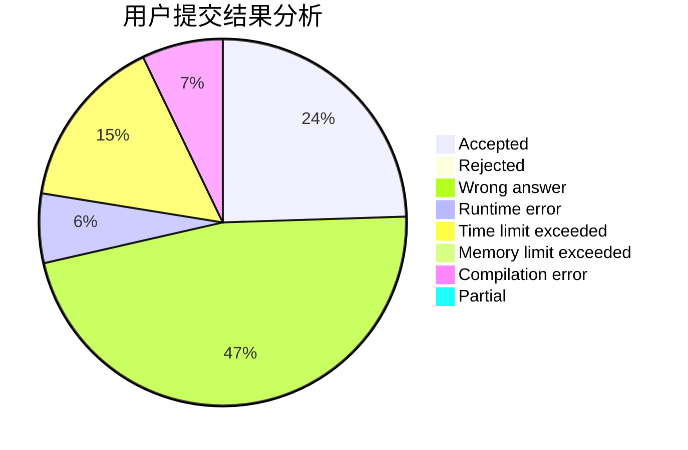
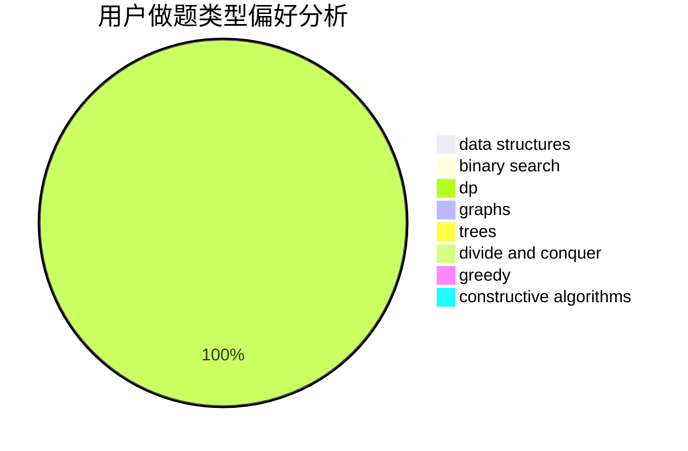
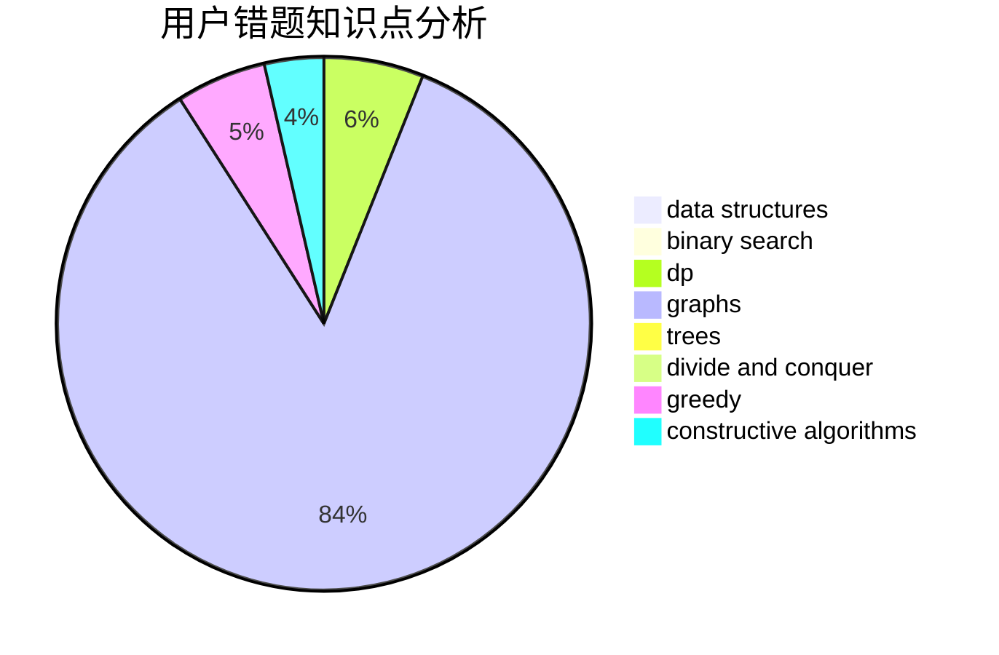

# FengZ

<!-- tabs:start -->

#### **用户提交结果分析**

#### **用户做题类型偏好分析**

#### **用户错题知识点分析**

<!-- tabs:end -->
# 推荐题目
[749A](https://codeforces.com/contest/749/problem/A)		greedy,
                        implementation,
                        math,
                        number theory		  
[632E](https://codeforces.com/contest/632/problem/E)		divide and conquer,
                        dp,
                        fft,
                        math		  
[1408E](https://codeforces.com/contest/1408/problem/E)		data structures,
                        dsu,
                        graphs,
                        greedy,
                        sortings,
                        trees		  
[1373C](https://codeforces.com/contest/1373/problem/C)		math		  
[1152D](https://codeforces.com/contest/1152/problem/D)		dp,
                        greedy,
                        trees		  
[741C](https://codeforces.com/contest/741/problem/C)		constructive algorithms,
                        dfs and similar,
                        graphs		  
[1490C](https://codeforces.com/contest/1490/problem/C)		binary search,
                        brute force,
                        brute force,
                        math		  
[1497B](https://codeforces.com/contest/1497/problem/B)		constructive algorithms,
                        greedy,
                        math		  
[1491C](https://codeforces.com/contest/1491/problem/C)		brute force,
                        data structures,
                        dp,
                        greedy,
                        implementation		  
[1484C](https://codeforces.com/contest/1484/problem/C)		dsu,graphs,sortings,trees		  
