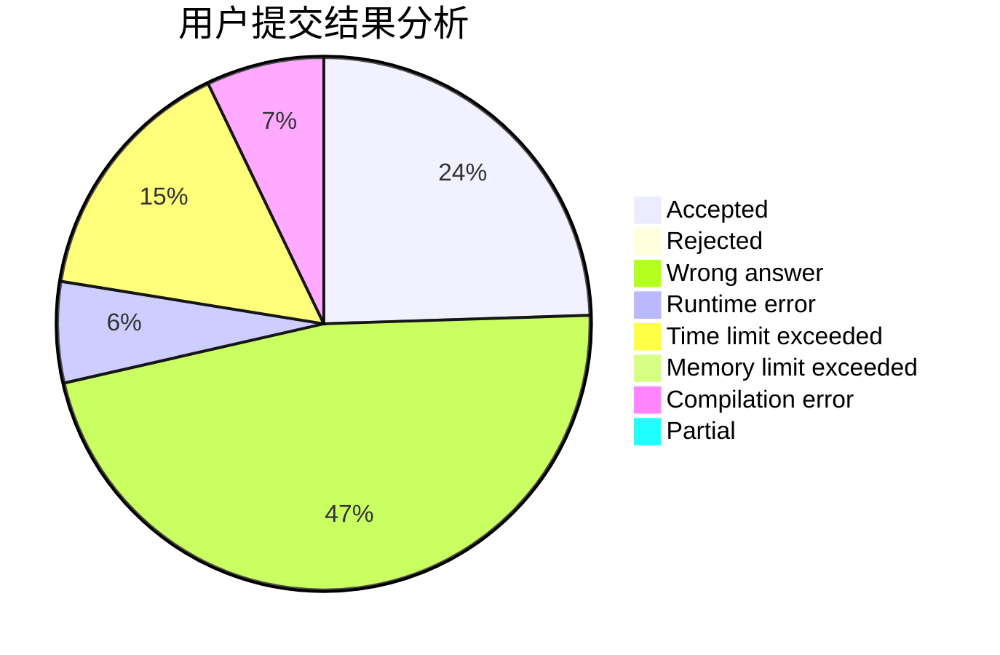
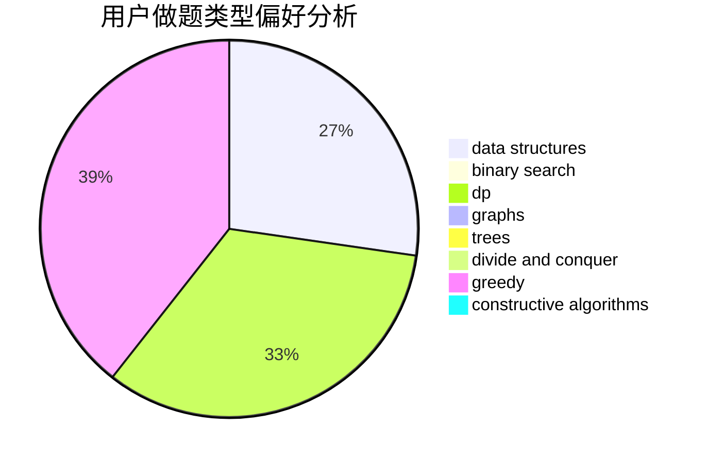
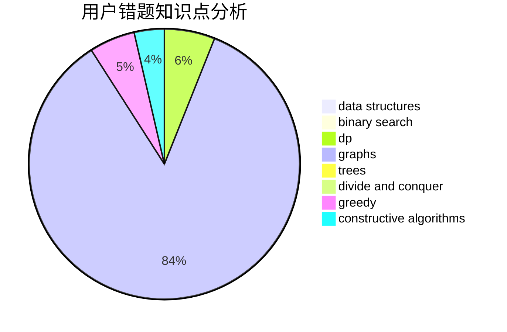

# FengZ

<!-- tabs:start -->

#### **用户提交结果分析**

#### **用户做题类型偏好分析**

#### **用户错题知识点分析**

<!-- tabs:end -->
# 推荐题目
[730J](https://codeforces.com/contest/730/problem/J)		dp		  
[613C](https://codeforces.com/contest/613/problem/C)		constructive algorithms,
                        math		  
[1399D](https://codeforces.com/contest/1399/problem/D)		constructive algorithms,
                        data structures,
                        greedy,
                        implementation		  
[1366D](https://codeforces.com/contest/1366/problem/D)		constructive algorithms,
                        math,
                        number theory		  
[1150D](https://codeforces.com/contest/1150/problem/D)		dsu,graphs,sortings,trees		  
[723F](https://codeforces.com/contest/723/problem/F)		dsu,
                        graphs,
                        greedy,
                        implementation		  
[1482E](https://codeforces.com/contest/1482/problem/E)		data structures,
                        divide and conquer,
                        dp		  
[1489D](https://codeforces.com/contest/1489/problem/D)		dsu,graphs,sortings,trees		  
[1483E](https://codeforces.com/contest/1483/problem/E)		dsu,graphs,sortings,trees		  
[1475F](https://codeforces.com/contest/1475/problem/F)		2-sat,
                        brute force,
                        constructive algorithms		  
