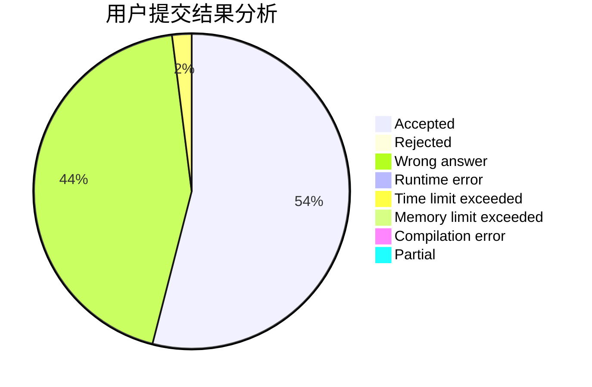
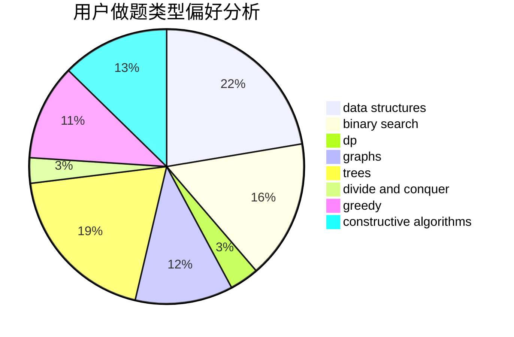
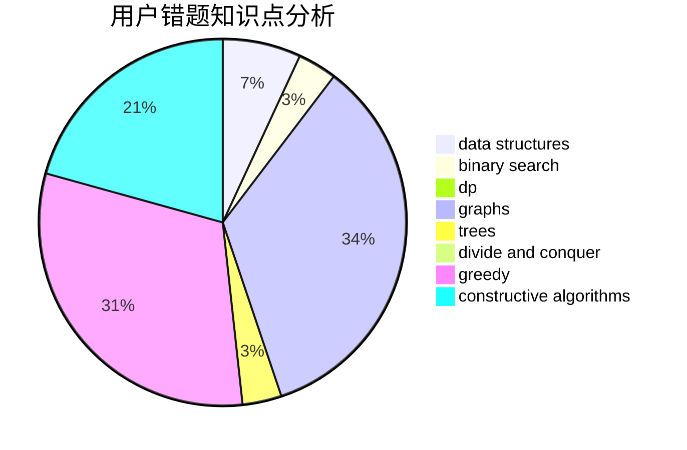

# Fesur8891

<!-- tabs:start -->

#### **用户提交结果分析**

#### **用户做题类型偏好分析**

#### **用户错题知识点分析**

<!-- tabs:end -->
# 推荐题目
[12271](https://codeforces.com/contest/1227/problem/1)		dsu,graphs,sortings,trees		  
[519B](https://codeforces.com/contest/519/problem/B)		data structures,
                        implementation,
                        sortings		  
[1347C](https://codeforces.com/contest/1347/problem/C)		dsu,graphs,sortings,trees		  
[659F](https://codeforces.com/contest/659/problem/F)		dfs and similar,
                        dsu,
                        graphs,
                        greedy,
                        sortings		  
[549E](https://codeforces.com/contest/549/problem/E)		geometry,
                        math		  
[1090D](https://codeforces.com/contest/1090/problem/D)		constructive algorithms		  
[1286A](https://codeforces.com/contest/1286/problem/A)		dp,
                        greedy,
                        sortings		  
[180C](https://codeforces.com/contest/180/problem/C)		dp		  
[1366B](https://codeforces.com/contest/1366/problem/B)		math,
                        two pointers		  
[645E](https://codeforces.com/contest/645/problem/E)		dp,
                        greedy,
                        strings		  
