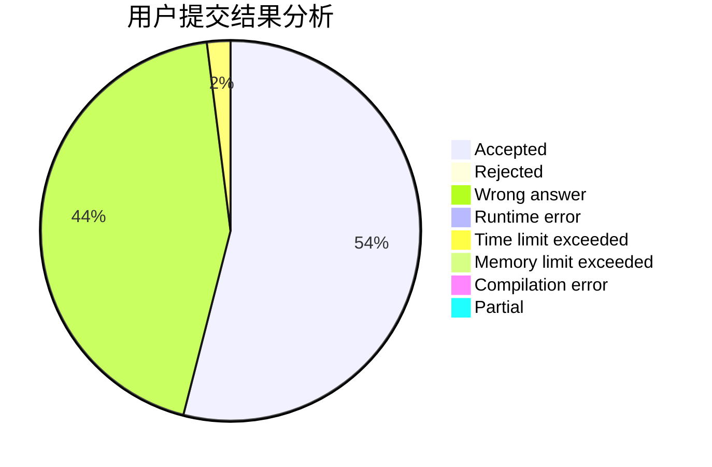
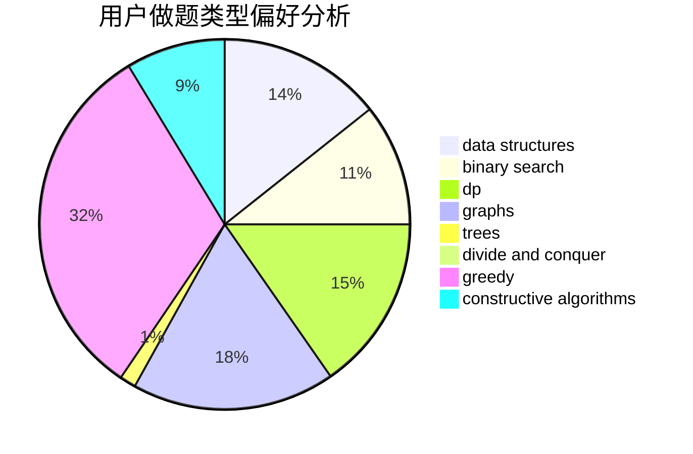
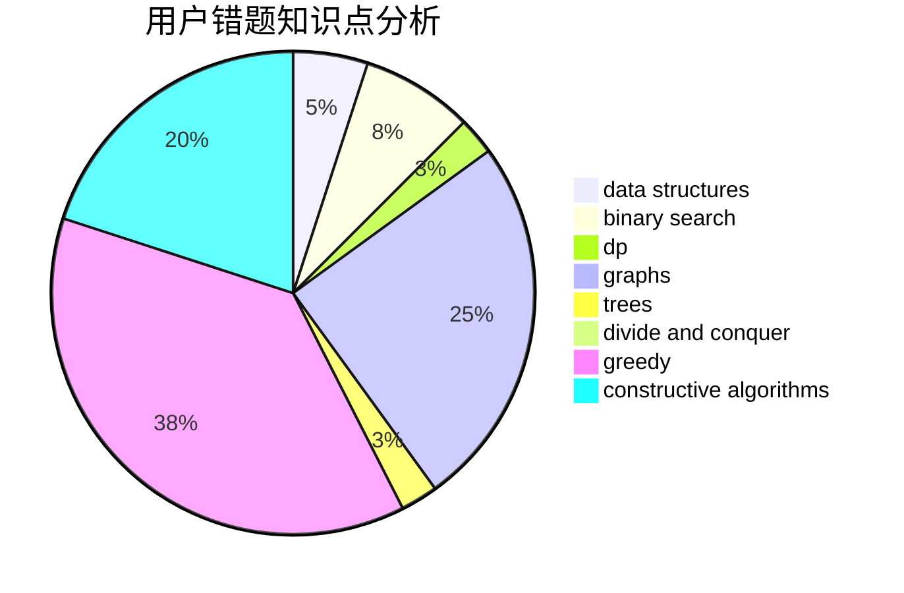

# Fesur8891
<!-- tabs:start -->
#### **用户提交结果分析**

#### **用户做题类型偏好分析**

#### **用户错题知识点分析**

<!-- tabs:end -->
# 推荐题目
[Root of quantum Fourier transform](http://codeforces.com/problemset/problem/1357/E2)		nan		  
[Codeforces World Finals](http://codeforces.com/problemset/problem/30/B)		implementation		  
[Cut and Paste](http://codeforces.com/problemset/problem/1280/A)		implementation,
                        math		  
[Xor Spanning Tree](https://codeforces.com/contest/1219/problem/B)		divide and conquer,
                        fft,
                        graphs		  
[Dorm Water Supply](https://codeforces.com/contest/108/problem/C)		dfs and similar,
                        graphs		  
[Array and Operations](http://codeforces.com/problemset/problem/498/C)		flows,
                        graph matchings,
                        number theory		  
[A Student's Dream](http://codeforces.com/problemset/problem/62/A)		greedy,
                        math		  
[Nastya and Time Machine](http://codeforces.com/problemset/problem/1340/D)		constructive algorithms,
                        dfs and similar,
                        graphs,
                        trees		  
[Bracket Subsequence](http://codeforces.com/problemset/problem/1023/C)		greedy		  
[Find a car](https://codeforces.com/contest/810/problem/E)		combinatorics,
                        divide and conquer,
                        dp		  
<!-- tabs:start -->
#### **data structures**
[Root of quantum Fourier transform](http://codeforces.com/problemset/problem/158/C)		*special problem,
                        data structures,
                        implementation		  
[Codeforces World Finals](http://codeforces.com/problemset/problem/746/F)		data structures,
                        greedy,
                        two pointers		  
[Cut and Paste](http://codeforces.com/problemset/problem/846/F)		data structures,
                        math,
                        probabilities,
                        two pointers		  
[Xor Spanning Tree](https://codeforces.com/contest/1248/problem/E)		data structures,
                        greedy,
                        implementation		  
[Dorm Water Supply](https://codeforces.com/contest/1447/problem/E)		binary search,
                        bitmasks,
                        data structures,
                        divide and conquer,
                        dp,
                        trees		  
[Array and Operations](http://codeforces.com/problemset/problem/777/B)		data structures,
                        dp,
                        greedy,
                        sortings		  
[A Student's Dream](http://codeforces.com/problemset/problem/235/C)		data structures,
                        string suffix structures,
                        strings		  
[Nastya and Time Machine](http://codeforces.com/problemset/problem/1492/C)		binary search,
                        data structures,
                        dp,
                        greedy,
                        two pointers		  
[Bracket Subsequence](http://codeforces.com/problemset/problem/1490/G)		binary search,
                        data structures,
                        math		  
[Find a car](http://codeforces.com/problemset/problem/1479/D)		binary search,
                        bitmasks,
                        brute force,
                        data structures,
                        probabilities,
                        trees		  
#### **binary search**
[Root of quantum Fourier transform](https://codeforces.com/contest/1447/problem/E)		binary search,
                        bitmasks,
                        data structures,
                        divide and conquer,
                        dp,
                        trees		  
[Codeforces World Finals](http://codeforces.com/problemset/problem/1360/H)		binary search,
                        bitmasks,
                        brute force,
                        constructive algorithms		  
[Cut and Paste](http://codeforces.com/problemset/problem/1492/C)		binary search,
                        data structures,
                        dp,
                        greedy,
                        two pointers		  
[Xor Spanning Tree](http://codeforces.com/problemset/problem/1463/D)		binary search,
                        constructive algorithms,
                        greedy,
                        two pointers		  
[Dorm Water Supply](http://codeforces.com/problemset/problem/1490/G)		binary search,
                        data structures,
                        math		  
[Array and Operations](http://codeforces.com/problemset/problem/1479/D)		binary search,
                        bitmasks,
                        brute force,
                        data structures,
                        probabilities,
                        trees		  
[A Student's Dream](http://codeforces.com/problemset/problem/1436/E)		binary search,
                        data structures,
                        two pointers		  
[Nastya and Time Machine](http://codeforces.com/problemset/problem/1461/D)		binary search,
                        brute force,
                        data structures,
                        divide and conquer,
                        implementation,
                        sortings		  
[Bracket Subsequence](http://codeforces.com/problemset/problem/1493/C)		binary search,
                        brute force,
                        constructive algorithms,
                        greedy,
                        strings		  
[Find a car](http://codeforces.com/problemset/problem/1487/D)		binary search,
                        brute force,
                        math,
                        number theory		  
#### **dp**
[Root of quantum Fourier transform](https://codeforces.com/contest/810/problem/E)		combinatorics,
                        divide and conquer,
                        dp		  
[Codeforces World Finals](http://codeforces.com/problemset/problem/1268/B)		dp,
                        greedy,
                        math		  
[Cut and Paste](http://codeforces.com/problemset/problem/145/C)		combinatorics,
                        dp,
                        math		  
[Xor Spanning Tree](http://codeforces.com/problemset/problem/758/D)		constructive algorithms,
                        dp,
                        greedy,
                        math,
                        strings		  
[Dorm Water Supply](https://codeforces.com/contest/1447/problem/E)		binary search,
                        bitmasks,
                        data structures,
                        divide and conquer,
                        dp,
                        trees		  
[Array and Operations](http://codeforces.com/problemset/problem/777/B)		data structures,
                        dp,
                        greedy,
                        sortings		  
[A Student's Dream](http://codeforces.com/problemset/problem/1475/B)		brute force,
                        dp,
                        math		  
[Nastya and Time Machine](http://codeforces.com/problemset/problem/1492/C)		binary search,
                        data structures,
                        dp,
                        greedy,
                        two pointers		  
[Bracket Subsequence](https://codeforces.com/contest/1457/problem/C)		brute force,
                        dp,
                        implementation		  
[Find a car](http://codeforces.com/problemset/problem/1491/C)		brute force,
                        data structures,
                        dp,
                        greedy,
                        implementation		  
#### **graph**
[Root of quantum Fourier transform](https://codeforces.com/contest/1219/problem/B)		divide and conquer,
                        fft,
                        graphs		  
[Codeforces World Finals](https://codeforces.com/contest/108/problem/C)		dfs and similar,
                        graphs		  
[Cut and Paste](http://codeforces.com/problemset/problem/498/C)		flows,
                        graph matchings,
                        number theory		  
[Xor Spanning Tree](http://codeforces.com/problemset/problem/1340/D)		constructive algorithms,
                        dfs and similar,
                        graphs,
                        trees		  
[Dorm Water Supply](https://codeforces.com/contest/1496/problem/E)		constructive algorithms,
                        graphs		  
[Array and Operations](http://codeforces.com/problemset/problem/1487/C)		brute force,
                        constructive algorithms,
                        dfs and similar,
                        graphs,
                        greedy,
                        implementation,
                        math		  
[A Student's Dream](http://codeforces.com/problemset/problem/1437/C)		dp,
                        flows,
                        graph matchings,
                        greedy,
                        math,
                        sortings		  
[Nastya and Time Machine](http://codeforces.com/problemset/problem/1470/D)		constructive algorithms,
                        dfs and similar,
                        graph matchings,
                        graphs,
                        greedy		  
[Bracket Subsequence](http://codeforces.com/problemset/problem/1476/C)		dp,
                        graphs,
                        greedy		  
[Find a car](http://codeforces.com/problemset/problem/1304/D)		constructive algorithms,
                        graphs,
                        greedy,
                        two pointers		  
#### **trees**
[Root of quantum Fourier transform](http://codeforces.com/problemset/problem/1340/D)		constructive algorithms,
                        dfs and similar,
                        graphs,
                        trees		  
[Codeforces World Finals](https://codeforces.com/contest/1447/problem/E)		binary search,
                        bitmasks,
                        data structures,
                        divide and conquer,
                        dp,
                        trees		  
[Cut and Paste](http://codeforces.com/problemset/problem/1479/D)		binary search,
                        bitmasks,
                        brute force,
                        data structures,
                        probabilities,
                        trees		  
[Xor Spanning Tree](http://codeforces.com/problemset/problem/1511/C)		brute force,
                        data structures,
                        implementation,
                        trees		  
[Dorm Water Supply](http://codeforces.com/problemset/problem/1499/F)		combinatorics,
                        dfs and similar,
                        dp,
                        trees		  
[Array and Operations](http://codeforces.com/problemset/problem/1491/E)		brute force,
                        dfs and similar,
                        divide and conquer,
                        number theory,
                        trees		  
[A Student's Dream](http://codeforces.com/problemset/problem/1466/D)		data structures,
                        greedy,
                        sortings,
                        trees		  
[Nastya and Time Machine](http://codeforces.com/problemset/problem/1495/D)		combinatorics,
                        dfs and similar,
                        graphs,
                        math,
                        shortest paths,
                        trees		  
[Bracket Subsequence](http://codeforces.com/problemset/problem/1303/G)		data structures,
                        divide and conquer,
                        geometry,
                        trees		  
[Find a car](http://codeforces.com/problemset/problem/1454/E)		combinatorics,
                        dfs and similar,
                        graphs,
                        trees		  
#### **divide and conquer**
[Root of quantum Fourier transform](https://codeforces.com/contest/1219/problem/B)		divide and conquer,
                        fft,
                        graphs		  
[Codeforces World Finals](https://codeforces.com/contest/810/problem/E)		combinatorics,
                        divide and conquer,
                        dp		  
[Cut and Paste](https://codeforces.com/contest/1447/problem/E)		binary search,
                        bitmasks,
                        data structures,
                        divide and conquer,
                        dp,
                        trees		  
[Xor Spanning Tree](http://codeforces.com/problemset/problem/1461/D)		binary search,
                        brute force,
                        data structures,
                        divide and conquer,
                        implementation,
                        sortings		  
[Dorm Water Supply](http://codeforces.com/problemset/problem/1466/G)		combinatorics,
                        divide and conquer,
                        hashing,
                        math,
                        string suffix structures,
                        strings		  
[Array and Operations](http://codeforces.com/problemset/problem/1490/D)		dfs and similar,
                        divide and conquer,
                        implementation		  
[A Student's Dream](https://codeforces.com/contest/1483/problem/C)		data structures,
                        divide and conquer,
                        dp		  
[Nastya and Time Machine](http://codeforces.com/problemset/problem/1491/E)		brute force,
                        dfs and similar,
                        divide and conquer,
                        number theory,
                        trees		  
[Bracket Subsequence](http://codeforces.com/problemset/problem/1303/G)		data structures,
                        divide and conquer,
                        geometry,
                        trees		  
[Find a car](http://codeforces.com/problemset/problem/1494/D)		constructive algorithms,
                        data structures,
                        dfs and similar,
                        divide and conquer,
                        dsu,
                        greedy,
                        sortings,
                        trees		  
#### **greedy**
[Root of quantum Fourier transform](http://codeforces.com/problemset/problem/62/A)		greedy,
                        math		  
[Codeforces World Finals](http://codeforces.com/problemset/problem/1023/C)		greedy		  
[Cut and Paste](http://codeforces.com/problemset/problem/731/B)		constructive algorithms,
                        greedy		  
[Xor Spanning Tree](http://codeforces.com/problemset/problem/746/F)		data structures,
                        greedy,
                        two pointers		  
[Dorm Water Supply](http://codeforces.com/problemset/problem/1132/A)		greedy,
                        implementation		  
[Array and Operations](http://codeforces.com/problemset/problem/525/B)		constructive algorithms,
                        greedy,
                        math,
                        strings		  
[A Student's Dream](http://codeforces.com/problemset/problem/1268/B)		dp,
                        greedy,
                        math		  
[Nastya and Time Machine](http://codeforces.com/problemset/problem/758/D)		constructive algorithms,
                        dp,
                        greedy,
                        math,
                        strings		  
[Bracket Subsequence](https://codeforces.com/contest/1248/problem/E)		data structures,
                        greedy,
                        implementation		  
[Find a car](http://codeforces.com/problemset/problem/777/B)		data structures,
                        dp,
                        greedy,
                        sortings		  
#### **constructive algorithms**
[Root of quantum Fourier transform](http://codeforces.com/problemset/problem/1340/D)		constructive algorithms,
                        dfs and similar,
                        graphs,
                        trees		  
[Codeforces World Finals](http://codeforces.com/problemset/problem/731/B)		constructive algorithms,
                        greedy		  
[Cut and Paste](http://codeforces.com/problemset/problem/297/C)		constructive algorithms		  
[Xor Spanning Tree](http://codeforces.com/problemset/problem/1326/A)		constructive algorithms,
                        number theory		  
[Dorm Water Supply](http://codeforces.com/problemset/problem/814/B)		constructive algorithms		  
[Array and Operations](http://codeforces.com/problemset/problem/525/B)		constructive algorithms,
                        greedy,
                        math,
                        strings		  
[A Student's Dream](http://codeforces.com/problemset/problem/679/A)		constructive algorithms,
                        interactive,
                        math		  
[Nastya and Time Machine](http://codeforces.com/problemset/problem/42/D)		constructive algorithms,
                        math		  
[Bracket Subsequence](http://codeforces.com/problemset/problem/758/D)		constructive algorithms,
                        dp,
                        greedy,
                        math,
                        strings		  
[Find a car](https://codeforces.com/contest/1496/problem/E)		constructive algorithms,
                        graphs		  
#### **sortings**
[Root of quantum Fourier transform](http://codeforces.com/problemset/problem/1478/C)		implementation,
                        math,
                        sortings		  
[Codeforces World Finals](http://codeforces.com/problemset/problem/777/B)		data structures,
                        dp,
                        greedy,
                        sortings		  
[Cut and Paste](https://codeforces.com/contest/1496/problem/C)		geometry,
                        greedy,
                        math,
                        sortings		  
[Xor Spanning Tree](http://codeforces.com/problemset/problem/1495/A)		geometry,
                        greedy,
                        math,
                        sortings		  
[Dorm Water Supply](http://codeforces.com/problemset/problem/1497/A)		brute force,
                        data structures,
                        greedy,
                        sortings		  
[Array and Operations](http://codeforces.com/problemset/problem/1427/A)		math,
                        sortings		  
[A Student's Dream](http://codeforces.com/problemset/problem/1461/D)		binary search,
                        brute force,
                        data structures,
                        divide and conquer,
                        implementation,
                        sortings		  
[Nastya and Time Machine](http://codeforces.com/problemset/problem/1437/C)		dp,
                        flows,
                        graph matchings,
                        greedy,
                        math,
                        sortings		  
[Bracket Subsequence](http://codeforces.com/problemset/problem/1473/A)		greedy,
                        implementation,
                        math,
                        sortings		  
[Find a car](http://codeforces.com/problemset/problem/1486/B)		binary search,
                        geometry,
                        shortest paths,
                        sortings		  
<!-- tabs:end -->
