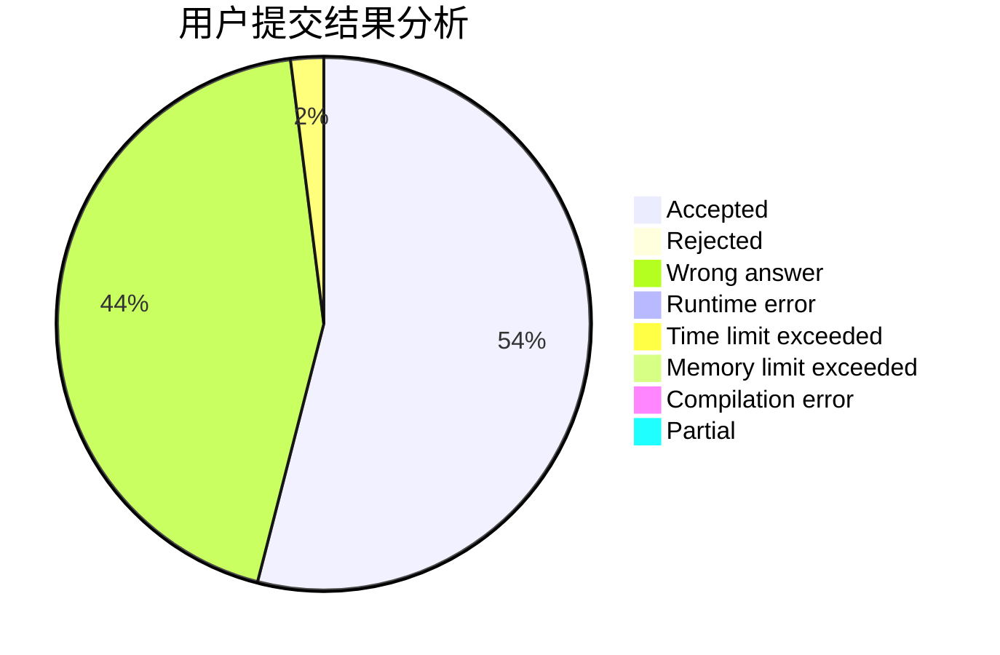
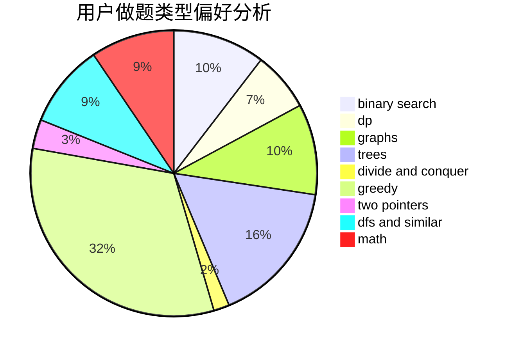

# Fesur8891

<!-- tabs:start -->

#### **用户提交结果分析**

#### **用户做题类型偏好分析**

<!-- tabs:end -->
# 推荐题目
[12271](https://codeforces.com/contest/1227/problem/1)
[519B](https://codeforces.com/contest/519/problem/B)
[1347C](https://codeforces.com/contest/1347/problem/C)
[659F](https://codeforces.com/contest/659/problem/F)
[549E](https://codeforces.com/contest/549/problem/E)
[1090D](https://codeforces.com/contest/1090/problem/D)
[1286A](https://codeforces.com/contest/1286/problem/A)
[180C](https://codeforces.com/contest/180/problem/C)
[1366B](https://codeforces.com/contest/1366/problem/B)
[645E](https://codeforces.com/contest/645/problem/E)
