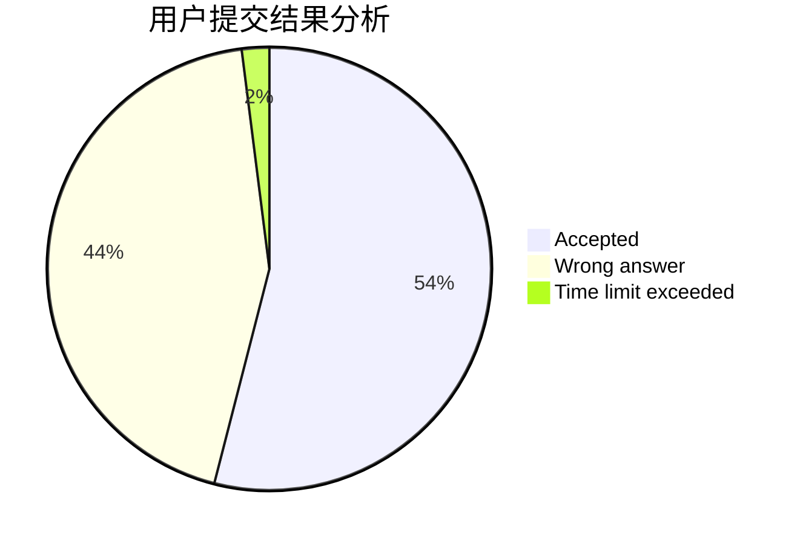
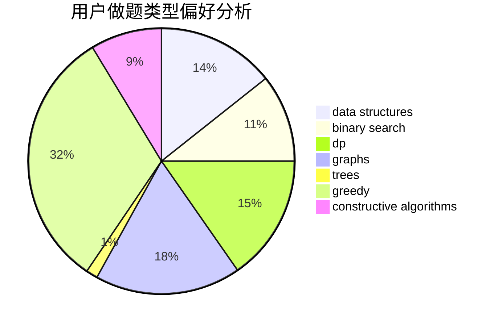
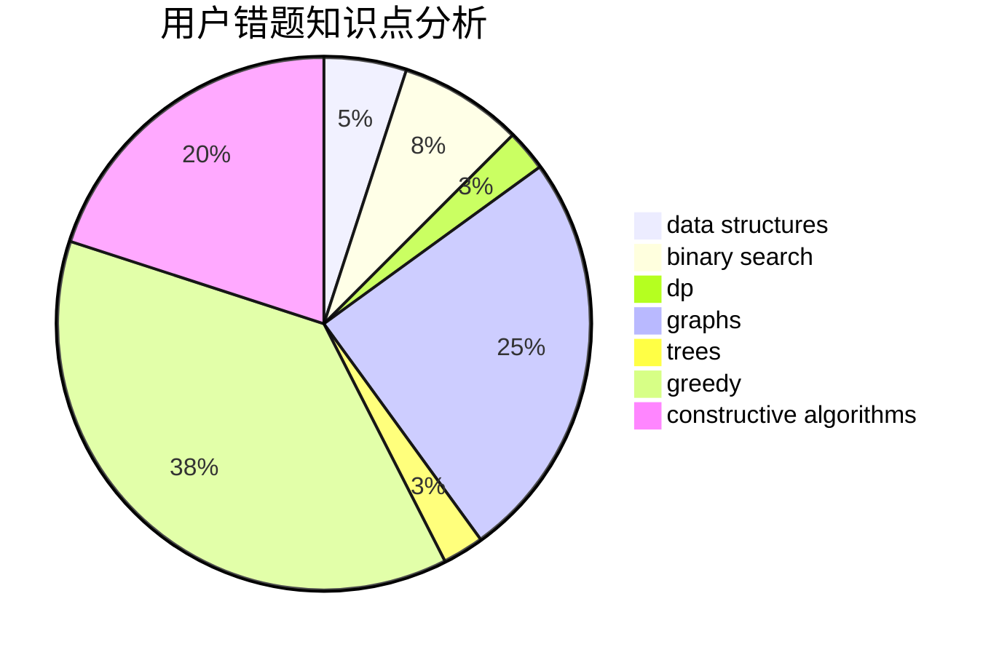

# Fesur8891
<!-- tabs:start -->
#### **用户提交结果分析**

#### **用户做题类型偏好分析**

#### **用户错题知识点分析**

<!-- tabs:end -->
# 推荐题目
[Root of quantum Fourier transform](http://codeforces.com/problemset/problem/1357/E2)		nan		  
[Codeforces World Finals](http://codeforces.com/problemset/problem/30/B)		implementation		  
[Cut and Paste](http://codeforces.com/problemset/problem/1280/A)		implementation,
                        math		  
[Xor Spanning Tree](https://codeforces.com/contest/1219/problem/B)		divide and conquer,
                        fft,
                        graphs		  
[Dorm Water Supply](https://codeforces.com/contest/108/problem/C)		dfs and similar,
                        graphs		  
[Array and Operations](http://codeforces.com/problemset/problem/498/C)		flows,
                        graph matchings,
                        number theory		  
[A Student's Dream](http://codeforces.com/problemset/problem/62/A)		greedy,
                        math		  
[Nastya and Time Machine](http://codeforces.com/problemset/problem/1340/D)		constructive algorithms,
                        dfs and similar,
                        graphs,
                        trees		  
[Bracket Subsequence](http://codeforces.com/problemset/problem/1023/C)		greedy		  
[Find a car](https://codeforces.com/contest/810/problem/E)		combinatorics,
                        divide and conquer,
                        dp		  
<!-- tabs:start -->
#### **data structures**
[Cd and pwd commands](http://codeforces.com/problemset/problem/158/C)		*special problem,
                        data structures,
                        implementation		  
[Music in Car](http://codeforces.com/problemset/problem/746/F)		data structures,
                        greedy,
                        two pointers		  
[Random Query](http://codeforces.com/problemset/problem/846/F)		data structures,
                        math,
                        probabilities,
                        two pointers		  
[Queue in the Train](https://codeforces.com/contest/1248/problem/E)		data structures,
                        greedy,
                        implementation		  
[Xor Tree](https://codeforces.com/contest/1447/problem/E)		binary search,
                        bitmasks,
                        data structures,
                        divide and conquer,
                        dp,
                        trees		  
[Game of Credit Cards](http://codeforces.com/problemset/problem/777/B)		data structures,
                        dp,
                        greedy,
                        sortings		  
[Cyclical Quest](http://codeforces.com/problemset/problem/235/C)		data structures,
                        string suffix structures,
                        strings		  
[Maximum width](http://codeforces.com/problemset/problem/1492/C)		binary search,
                        data structures,
                        dp,
                        greedy,
                        two pointers		  
[Old Floppy Drive](http://codeforces.com/problemset/problem/1490/G)		binary search,
                        data structures,
                        math		  
[Odd Mineral Resource](http://codeforces.com/problemset/problem/1479/D)		binary search,
                        bitmasks,
                        brute force,
                        data structures,
                        probabilities,
                        trees		  
#### **binary search**
[Xor Tree](https://codeforces.com/contest/1447/problem/E)		binary search,
                        bitmasks,
                        data structures,
                        divide and conquer,
                        dp,
                        trees		  
[Binary Median](http://codeforces.com/problemset/problem/1360/H)		binary search,
                        bitmasks,
                        brute force,
                        constructive algorithms		  
[Maximum width](http://codeforces.com/problemset/problem/1492/C)		binary search,
                        data structures,
                        dp,
                        greedy,
                        two pointers		  
[Pairs](http://codeforces.com/problemset/problem/1463/D)		binary search,
                        constructive algorithms,
                        greedy,
                        two pointers		  
[Old Floppy Drive](http://codeforces.com/problemset/problem/1490/G)		binary search,
                        data structures,
                        math		  
[Odd Mineral Resource](http://codeforces.com/problemset/problem/1479/D)		binary search,
                        bitmasks,
                        brute force,
                        data structures,
                        probabilities,
                        trees		  
[Complicated Computations](http://codeforces.com/problemset/problem/1436/E)		binary search,
                        data structures,
                        two pointers		  
[Divide and Summarize](http://codeforces.com/problemset/problem/1461/D)		binary search,
                        brute force,
                        data structures,
                        divide and conquer,
                        implementation,
                        sortings		  
[K-beautiful Strings](http://codeforces.com/problemset/problem/1493/C)		binary search,
                        brute force,
                        constructive algorithms,
                        greedy,
                        strings		  
[Pythagorean Triples](http://codeforces.com/problemset/problem/1487/D)		binary search,
                        brute force,
                        math,
                        number theory		  
#### **dp**
[Find a car](https://codeforces.com/contest/810/problem/E)		combinatorics,
                        divide and conquer,
                        dp		  
[Domino for Young](http://codeforces.com/problemset/problem/1268/B)		dp,
                        greedy,
                        math		  
[Lucky Subsequence](http://codeforces.com/problemset/problem/145/C)		combinatorics,
                        dp,
                        math		  
[Ability To Convert](http://codeforces.com/problemset/problem/758/D)		constructive algorithms,
                        dp,
                        greedy,
                        math,
                        strings		  
[Xor Tree](https://codeforces.com/contest/1447/problem/E)		binary search,
                        bitmasks,
                        data structures,
                        divide and conquer,
                        dp,
                        trees		  
[Game of Credit Cards](http://codeforces.com/problemset/problem/777/B)		data structures,
                        dp,
                        greedy,
                        sortings		  
[New Year's Number](http://codeforces.com/problemset/problem/1475/B)		brute force,
                        dp,
                        math		  
[Maximum width](http://codeforces.com/problemset/problem/1492/C)		binary search,
                        data structures,
                        dp,
                        greedy,
                        two pointers		  
[Bouncing Ball](https://codeforces.com/contest/1457/problem/C)		brute force,
                        dp,
                        implementation		  
[Pekora and Trampoline](http://codeforces.com/problemset/problem/1491/C)		brute force,
                        data structures,
                        dp,
                        greedy,
                        implementation		  
#### **graph**
[Xor Spanning Tree](https://codeforces.com/contest/1219/problem/B)		divide and conquer,
                        fft,
                        graphs		  
[Dorm Water Supply](https://codeforces.com/contest/108/problem/C)		dfs and similar,
                        graphs		  
[Array and Operations](http://codeforces.com/problemset/problem/498/C)		flows,
                        graph matchings,
                        number theory		  
[Nastya and Time Machine](http://codeforces.com/problemset/problem/1340/D)		constructive algorithms,
                        dfs and similar,
                        graphs,
                        trees		  
[Garden of the Sun](https://codeforces.com/contest/1496/problem/E)		constructive algorithms,
                        graphs		  
[Minimum Ties](http://codeforces.com/problemset/problem/1487/C)		brute force,
                        constructive algorithms,
                        dfs and similar,
                        graphs,
                        greedy,
                        implementation,
                        math		  
[Chef Monocarp](http://codeforces.com/problemset/problem/1437/C)		dp,
                        flows,
                        graph matchings,
                        greedy,
                        math,
                        sortings		  
[Strange Housing](http://codeforces.com/problemset/problem/1470/D)		constructive algorithms,
                        dfs and similar,
                        graph matchings,
                        graphs,
                        greedy		  
[Longest Simple Cycle](http://codeforces.com/problemset/problem/1476/C)		dp,
                        graphs,
                        greedy		  
[Shortest and Longest LIS](http://codeforces.com/problemset/problem/1304/D)		constructive algorithms,
                        graphs,
                        greedy,
                        two pointers		  
#### **trees**
[Nastya and Time Machine](http://codeforces.com/problemset/problem/1340/D)		constructive algorithms,
                        dfs and similar,
                        graphs,
                        trees		  
[Xor Tree](https://codeforces.com/contest/1447/problem/E)		binary search,
                        bitmasks,
                        data structures,
                        divide and conquer,
                        dp,
                        trees		  
[Odd Mineral Resource](http://codeforces.com/problemset/problem/1479/D)		binary search,
                        bitmasks,
                        brute force,
                        data structures,
                        probabilities,
                        trees		  
[Yet Another Card Deck](http://codeforces.com/problemset/problem/1511/C)		brute force,
                        data structures,
                        implementation,
                        trees		  
[Diameter Cuts](http://codeforces.com/problemset/problem/1499/F)		combinatorics,
                        dfs and similar,
                        dp,
                        trees		  
[Fib-tree](http://codeforces.com/problemset/problem/1491/E)		brute force,
                        dfs and similar,
                        divide and conquer,
                        number theory,
                        trees		  
[13th Labour of Heracles](http://codeforces.com/problemset/problem/1466/D)		data structures,
                        greedy,
                        sortings,
                        trees		  
[BFS Trees](http://codeforces.com/problemset/problem/1495/D)		combinatorics,
                        dfs and similar,
                        graphs,
                        math,
                        shortest paths,
                        trees		  
[Sum of Prefix Sums](http://codeforces.com/problemset/problem/1303/G)		data structures,
                        divide and conquer,
                        geometry,
                        trees		  
[Number of Simple Paths](http://codeforces.com/problemset/problem/1454/E)		combinatorics,
                        dfs and similar,
                        graphs,
                        trees		  
#### **divide and conquer**
[Xor Spanning Tree](https://codeforces.com/contest/1219/problem/B)		divide and conquer,
                        fft,
                        graphs		  
[Find a car](https://codeforces.com/contest/810/problem/E)		combinatorics,
                        divide and conquer,
                        dp		  
[Xor Tree](https://codeforces.com/contest/1447/problem/E)		binary search,
                        bitmasks,
                        data structures,
                        divide and conquer,
                        dp,
                        trees		  
[Divide and Summarize](http://codeforces.com/problemset/problem/1461/D)		binary search,
                        brute force,
                        data structures,
                        divide and conquer,
                        implementation,
                        sortings		  
[Song of the Sirens](http://codeforces.com/problemset/problem/1466/G)		combinatorics,
                        divide and conquer,
                        hashing,
                        math,
                        string suffix structures,
                        strings		  
[Permutation Transformation](http://codeforces.com/problemset/problem/1490/D)		dfs and similar,
                        divide and conquer,
                        implementation		  
[Skyline Photo](https://codeforces.com/contest/1483/problem/C)		data structures,
                        divide and conquer,
                        dp		  
[Fib-tree](http://codeforces.com/problemset/problem/1491/E)		brute force,
                        dfs and similar,
                        divide and conquer,
                        number theory,
                        trees		  
[Sum of Prefix Sums](http://codeforces.com/problemset/problem/1303/G)		data structures,
                        divide and conquer,
                        geometry,
                        trees		  
[Dogeforces](http://codeforces.com/problemset/problem/1494/D)		constructive algorithms,
                        data structures,
                        dfs and similar,
                        divide and conquer,
                        dsu,
                        greedy,
                        sortings,
                        trees		  
#### **greedy**
[A Student's Dream](http://codeforces.com/problemset/problem/62/A)		greedy,
                        math		  
[Bracket Subsequence](http://codeforces.com/problemset/problem/1023/C)		greedy		  
[Coupons and Discounts](http://codeforces.com/problemset/problem/731/B)		constructive algorithms,
                        greedy		  
[Music in Car](http://codeforces.com/problemset/problem/746/F)		data structures,
                        greedy,
                        two pointers		  
[Regular Bracket Sequence](http://codeforces.com/problemset/problem/1132/A)		greedy,
                        implementation		  
[Pasha and String](http://codeforces.com/problemset/problem/525/B)		constructive algorithms,
                        greedy,
                        math,
                        strings		  
[Domino for Young](http://codeforces.com/problemset/problem/1268/B)		dp,
                        greedy,
                        math		  
[Ability To Convert](http://codeforces.com/problemset/problem/758/D)		constructive algorithms,
                        dp,
                        greedy,
                        math,
                        strings		  
[Queue in the Train](https://codeforces.com/contest/1248/problem/E)		data structures,
                        greedy,
                        implementation		  
[Game of Credit Cards](http://codeforces.com/problemset/problem/777/B)		data structures,
                        dp,
                        greedy,
                        sortings		  
#### **constructive algorithms**
[Nastya and Time Machine](http://codeforces.com/problemset/problem/1340/D)		constructive algorithms,
                        dfs and similar,
                        graphs,
                        trees		  
[Coupons and Discounts](http://codeforces.com/problemset/problem/731/B)		constructive algorithms,
                        greedy		  
[Splitting the Uniqueness](http://codeforces.com/problemset/problem/297/C)		constructive algorithms		  
[Bad Ugly Numbers](http://codeforces.com/problemset/problem/1326/A)		constructive algorithms,
                        number theory		  
[An express train to reveries](http://codeforces.com/problemset/problem/814/B)		constructive algorithms		  
[Pasha and String](http://codeforces.com/problemset/problem/525/B)		constructive algorithms,
                        greedy,
                        math,
                        strings		  
[Bear and Prime 100](http://codeforces.com/problemset/problem/679/A)		constructive algorithms,
                        interactive,
                        math		  
[Strange town](http://codeforces.com/problemset/problem/42/D)		constructive algorithms,
                        math		  
[Ability To Convert](http://codeforces.com/problemset/problem/758/D)		constructive algorithms,
                        dp,
                        greedy,
                        math,
                        strings		  
[Garden of the Sun](https://codeforces.com/contest/1496/problem/E)		constructive algorithms,
                        graphs		  
#### **sortings**
[Nezzar and Symmetric Array](http://codeforces.com/problemset/problem/1478/C)		implementation,
                        math,
                        sortings		  
[Game of Credit Cards](http://codeforces.com/problemset/problem/777/B)		data structures,
                        dp,
                        greedy,
                        sortings		  
[Diamond Miner](https://codeforces.com/contest/1496/problem/C)		geometry,
                        greedy,
                        math,
                        sortings		  
[Meximization](http://codeforces.com/problemset/problem/1497/A)		brute force,
                        data structures,
                        greedy,
                        sortings		  
[Avoiding Zero](http://codeforces.com/problemset/problem/1427/A)		math,
                        sortings		  
[Divide and Summarize](http://codeforces.com/problemset/problem/1461/D)		binary search,
                        brute force,
                        data structures,
                        divide and conquer,
                        implementation,
                        sortings		  
[Chef Monocarp](http://codeforces.com/problemset/problem/1437/C)		dp,
                        flows,
                        graph matchings,
                        greedy,
                        math,
                        sortings		  
[Replacing Elements](http://codeforces.com/problemset/problem/1473/A)		greedy,
                        implementation,
                        math,
                        sortings		  
[Eastern Exhibition](http://codeforces.com/problemset/problem/1486/B)		binary search,
                        geometry,
                        shortest paths,
                        sortings		  
[The Great Hero](http://codeforces.com/problemset/problem/1480/B)		greedy,
                        implementation,
                        sortings		  
<!-- tabs:end -->
