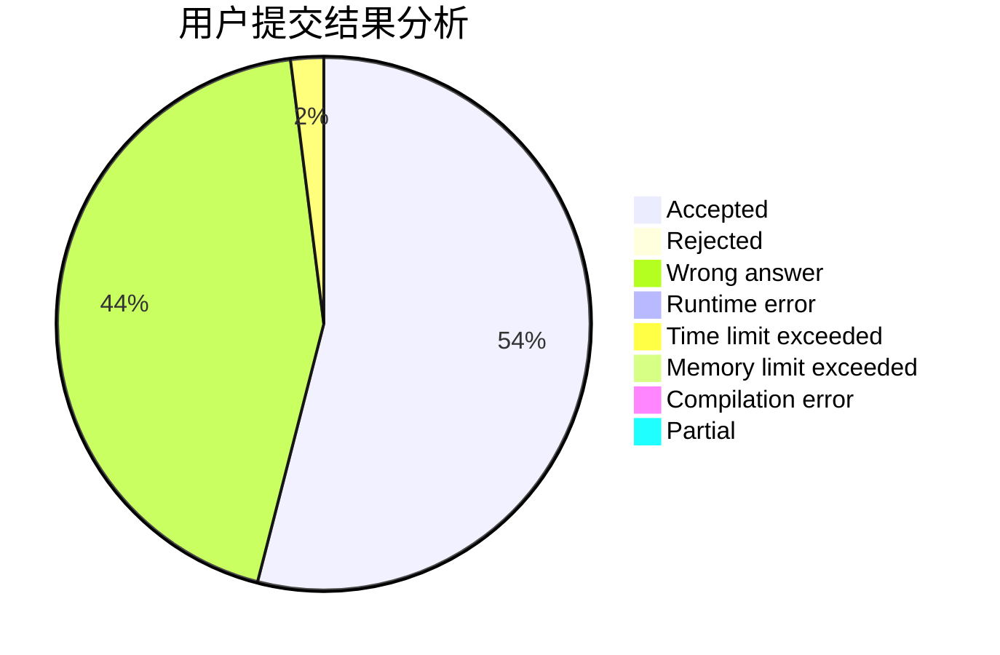
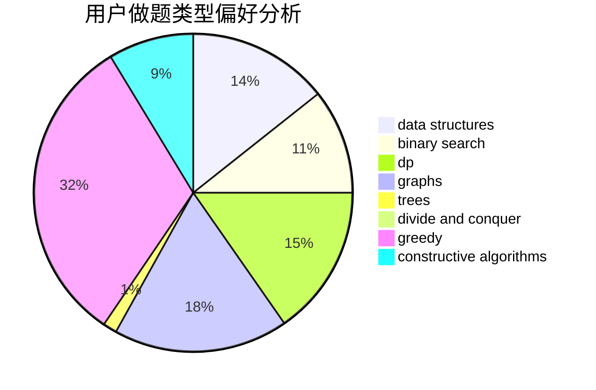
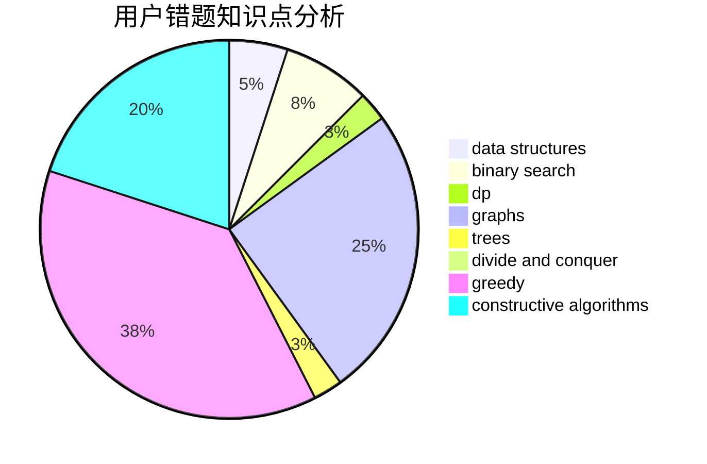

# Fesur8891

<!-- tabs:start -->

#### **用户提交结果分析**

#### **用户做题类型偏好分析**

#### **用户错题知识点分析**

<!-- tabs:end -->
# 推荐题目
[1219B](https://codeforces.com/contest/1219/problem/B)		dsu,graphs,sortings,trees		  
[498C](https://codeforces.com/contest/498/problem/C)		flows,
                        graph matchings,
                        number theory		  
[1340D](https://codeforces.com/contest/1340/problem/D)		constructive algorithms,
                        dfs and similar,
                        graphs,
                        trees		  
[62A](https://codeforces.com/contest/62/problem/A)		greedy,
                        math		  
[525B](https://codeforces.com/contest/525/problem/B)		constructive algorithms,
                        greedy,
                        math,
                        strings		  
[108C](https://codeforces.com/contest/108/problem/C)		dsu,graphs,sortings,trees		  
[1280A](https://codeforces.com/contest/1280/problem/A)		implementation,
                        math		  
[158C](https://codeforces.com/contest/158/problem/C)		*special problem,
                        data structures,
                        implementation		  
[1357E2](https://codeforces.com/contest/1357E/problem/2)		nan		  
[621C](https://codeforces.com/contest/621/problem/C)		combinatorics,
                        math,
                        number theory,
                        probabilities		  
