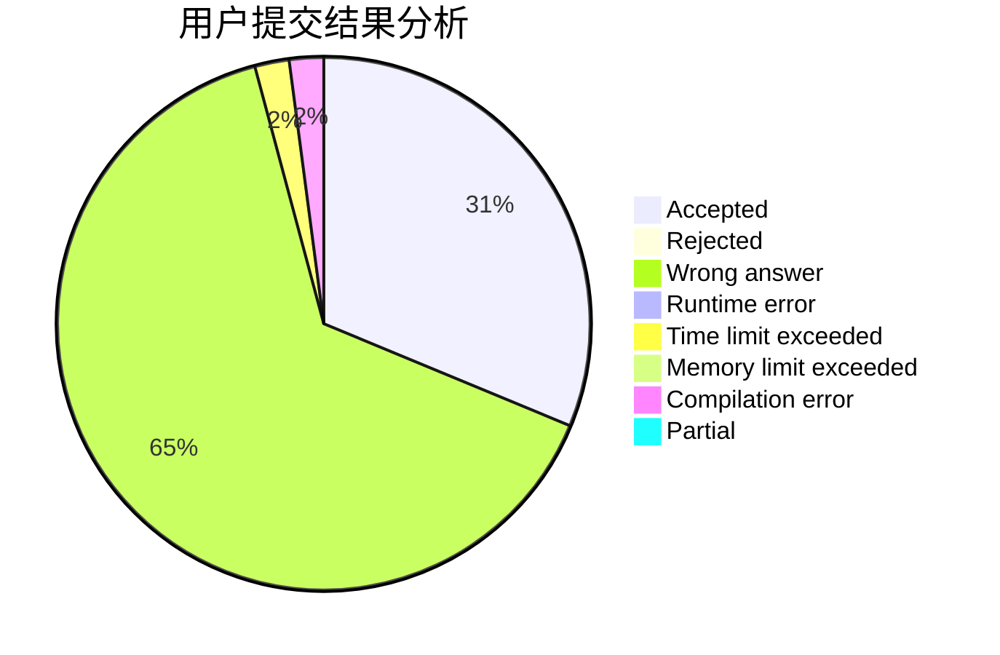
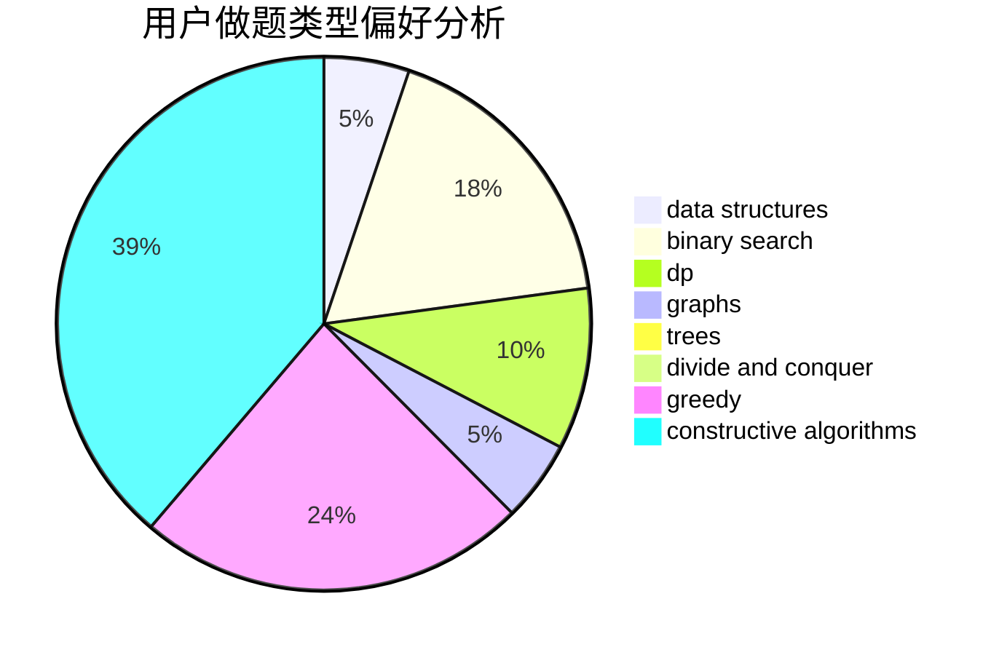
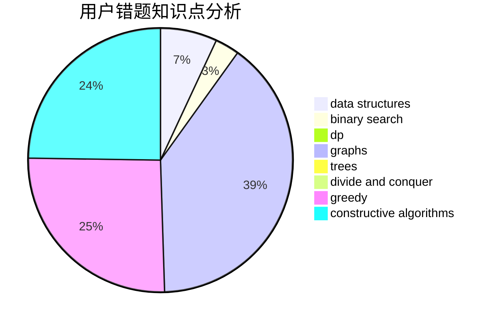

# FireCrystal

<!-- tabs:start -->

#### **用户提交结果分析**

#### **用户做题类型偏好分析**

#### **用户错题知识点分析**

<!-- tabs:end -->
# 推荐题目
[1067E](https://codeforces.com/contest/1067/problem/E)		dp,
                        graph matchings,
                        math,
                        trees		  
[311D](https://codeforces.com/contest/311/problem/D)		data structures,
                        math		  
[617E](https://codeforces.com/contest/617/problem/E)		data structures		  
[70D](https://codeforces.com/contest/70/problem/D)		data structures,
                        geometry		  
[650A](https://codeforces.com/contest/650/problem/A)		data structures,
                        geometry,
                        math		  
[643F](https://codeforces.com/contest/643/problem/F)		dp,
                        math,
                        meet-in-the-middle		  
[459E](https://codeforces.com/contest/459/problem/E)		dp,
                        sortings		  
[171F](https://codeforces.com/contest/171/problem/F)		*special problem,
                        brute force,
                        implementation,
                        number theory		  
[588A](https://codeforces.com/contest/588/problem/A)		greedy		  
[409G](https://codeforces.com/contest/409/problem/G)		*special problem,
                        geometry		  
