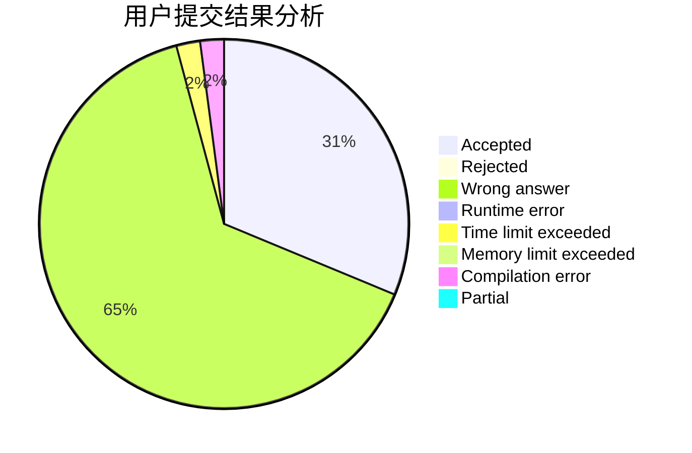
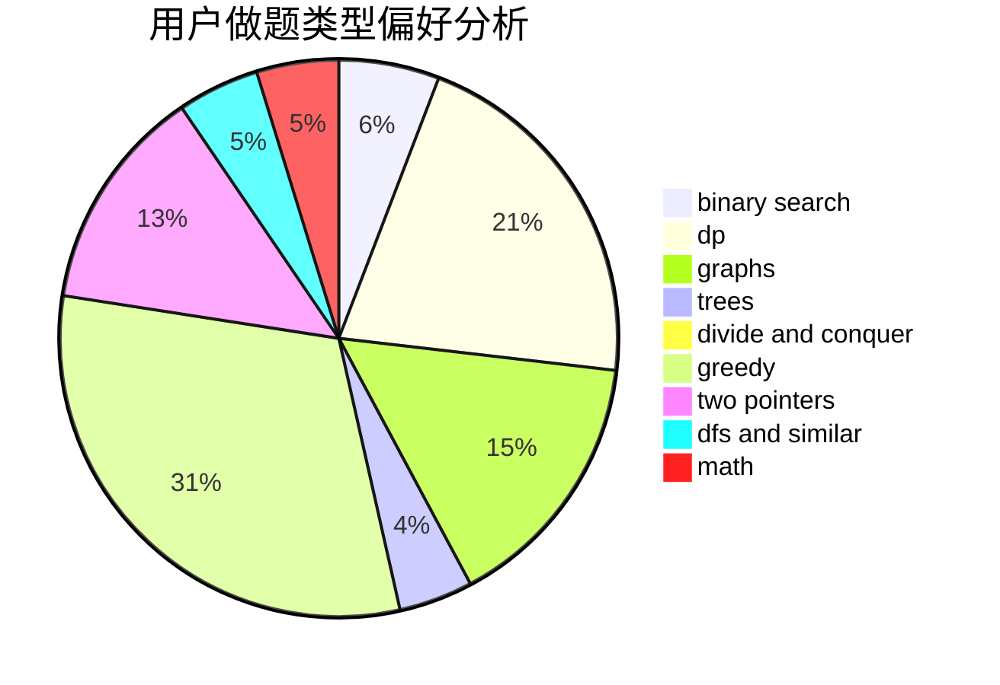

# FireCrystal

<!-- tabs:start -->

#### **用户提交结果分析**

#### **用户做题类型偏好分析**

<!-- tabs:end -->
# 推荐题目
[1068C](https://codeforces.com/contest/1068/problem/C)
[335A](https://codeforces.com/contest/335/problem/A)
[635E](https://codeforces.com/contest/635/problem/E)
[730B](https://codeforces.com/contest/730/problem/B)
[672D](https://codeforces.com/contest/672/problem/D)
[670F](https://codeforces.com/contest/670/problem/F)
[478D](https://codeforces.com/contest/478/problem/D)
[199D](https://codeforces.com/contest/199/problem/D)
[608C](https://codeforces.com/contest/608/problem/C)
[437A](https://codeforces.com/contest/437/problem/A)
