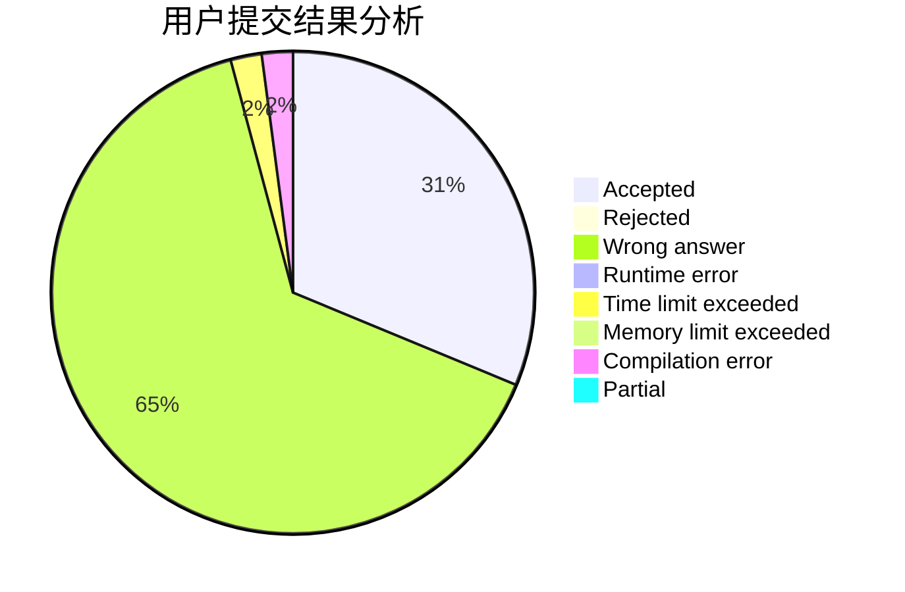
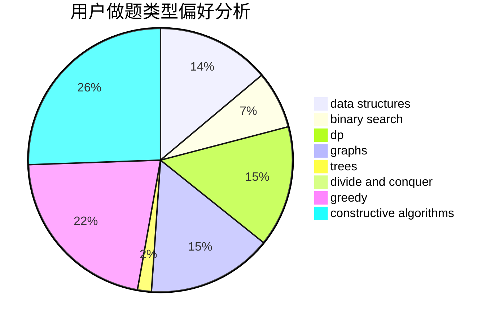
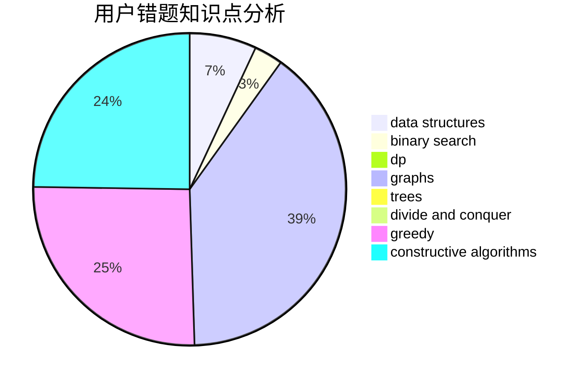

# FireCrystal

<!-- tabs:start -->

#### **用户提交结果分析**

#### **用户做题类型偏好分析**

#### **用户错题知识点分析**

<!-- tabs:end -->
# 推荐题目
[1068C](https://codeforces.com/contest/1068/problem/C)		constructive algorithms,
                        graphs		  
[335A](https://codeforces.com/contest/335/problem/A)		binary search,
                        constructive algorithms,
                        greedy		  
[635E](https://codeforces.com/contest/635/problem/E)		dsu,graphs,sortings,trees		  
[730B](https://codeforces.com/contest/730/problem/B)		constructive algorithms,
                        interactive		  
[672D](https://codeforces.com/contest/672/problem/D)		dsu,graphs,sortings,trees		  
[670F](https://codeforces.com/contest/670/problem/F)		brute force,
                        constructive algorithms,
                        strings		  
[478D](https://codeforces.com/contest/478/problem/D)		dp		  
[199D](https://codeforces.com/contest/199/problem/D)		dsu,graphs,sortings,trees		  
[608C](https://codeforces.com/contest/608/problem/C)		dsu,graphs,sortings,trees		  
[437A](https://codeforces.com/contest/437/problem/A)		implementation		  
