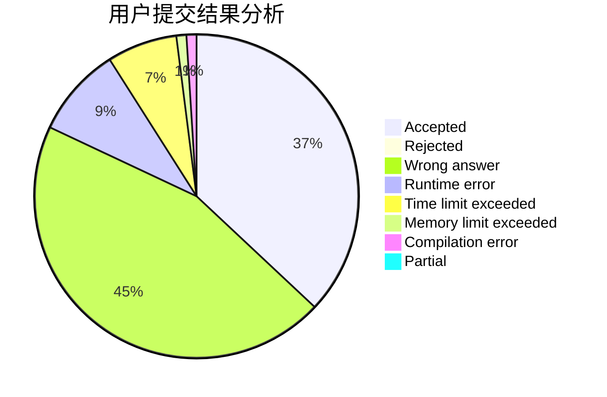
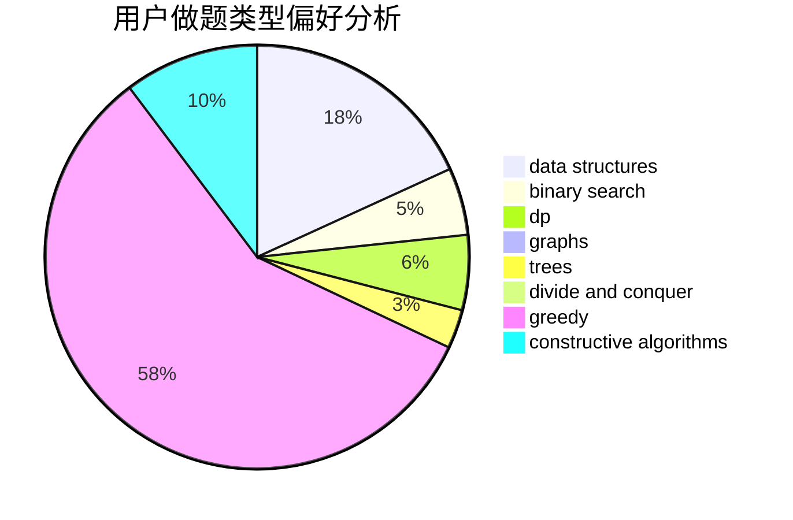
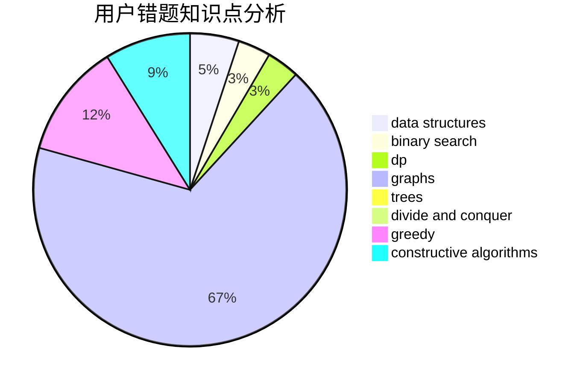

# Fish_Q

<!-- tabs:start -->

#### **用户提交结果分析**

#### **用户做题类型偏好分析**

#### **用户错题知识点分析**

<!-- tabs:end -->
# 推荐题目
[1305B](https://codeforces.com/contest/1305/problem/B)		constructive algorithms,
                        greedy,
                        strings,
                        two pointers		  
[1044B](https://codeforces.com/contest/1044/problem/B)		dfs and similar,
                        interactive,
                        trees		  
[1119B](https://codeforces.com/contest/1119/problem/B)		binary search,
                        flows,
                        greedy,
                        sortings		  
[702F](https://codeforces.com/contest/702/problem/F)		data structures		  
[441C](https://codeforces.com/contest/441/problem/C)		constructive algorithms,
                        dfs and similar,
                        implementation		  
[1154C](https://codeforces.com/contest/1154/problem/C)		implementation,
                        math		  
[1084B](https://codeforces.com/contest/1084/problem/B)		greedy,
                        implementation		  
[1452D](https://codeforces.com/contest/1452/problem/D)		combinatorics,
                        dp,
                        math		  
[718E](https://codeforces.com/contest/718/problem/E)		bitmasks,
                        graphs		  
[847F](https://codeforces.com/contest/847/problem/F)		greedy,
                        sortings		  
