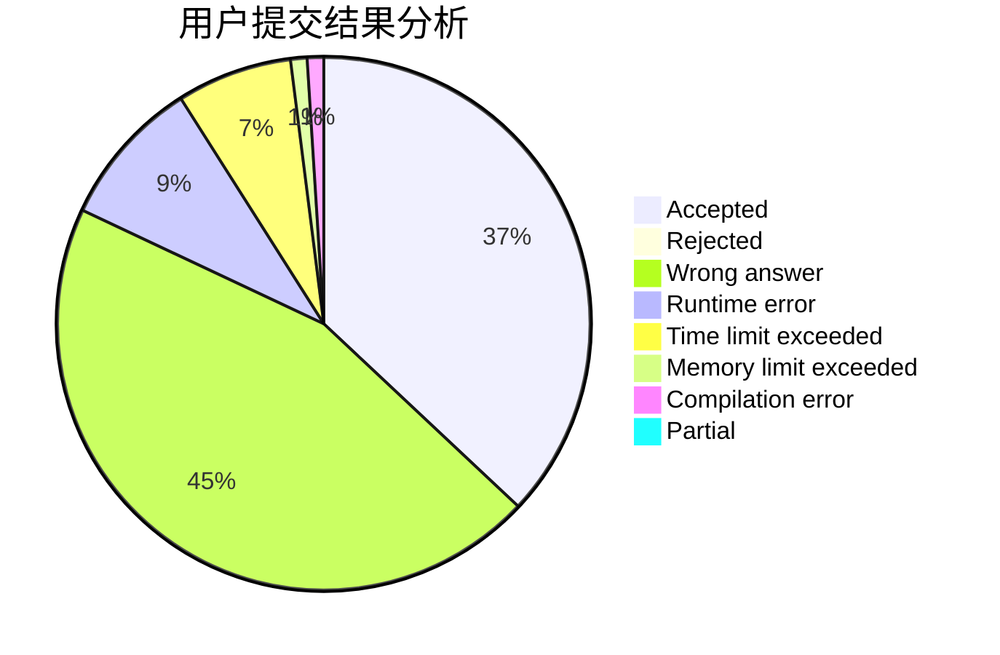
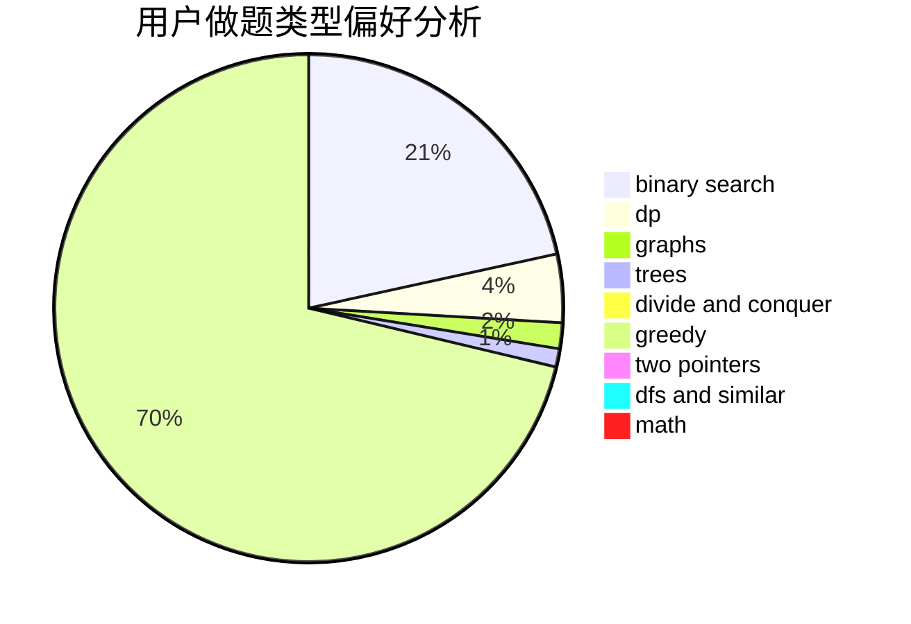

# Fish_Q

<!-- tabs:start -->

#### **用户提交结果分析**

#### **用户做题类型偏好分析**

<!-- tabs:end -->
# 推荐题目
[1314A](https://codeforces.com/contest/1314/problem/A)
[1045C](https://codeforces.com/contest/1045/problem/C)
[1121B](https://codeforces.com/contest/1121/problem/B)
[721D](https://codeforces.com/contest/721/problem/D)
[462A](https://codeforces.com/contest/462/problem/A)
[1156C](https://codeforces.com/contest/1156/problem/C)
[1085A](https://codeforces.com/contest/1085/problem/A)
[14621](https://codeforces.com/contest/1462/problem/1)
[736A](https://codeforces.com/contest/736/problem/A)
[865G](https://codeforces.com/contest/865/problem/G)
