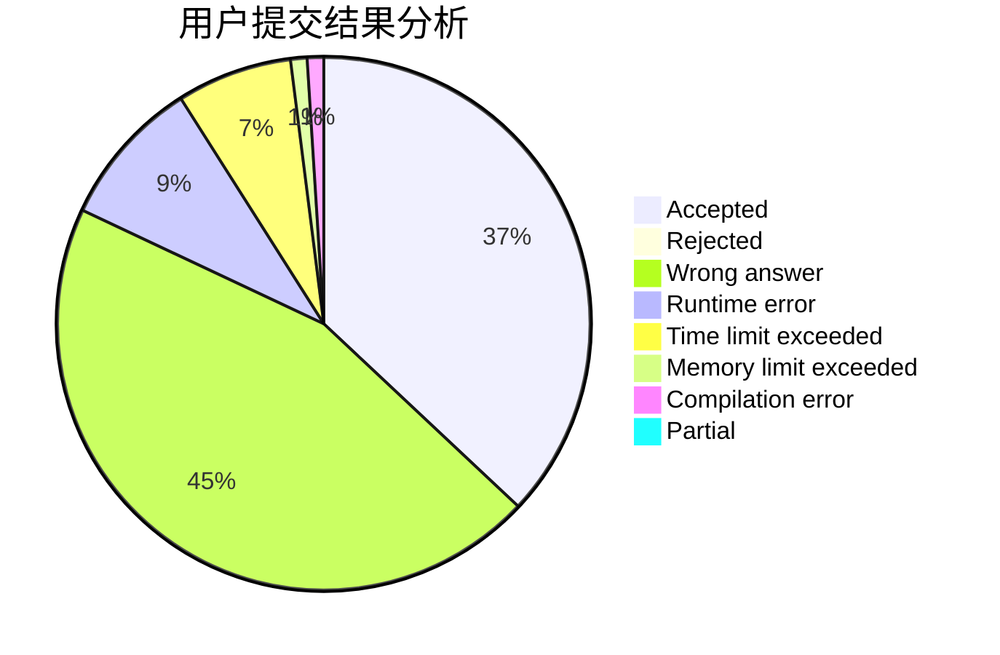
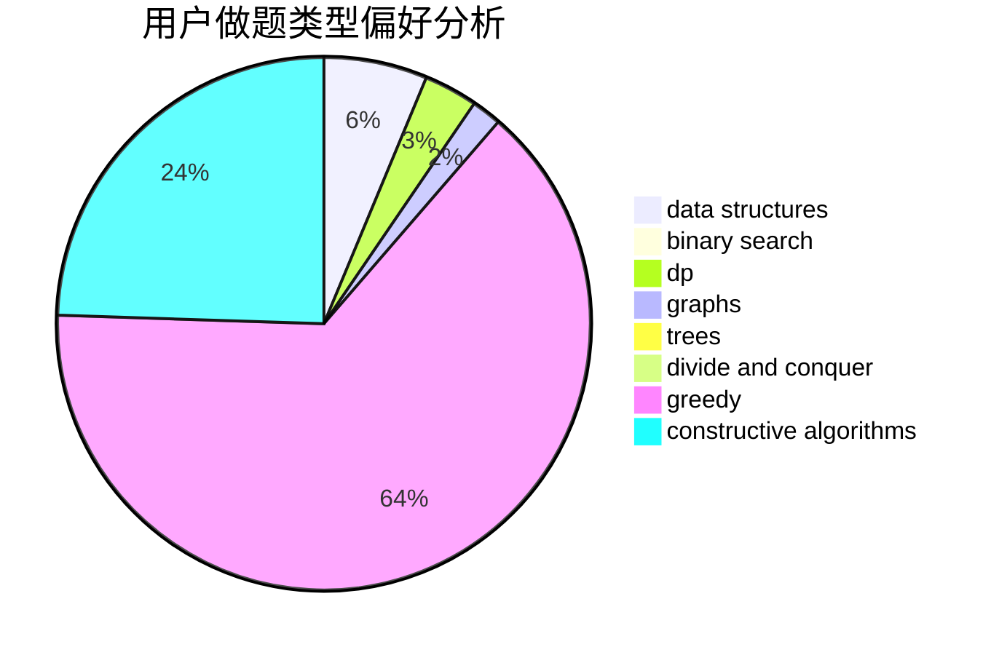
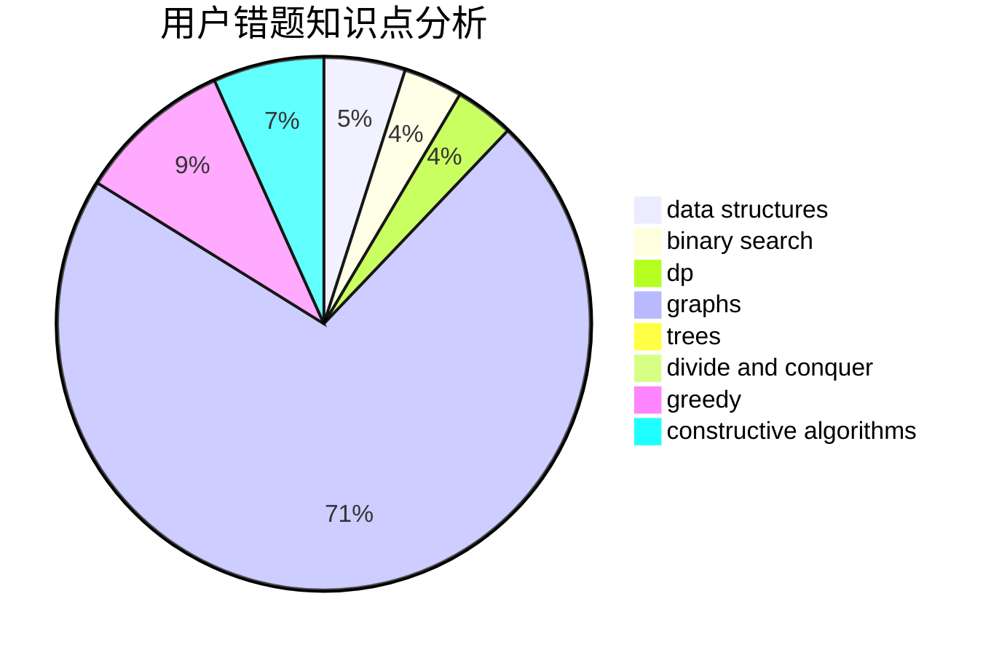

# Fish_Q

<!-- tabs:start -->

#### **用户提交结果分析**

#### **用户做题类型偏好分析**

#### **用户错题知识点分析**

<!-- tabs:end -->
# 推荐题目
[1314A](https://codeforces.com/contest/1314/problem/A)		dsu,graphs,sortings,trees		  
[1045C](https://codeforces.com/contest/1045/problem/C)		dfs and similar,
                        graphs,
                        trees		  
[1121B](https://codeforces.com/contest/1121/problem/B)		brute force,
                        implementation		  
[721D](https://codeforces.com/contest/721/problem/D)		constructive algorithms,
                        data structures,
                        greedy,
                        math		  
[462A](https://codeforces.com/contest/462/problem/A)		brute force,
                        implementation		  
[1156C](https://codeforces.com/contest/1156/problem/C)		binary search,
                        greedy,
                        sortings,
                        ternary search,
                        two pointers		  
[1085A](https://codeforces.com/contest/1085/problem/A)		implementation,
                        strings		  
[14621](https://codeforces.com/contest/1462/problem/1)		dsu,graphs,sortings,trees		  
[736A](https://codeforces.com/contest/736/problem/A)		dsu,graphs,sortings,trees		  
[865G](https://codeforces.com/contest/865/problem/G)		combinatorics,
                        math,
                        matrices		  
