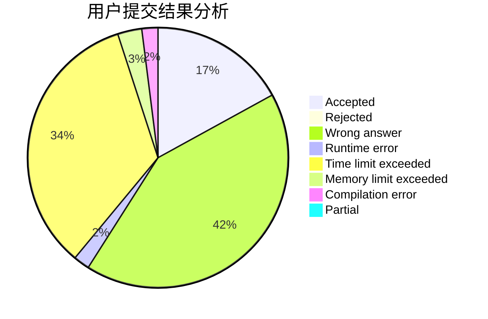
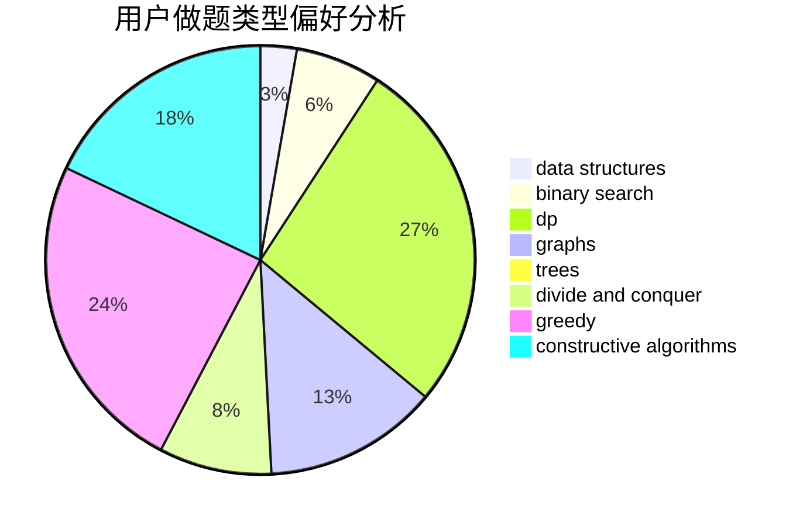
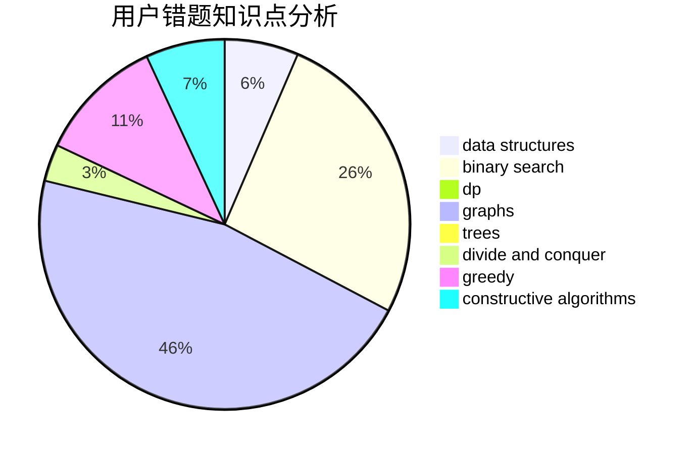

# FishingPrince
<!-- tabs:start -->
#### **用户提交结果分析**

#### **用户做题类型偏好分析**

#### **用户错题知识点分析**

<!-- tabs:end -->
# 推荐题目
[Complicated GCD](http://codeforces.com/problemset/problem/664/A)		math,
                        number theory		  
[Tell Your World](http://codeforces.com/problemset/problem/849/B)		brute force,
                        geometry		  
[Substitutes in Number](http://codeforces.com/problemset/problem/464/C)		dp		  
[Toy Army](http://codeforces.com/problemset/problem/84/A)		math,
                        number theory		  
[Vanya and Brackets](http://codeforces.com/problemset/problem/552/E)		brute force,
                        dp,
                        expression parsing,
                        greedy,
                        implementation,
                        strings		  
[A polyline](http://codeforces.com/problemset/problem/171/H)		*special problem,
                        implementation		  
[Days of Floral Colours](http://codeforces.com/problemset/problem/848/E)		combinatorics,
                        divide and conquer,
                        dp,
                        fft,
                        math		  
[From Y to Y](http://codeforces.com/problemset/problem/848/A)		constructive algorithms		  
[Periodic integer number](http://codeforces.com/problemset/problem/1219/C)		implementation,
                        strings		  
[Jeff and Brackets](https://codeforces.com/contest/352/problem/E)		dp,
                        matrices		  
<!-- tabs:start -->
#### **data structures**
[Rain of Fire](http://codeforces.com/problemset/problem/1419/F)		binary search,
                        data structures,
                        dfs and similar,
                        dsu,
                        graphs,
                        implementation		  
[Security](http://codeforces.com/problemset/problem/1037/H)		data structures,
                        string suffix structures		  
[Goodbye Souvenir](http://codeforces.com/problemset/problem/848/C)		data structures,
                        divide and conquer		  
[Vessels](http://codeforces.com/problemset/problem/371/D)		data structures,
                        dsu,
                        implementation,
                        trees		  
[Rooter's Song](http://codeforces.com/problemset/problem/848/B)		constructive algorithms,
                        data structures,
                        geometry,
                        implementation,
                        sortings,
                        two pointers		  
[Nezzar and Binary String](https://codeforces.com/contest/1478/problem/E)		data structures,
                        greedy		  
[Prefix Flip (Hard Version)](http://codeforces.com/problemset/problem/1381/A2)		constructive algorithms,
                        data structures,
                        implementation,
                        strings,
                        two pointers		  
[Maximum width](http://codeforces.com/problemset/problem/1492/C)		binary search,
                        data structures,
                        dp,
                        greedy,
                        two pointers		  
[Old Floppy Drive](http://codeforces.com/problemset/problem/1490/G)		binary search,
                        data structures,
                        math		  
[Odd Mineral Resource](http://codeforces.com/problemset/problem/1479/D)		binary search,
                        bitmasks,
                        brute force,
                        data structures,
                        probabilities,
                        trees		  
#### **binary search**
[Rain of Fire](http://codeforces.com/problemset/problem/1419/F)		binary search,
                        data structures,
                        dfs and similar,
                        dsu,
                        graphs,
                        implementation		  
[Thoroughly Bureaucratic Organization](http://codeforces.com/problemset/problem/201/E)		binary search,
                        combinatorics		  
[The Delivery Dilemma](http://codeforces.com/problemset/problem/1443/C)		binary search,
                        greedy,
                        sortings		  
[Maximum width](http://codeforces.com/problemset/problem/1492/C)		binary search,
                        data structures,
                        dp,
                        greedy,
                        two pointers		  
[Pairs](http://codeforces.com/problemset/problem/1463/D)		binary search,
                        constructive algorithms,
                        greedy,
                        two pointers		  
[Old Floppy Drive](http://codeforces.com/problemset/problem/1490/G)		binary search,
                        data structures,
                        math		  
[Odd Mineral Resource](http://codeforces.com/problemset/problem/1479/D)		binary search,
                        bitmasks,
                        brute force,
                        data structures,
                        probabilities,
                        trees		  
[Complicated Computations](http://codeforces.com/problemset/problem/1436/E)		binary search,
                        data structures,
                        two pointers		  
[Divide and Summarize](http://codeforces.com/problemset/problem/1461/D)		binary search,
                        brute force,
                        data structures,
                        divide and conquer,
                        implementation,
                        sortings		  
[K-beautiful Strings](http://codeforces.com/problemset/problem/1493/C)		binary search,
                        brute force,
                        constructive algorithms,
                        greedy,
                        strings		  
#### **dp**
[Substitutes in Number](http://codeforces.com/problemset/problem/464/C)		dp		  
[Vanya and Brackets](http://codeforces.com/problemset/problem/552/E)		brute force,
                        dp,
                        expression parsing,
                        greedy,
                        implementation,
                        strings		  
[Days of Floral Colours](http://codeforces.com/problemset/problem/848/E)		combinatorics,
                        divide and conquer,
                        dp,
                        fft,
                        math		  
[Jeff and Brackets](https://codeforces.com/contest/352/problem/E)		dp,
                        matrices		  
[Soldier and Number Game](http://codeforces.com/problemset/problem/546/D)		constructive algorithms,
                        dp,
                        math,
                        number theory		  
[Wall Bars](http://codeforces.com/problemset/problem/268/D)		dp		  
[EKG](http://codeforces.com/problemset/problem/316/B2)		dfs and similar,
                        dp		  
[Shake It!](http://codeforces.com/problemset/problem/848/D)		combinatorics,
                        dp,
                        flows,
                        graphs		  
[PE Lesson](http://codeforces.com/problemset/problem/316/D1)		brute force,
                        dp		  
[Yet Another Broken Keyboard](http://codeforces.com/problemset/problem/1272/C)		combinatorics,
                        dp,
                        implementation		  
#### **graph**
[Neko and Flashback](http://codeforces.com/problemset/problem/1152/E)		constructive algorithms,
                        dfs and similar,
                        graphs		  
[Tree Queries](http://codeforces.com/problemset/problem/825/G)		dfs and similar,
                        graphs,
                        trees		  
[Palindrome XOR](http://codeforces.com/problemset/problem/1147/D)		dfs and similar,
                        graphs		  
[Constructing the Dungeon](http://codeforces.com/problemset/problem/1346/D)		*special problem,
                        graphs,
                        greedy		  
[Rain of Fire](http://codeforces.com/problemset/problem/1419/F)		binary search,
                        data structures,
                        dfs and similar,
                        dsu,
                        graphs,
                        implementation		  
[Shake It!](http://codeforces.com/problemset/problem/848/D)		combinatorics,
                        dp,
                        flows,
                        graphs		  
[Levko and Game](http://codeforces.com/problemset/problem/360/E)		graphs,
                        greedy,
                        shortest paths		  
[Send the Fool Further! (easy)](http://codeforces.com/problemset/problem/802/J)		dfs and similar,
                        graphs,
                        trees		  
[Maximum Distance](http://codeforces.com/problemset/problem/1081/D)		dsu,
                        graphs,
                        shortest paths,
                        sortings		  
[Cactus Not Enough](http://codeforces.com/problemset/problem/1510/C)		dfs and similar,
                        graph matchings,
                        graphs		  
#### **trees**
[Tree Queries](http://codeforces.com/problemset/problem/825/G)		dfs and similar,
                        graphs,
                        trees		  
[Send the Fool Further! (easy)](http://codeforces.com/problemset/problem/802/J)		dfs and similar,
                        graphs,
                        trees		  
[Vessels](http://codeforces.com/problemset/problem/371/D)		data structures,
                        dsu,
                        implementation,
                        trees		  
[Drazil and Morning Exercise](http://codeforces.com/problemset/problem/516/D)		dfs and similar,
                        dp,
                        dsu,
                        trees,
                        two pointers		  
[Kingdom and its Cities](http://codeforces.com/problemset/problem/613/D)		dfs and similar,
                        divide and conquer,
                        dp,
                        graphs,
                        sortings,
                        trees		  
[Minimum Diameter Tree](http://codeforces.com/problemset/problem/1085/D)		constructive algorithms,
                        implementation,
                        trees		  
[Odd Mineral Resource](http://codeforces.com/problemset/problem/1479/D)		binary search,
                        bitmasks,
                        brute force,
                        data structures,
                        probabilities,
                        trees		  
[Yet Another Card Deck](http://codeforces.com/problemset/problem/1511/C)		brute force,
                        data structures,
                        implementation,
                        trees		  
[Diameter Cuts](http://codeforces.com/problemset/problem/1499/F)		combinatorics,
                        dfs and similar,
                        dp,
                        trees		  
[Fib-tree](http://codeforces.com/problemset/problem/1491/E)		brute force,
                        dfs and similar,
                        divide and conquer,
                        number theory,
                        trees		  
#### **divide and conquer**
[Days of Floral Colours](http://codeforces.com/problemset/problem/848/E)		combinatorics,
                        divide and conquer,
                        dp,
                        fft,
                        math		  
[Goodbye Souvenir](http://codeforces.com/problemset/problem/848/C)		data structures,
                        divide and conquer		  
[Kingdom and its Cities](http://codeforces.com/problemset/problem/613/D)		dfs and similar,
                        divide and conquer,
                        dp,
                        graphs,
                        sortings,
                        trees		  
[Divide and Summarize](http://codeforces.com/problemset/problem/1461/D)		binary search,
                        brute force,
                        data structures,
                        divide and conquer,
                        implementation,
                        sortings		  
[Song of the Sirens](http://codeforces.com/problemset/problem/1466/G)		combinatorics,
                        divide and conquer,
                        hashing,
                        math,
                        string suffix structures,
                        strings		  
[Permutation Transformation](http://codeforces.com/problemset/problem/1490/D)		dfs and similar,
                        divide and conquer,
                        implementation		  
[Skyline Photo](https://codeforces.com/contest/1483/problem/C)		data structures,
                        divide and conquer,
                        dp		  
[Fib-tree](http://codeforces.com/problemset/problem/1491/E)		brute force,
                        dfs and similar,
                        divide and conquer,
                        number theory,
                        trees		  
[Sum of Prefix Sums](http://codeforces.com/problemset/problem/1303/G)		data structures,
                        divide and conquer,
                        geometry,
                        trees		  
[Dogeforces](http://codeforces.com/problemset/problem/1494/D)		constructive algorithms,
                        data structures,
                        dfs and similar,
                        divide and conquer,
                        dsu,
                        greedy,
                        sortings,
                        trees		  
#### **greedy**
[Vanya and Brackets](http://codeforces.com/problemset/problem/552/E)		brute force,
                        dp,
                        expression parsing,
                        greedy,
                        implementation,
                        strings		  
[Leha and Function](http://codeforces.com/problemset/problem/840/A)		combinatorics,
                        greedy,
                        math,
                        number theory,
                        sortings		  
[Constructing the Dungeon](http://codeforces.com/problemset/problem/1346/D)		*special problem,
                        graphs,
                        greedy		  
[Levko and Game](http://codeforces.com/problemset/problem/360/E)		graphs,
                        greedy,
                        shortest paths		  
[Nuts](http://codeforces.com/problemset/problem/402/A)		greedy,
                        math		  
[Travel Cards](http://codeforces.com/problemset/problem/847/K)		greedy,
                        implementation,
                        sortings		  
[Let's Go Hiking](https://codeforces.com/contest/1496/problem/D)		games,
                        greedy		  
[Nezzar and Binary String](https://codeforces.com/contest/1478/problem/E)		data structures,
                        greedy		  
[Karen and Game](http://codeforces.com/problemset/problem/815/A)		brute force,
                        greedy,
                        implementation		  
[Permutation Partitions](http://codeforces.com/problemset/problem/1326/C)		combinatorics,
                        greedy,
                        math		  
#### **constructive algorithms**
[From Y to Y](http://codeforces.com/problemset/problem/848/A)		constructive algorithms		  
[Neko and Flashback](http://codeforces.com/problemset/problem/1152/E)		constructive algorithms,
                        dfs and similar,
                        graphs		  
[Soldier and Number Game](http://codeforces.com/problemset/problem/546/D)		constructive algorithms,
                        dp,
                        math,
                        number theory		  
[Nastya Is Playing Computer Games](http://codeforces.com/problemset/problem/1136/B)		constructive algorithms,
                        math		  
[Rooter's Song](http://codeforces.com/problemset/problem/848/B)		constructive algorithms,
                        data structures,
                        geometry,
                        implementation,
                        sortings,
                        two pointers		  
[Suns and Rays](http://codeforces.com/problemset/problem/316/F3)		constructive algorithms,
                        dfs and similar,
                        implementation		  
[Prefix Flip (Hard Version)](http://codeforces.com/problemset/problem/1381/A2)		constructive algorithms,
                        data structures,
                        implementation,
                        strings,
                        two pointers		  
[Minimum Diameter Tree](http://codeforces.com/problemset/problem/1085/D)		constructive algorithms,
                        implementation,
                        trees		  
[Anti-knapsack](http://codeforces.com/problemset/problem/1493/A)		constructive algorithms,
                        greedy		  
[Pairs](http://codeforces.com/problemset/problem/1463/D)		binary search,
                        constructive algorithms,
                        greedy,
                        two pointers		  
#### **sortings**
[Leha and Function](http://codeforces.com/problemset/problem/840/A)		combinatorics,
                        greedy,
                        math,
                        number theory,
                        sortings		  
[Travel Cards](http://codeforces.com/problemset/problem/847/K)		greedy,
                        implementation,
                        sortings		  
[Cinema](http://codeforces.com/problemset/problem/670/C)		implementation,
                        sortings		  
[Rooter's Song](http://codeforces.com/problemset/problem/848/B)		constructive algorithms,
                        data structures,
                        geometry,
                        implementation,
                        sortings,
                        two pointers		  
[Maximum Distance](http://codeforces.com/problemset/problem/1081/D)		dsu,
                        graphs,
                        shortest paths,
                        sortings		  
[Kingdom and its Cities](http://codeforces.com/problemset/problem/613/D)		dfs and similar,
                        divide and conquer,
                        dp,
                        graphs,
                        sortings,
                        trees		  
[The Delivery Dilemma](http://codeforces.com/problemset/problem/1443/C)		binary search,
                        greedy,
                        sortings		  
[Diamond Miner](https://codeforces.com/contest/1496/problem/C)		geometry,
                        greedy,
                        math,
                        sortings		  
[Diamond Miner](http://codeforces.com/problemset/problem/1495/A)		geometry,
                        greedy,
                        math,
                        sortings		  
[Meximization](http://codeforces.com/problemset/problem/1497/A)		brute force,
                        data structures,
                        greedy,
                        sortings		  
<!-- tabs:end -->
