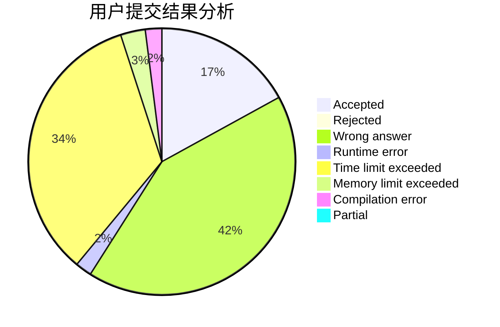
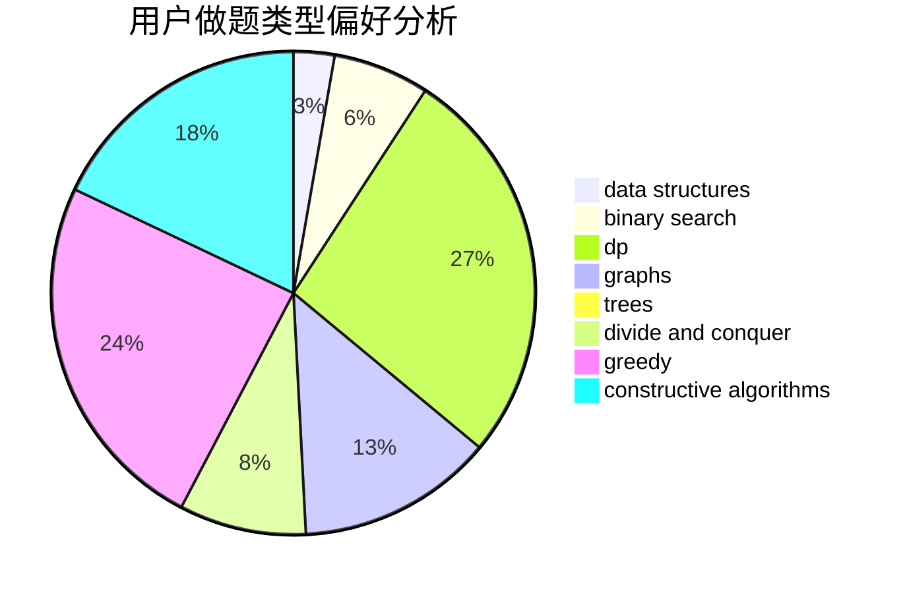
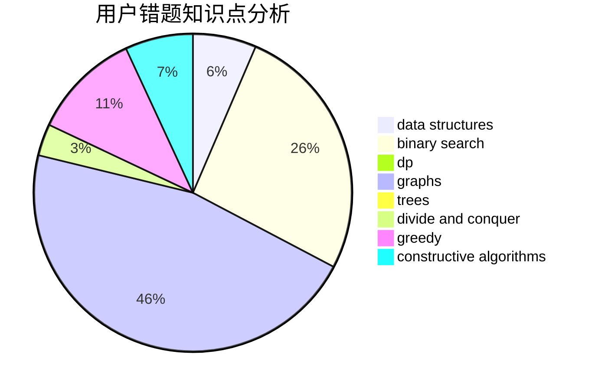

# FishingPrince

<!-- tabs:start -->

#### **用户提交结果分析**

#### **用户做题类型偏好分析**

#### **用户错题知识点分析**

<!-- tabs:end -->
# 推荐题目
[825G](https://codeforces.com/contest/825/problem/G)		dfs and similar,
                        graphs,
                        trees		  
[664A](https://codeforces.com/contest/664/problem/A)		math,
                        number theory		  
[849B](https://codeforces.com/contest/849/problem/B)		brute force,
                        geometry		  
[552E](https://codeforces.com/contest/552/problem/E)		brute force,
                        dp,
                        expression parsing,
                        greedy,
                        implementation,
                        strings		  
[171H](https://codeforces.com/contest/171/problem/H)		*special problem,
                        implementation		  
[352E](https://codeforces.com/contest/352/problem/E)		dsu,graphs,sortings,trees		  
[464C](https://codeforces.com/contest/464/problem/C)		dp		  
[268D](https://codeforces.com/contest/268/problem/D)		dp		  
[840A](https://codeforces.com/contest/840/problem/A)		combinatorics,
                        greedy,
                        math,
                        number theory,
                        sortings		  
[848B](https://codeforces.com/contest/848/problem/B)		constructive algorithms,
                        data structures,
                        geometry,
                        implementation,
                        sortings,
                        two pointers		  
