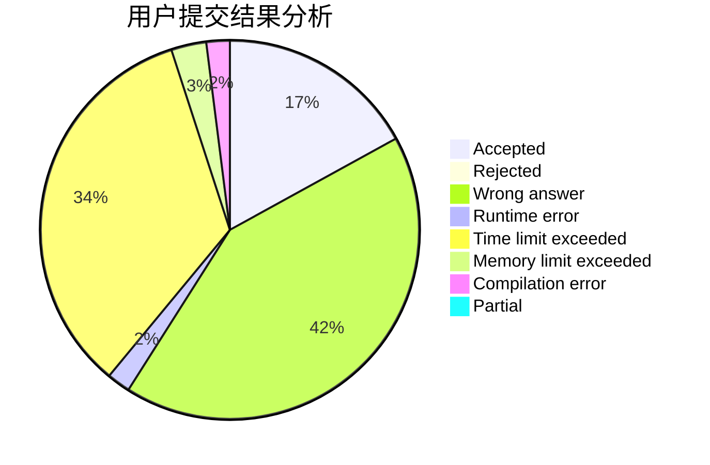
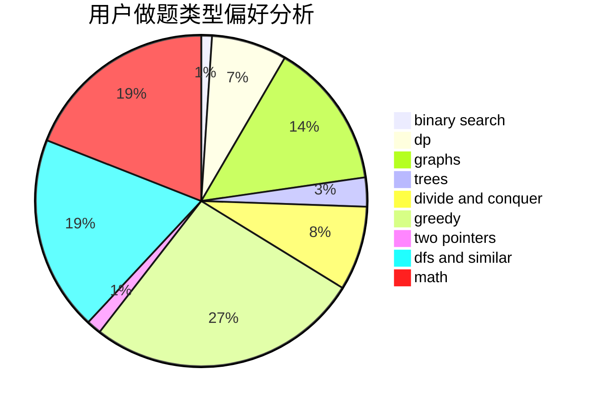

# FishingPrince

<!-- tabs:start -->

#### **用户提交结果分析**

#### **用户做题类型偏好分析**

<!-- tabs:end -->
# 推荐题目
[845C](https://codeforces.com/contest/845/problem/C)
[683B](https://codeforces.com/contest/683/problem/B)
[868D](https://codeforces.com/contest/868/problem/D)
[578B](https://codeforces.com/contest/578/problem/B)
[19A](https://codeforces.com/contest/19/problem/A)
[379D](https://codeforces.com/contest/379/problem/D)
[484B](https://codeforces.com/contest/484/problem/B)
[283E](https://codeforces.com/contest/283/problem/E)
[859E](https://codeforces.com/contest/859/problem/E)
[866E](https://codeforces.com/contest/866/problem/E)
