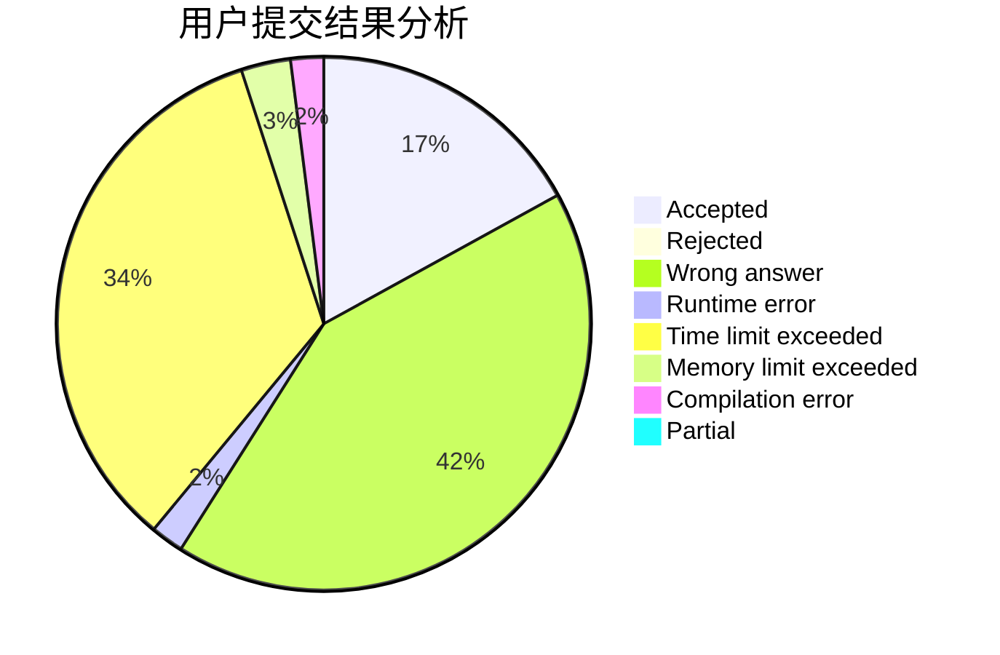
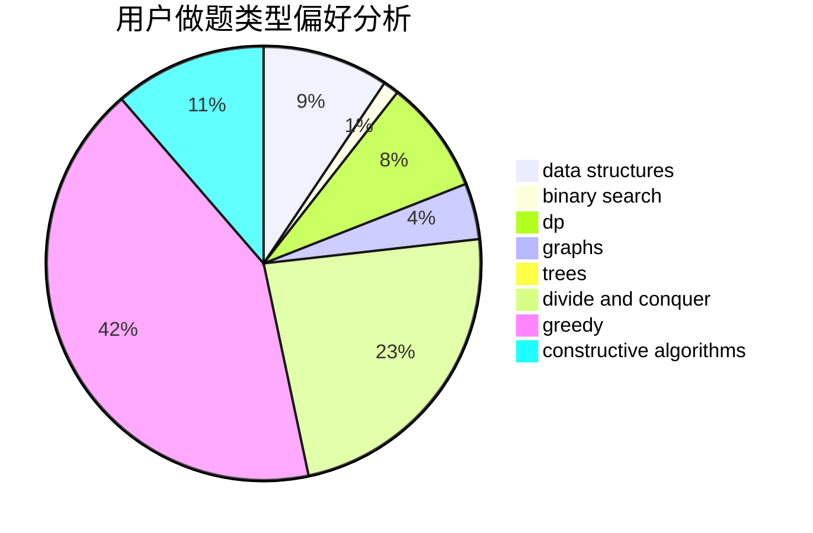
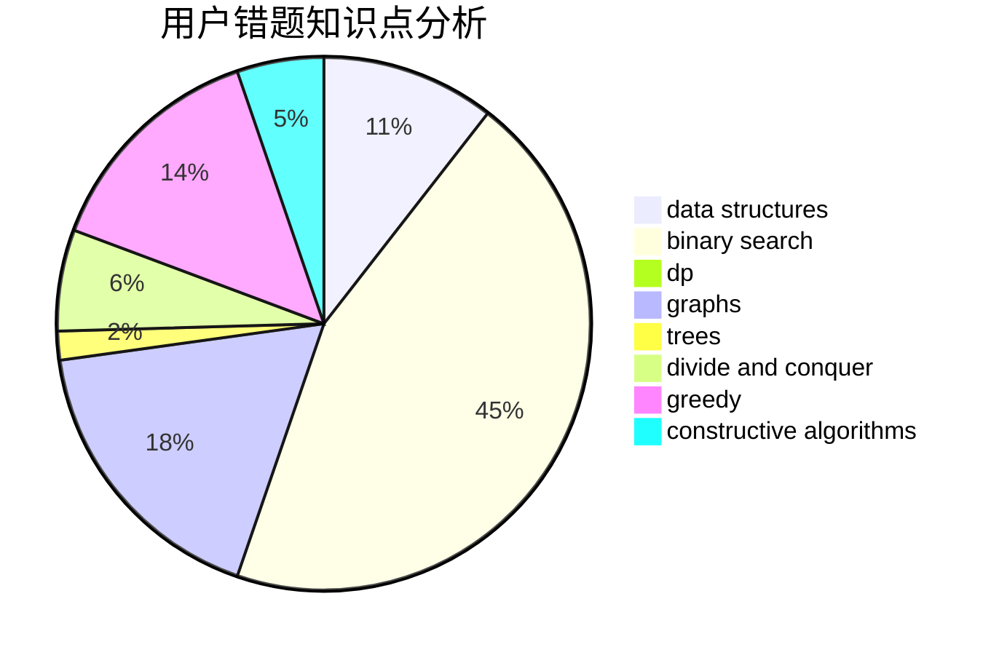

# FishingPrince

<!-- tabs:start -->

#### **用户提交结果分析**

#### **用户做题类型偏好分析**

#### **用户错题知识点分析**

<!-- tabs:end -->
# 推荐题目
[845C](https://codeforces.com/contest/845/problem/C)		data structures,
                        greedy,
                        sortings		  
[683B](https://codeforces.com/contest/683/problem/B)		*special problem		  
[868D](https://codeforces.com/contest/868/problem/D)		bitmasks,
                        brute force,
                        dp,
                        implementation,
                        strings		  
[578B](https://codeforces.com/contest/578/problem/B)		brute force,
                        greedy		  
[19A](https://codeforces.com/contest/19/problem/A)		implementation		  
[379D](https://codeforces.com/contest/379/problem/D)		bitmasks,
                        brute force,
                        dp		  
[484B](https://codeforces.com/contest/484/problem/B)		binary search,
                        math,
                        sortings,
                        two pointers		  
[283E](https://codeforces.com/contest/283/problem/E)		combinatorics,
                        data structures,
                        math		  
[859E](https://codeforces.com/contest/859/problem/E)		combinatorics,
                        dfs and similar,
                        dsu,
                        graphs,
                        trees		  
[866E](https://codeforces.com/contest/866/problem/E)		dsu,graphs,sortings,trees		  
