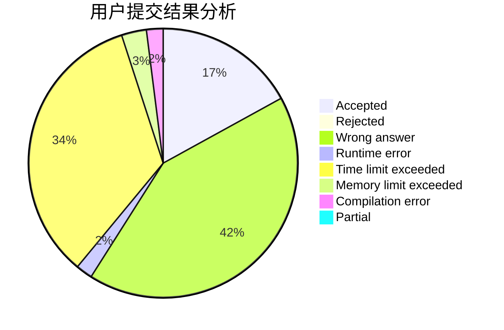
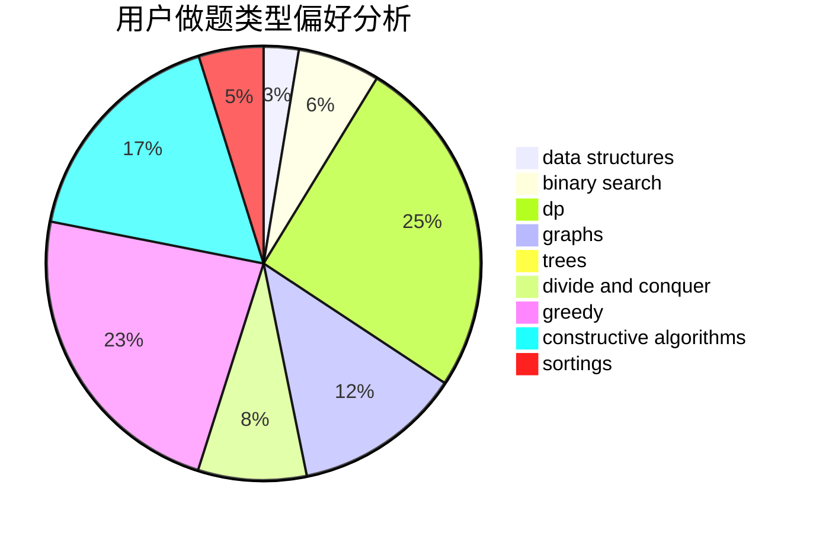
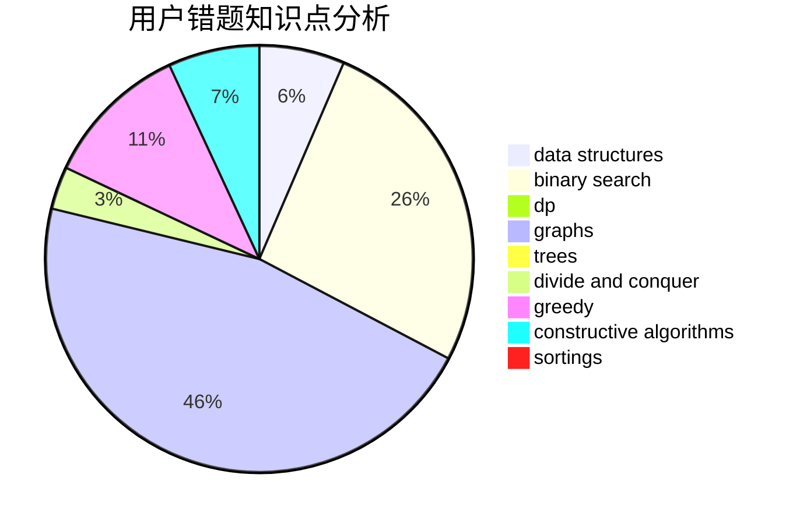

# FishingPrince
<!-- tabs:start -->
#### **用户提交结果分析**

#### **用户做题类型偏好分析**

#### **用户错题知识点分析**

<!-- tabs:end -->
# 推荐题目
[664A](http://codeforces.com/problemset/problem/664/A)		math,
                        number theory		  
[849B](http://codeforces.com/problemset/problem/849/B)		brute force,
                        geometry		  
[464C](http://codeforces.com/problemset/problem/464/C)		dp		  
[84A](http://codeforces.com/problemset/problem/84/A)		math,
                        number theory		  
[552E](http://codeforces.com/problemset/problem/552/E)		brute force,
                        dp,
                        expression parsing,
                        greedy,
                        implementation,
                        strings		  
[171H](http://codeforces.com/problemset/problem/171/H)		*special problem,
                        implementation		  
[848E](http://codeforces.com/problemset/problem/848/E)		combinatorics,
                        divide and conquer,
                        dp,
                        fft,
                        math		  
[848A](http://codeforces.com/problemset/problem/848/A)		constructive algorithms		  
[1219C](http://codeforces.com/problemset/problem/1219/C)		implementation,
                        strings		  
[352E](https://codeforces.com/contest/352/problem/E)		dp,
                        matrices		  
<!-- tabs:start -->
#### **data structures**
[1419F](http://codeforces.com/problemset/problem/1419/F)		binary search,
                        data structures,
                        dfs and similar,
                        dsu,
                        graphs,
                        implementation		  
[1037H](http://codeforces.com/problemset/problem/1037/H)		data structures,
                        string suffix structures		  
[848C](http://codeforces.com/problemset/problem/848/C)		data structures,
                        divide and conquer		  
[371D](http://codeforces.com/problemset/problem/371/D)		data structures,
                        dsu,
                        implementation,
                        trees		  
[848B](http://codeforces.com/problemset/problem/848/B)		constructive algorithms,
                        data structures,
                        geometry,
                        implementation,
                        sortings,
                        two pointers		  
[1478E](https://codeforces.com/contest/1478/problem/E)		data structures,
                        greedy		  
[1381A2](http://codeforces.com/problemset/problem/1381/A2)		constructive algorithms,
                        data structures,
                        implementation,
                        strings,
                        two pointers		  
[1492C](http://codeforces.com/problemset/problem/1492/C)		binary search,
                        data structures,
                        dp,
                        greedy,
                        two pointers		  
[1490G](http://codeforces.com/problemset/problem/1490/G)		binary search,
                        data structures,
                        math		  
[1479D](http://codeforces.com/problemset/problem/1479/D)		binary search,
                        bitmasks,
                        brute force,
                        data structures,
                        probabilities,
                        trees		  
#### **binary search**
[1419F](http://codeforces.com/problemset/problem/1419/F)		binary search,
                        data structures,
                        dfs and similar,
                        dsu,
                        graphs,
                        implementation		  
[201E](http://codeforces.com/problemset/problem/201/E)		binary search,
                        combinatorics		  
[1443C](http://codeforces.com/problemset/problem/1443/C)		binary search,
                        greedy,
                        sortings		  
[1492C](http://codeforces.com/problemset/problem/1492/C)		binary search,
                        data structures,
                        dp,
                        greedy,
                        two pointers		  
[1463D](http://codeforces.com/problemset/problem/1463/D)		binary search,
                        constructive algorithms,
                        greedy,
                        two pointers		  
[1490G](http://codeforces.com/problemset/problem/1490/G)		binary search,
                        data structures,
                        math		  
[1479D](http://codeforces.com/problemset/problem/1479/D)		binary search,
                        bitmasks,
                        brute force,
                        data structures,
                        probabilities,
                        trees		  
[1436E](http://codeforces.com/problemset/problem/1436/E)		binary search,
                        data structures,
                        two pointers		  
[1461D](http://codeforces.com/problemset/problem/1461/D)		binary search,
                        brute force,
                        data structures,
                        divide and conquer,
                        implementation,
                        sortings		  
[1493C](http://codeforces.com/problemset/problem/1493/C)		binary search,
                        brute force,
                        constructive algorithms,
                        greedy,
                        strings		  
#### **dp**
[464C](http://codeforces.com/problemset/problem/464/C)		dp		  
[552E](http://codeforces.com/problemset/problem/552/E)		brute force,
                        dp,
                        expression parsing,
                        greedy,
                        implementation,
                        strings		  
[848E](http://codeforces.com/problemset/problem/848/E)		combinatorics,
                        divide and conquer,
                        dp,
                        fft,
                        math		  
[352E](https://codeforces.com/contest/352/problem/E)		dp,
                        matrices		  
[546D](http://codeforces.com/problemset/problem/546/D)		constructive algorithms,
                        dp,
                        math,
                        number theory		  
[268D](http://codeforces.com/problemset/problem/268/D)		dp		  
[316B2](http://codeforces.com/problemset/problem/316/B2)		dfs and similar,
                        dp		  
[848D](http://codeforces.com/problemset/problem/848/D)		combinatorics,
                        dp,
                        flows,
                        graphs		  
[316D1](http://codeforces.com/problemset/problem/316/D1)		brute force,
                        dp		  
[1272C](http://codeforces.com/problemset/problem/1272/C)		combinatorics,
                        dp,
                        implementation		  
#### **graph**
[1152E](http://codeforces.com/problemset/problem/1152/E)		constructive algorithms,
                        dfs and similar,
                        graphs		  
[825G](http://codeforces.com/problemset/problem/825/G)		dfs and similar,
                        graphs,
                        trees		  
[1147D](http://codeforces.com/problemset/problem/1147/D)		dfs and similar,
                        graphs		  
[1346D](http://codeforces.com/problemset/problem/1346/D)		*special problem,
                        graphs,
                        greedy		  
[1419F](http://codeforces.com/problemset/problem/1419/F)		binary search,
                        data structures,
                        dfs and similar,
                        dsu,
                        graphs,
                        implementation		  
[848D](http://codeforces.com/problemset/problem/848/D)		combinatorics,
                        dp,
                        flows,
                        graphs		  
[360E](http://codeforces.com/problemset/problem/360/E)		graphs,
                        greedy,
                        shortest paths		  
[802J](http://codeforces.com/problemset/problem/802/J)		dfs and similar,
                        graphs,
                        trees		  
[1081D](http://codeforces.com/problemset/problem/1081/D)		dsu,
                        graphs,
                        shortest paths,
                        sortings		  
[1510C](http://codeforces.com/problemset/problem/1510/C)		dfs and similar,
                        graph matchings,
                        graphs		  
#### **trees**
[825G](http://codeforces.com/problemset/problem/825/G)		dfs and similar,
                        graphs,
                        trees		  
[802J](http://codeforces.com/problemset/problem/802/J)		dfs and similar,
                        graphs,
                        trees		  
[371D](http://codeforces.com/problemset/problem/371/D)		data structures,
                        dsu,
                        implementation,
                        trees		  
[516D](http://codeforces.com/problemset/problem/516/D)		dfs and similar,
                        dp,
                        dsu,
                        trees,
                        two pointers		  
[613D](http://codeforces.com/problemset/problem/613/D)		dfs and similar,
                        divide and conquer,
                        dp,
                        graphs,
                        sortings,
                        trees		  
[1085D](http://codeforces.com/problemset/problem/1085/D)		constructive algorithms,
                        implementation,
                        trees		  
[1479D](http://codeforces.com/problemset/problem/1479/D)		binary search,
                        bitmasks,
                        brute force,
                        data structures,
                        probabilities,
                        trees		  
[1511C](http://codeforces.com/problemset/problem/1511/C)		brute force,
                        data structures,
                        implementation,
                        trees		  
[1499F](http://codeforces.com/problemset/problem/1499/F)		combinatorics,
                        dfs and similar,
                        dp,
                        trees		  
[1491E](http://codeforces.com/problemset/problem/1491/E)		brute force,
                        dfs and similar,
                        divide and conquer,
                        number theory,
                        trees		  
#### **divide and conquer**
[848E](http://codeforces.com/problemset/problem/848/E)		combinatorics,
                        divide and conquer,
                        dp,
                        fft,
                        math		  
[848C](http://codeforces.com/problemset/problem/848/C)		data structures,
                        divide and conquer		  
[613D](http://codeforces.com/problemset/problem/613/D)		dfs and similar,
                        divide and conquer,
                        dp,
                        graphs,
                        sortings,
                        trees		  
[1461D](http://codeforces.com/problemset/problem/1461/D)		binary search,
                        brute force,
                        data structures,
                        divide and conquer,
                        implementation,
                        sortings		  
[1466G](http://codeforces.com/problemset/problem/1466/G)		combinatorics,
                        divide and conquer,
                        hashing,
                        math,
                        string suffix structures,
                        strings		  
[1490D](http://codeforces.com/problemset/problem/1490/D)		dfs and similar,
                        divide and conquer,
                        implementation		  
[1483C](https://codeforces.com/contest/1483/problem/C)		data structures,
                        divide and conquer,
                        dp		  
[1491E](http://codeforces.com/problemset/problem/1491/E)		brute force,
                        dfs and similar,
                        divide and conquer,
                        number theory,
                        trees		  
[1303G](http://codeforces.com/problemset/problem/1303/G)		data structures,
                        divide and conquer,
                        geometry,
                        trees		  
[1494D](http://codeforces.com/problemset/problem/1494/D)		constructive algorithms,
                        data structures,
                        dfs and similar,
                        divide and conquer,
                        dsu,
                        greedy,
                        sortings,
                        trees		  
#### **greedy**
[552E](http://codeforces.com/problemset/problem/552/E)		brute force,
                        dp,
                        expression parsing,
                        greedy,
                        implementation,
                        strings		  
[840A](http://codeforces.com/problemset/problem/840/A)		combinatorics,
                        greedy,
                        math,
                        number theory,
                        sortings		  
[1346D](http://codeforces.com/problemset/problem/1346/D)		*special problem,
                        graphs,
                        greedy		  
[360E](http://codeforces.com/problemset/problem/360/E)		graphs,
                        greedy,
                        shortest paths		  
[402A](http://codeforces.com/problemset/problem/402/A)		greedy,
                        math		  
[847K](http://codeforces.com/problemset/problem/847/K)		greedy,
                        implementation,
                        sortings		  
[1496D](https://codeforces.com/contest/1496/problem/D)		games,
                        greedy		  
[1478E](https://codeforces.com/contest/1478/problem/E)		data structures,
                        greedy		  
[815A](http://codeforces.com/problemset/problem/815/A)		brute force,
                        greedy,
                        implementation		  
[1326C](http://codeforces.com/problemset/problem/1326/C)		combinatorics,
                        greedy,
                        math		  
#### **constructive algorithms**
[848A](http://codeforces.com/problemset/problem/848/A)		constructive algorithms		  
[1152E](http://codeforces.com/problemset/problem/1152/E)		constructive algorithms,
                        dfs and similar,
                        graphs		  
[546D](http://codeforces.com/problemset/problem/546/D)		constructive algorithms,
                        dp,
                        math,
                        number theory		  
[1136B](http://codeforces.com/problemset/problem/1136/B)		constructive algorithms,
                        math		  
[848B](http://codeforces.com/problemset/problem/848/B)		constructive algorithms,
                        data structures,
                        geometry,
                        implementation,
                        sortings,
                        two pointers		  
[316F3](http://codeforces.com/problemset/problem/316/F3)		constructive algorithms,
                        dfs and similar,
                        implementation		  
[1381A2](http://codeforces.com/problemset/problem/1381/A2)		constructive algorithms,
                        data structures,
                        implementation,
                        strings,
                        two pointers		  
[1085D](http://codeforces.com/problemset/problem/1085/D)		constructive algorithms,
                        implementation,
                        trees		  
[1493A](http://codeforces.com/problemset/problem/1493/A)		constructive algorithms,
                        greedy		  
[1463D](http://codeforces.com/problemset/problem/1463/D)		binary search,
                        constructive algorithms,
                        greedy,
                        two pointers		  
#### **sortings**
[840A](http://codeforces.com/problemset/problem/840/A)		combinatorics,
                        greedy,
                        math,
                        number theory,
                        sortings		  
[847K](http://codeforces.com/problemset/problem/847/K)		greedy,
                        implementation,
                        sortings		  
[670C](http://codeforces.com/problemset/problem/670/C)		implementation,
                        sortings		  
[848B](http://codeforces.com/problemset/problem/848/B)		constructive algorithms,
                        data structures,
                        geometry,
                        implementation,
                        sortings,
                        two pointers		  
[1081D](http://codeforces.com/problemset/problem/1081/D)		dsu,
                        graphs,
                        shortest paths,
                        sortings		  
[613D](http://codeforces.com/problemset/problem/613/D)		dfs and similar,
                        divide and conquer,
                        dp,
                        graphs,
                        sortings,
                        trees		  
[1443C](http://codeforces.com/problemset/problem/1443/C)		binary search,
                        greedy,
                        sortings		  
[1496C](https://codeforces.com/contest/1496/problem/C)		geometry,
                        greedy,
                        math,
                        sortings		  
[1495A](http://codeforces.com/problemset/problem/1495/A)		geometry,
                        greedy,
                        math,
                        sortings		  
[1497A](http://codeforces.com/problemset/problem/1497/A)		brute force,
                        data structures,
                        greedy,
                        sortings		  
<!-- tabs:end -->
