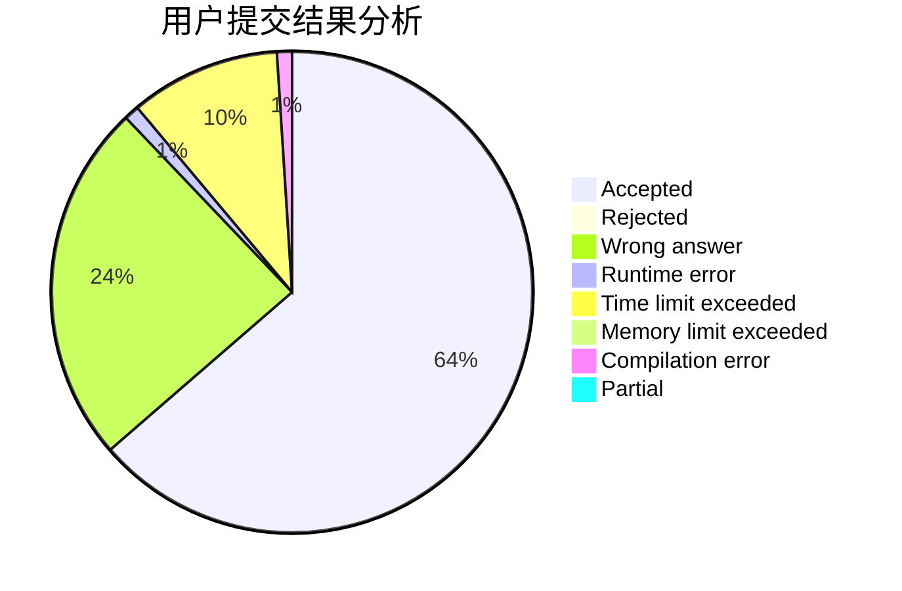
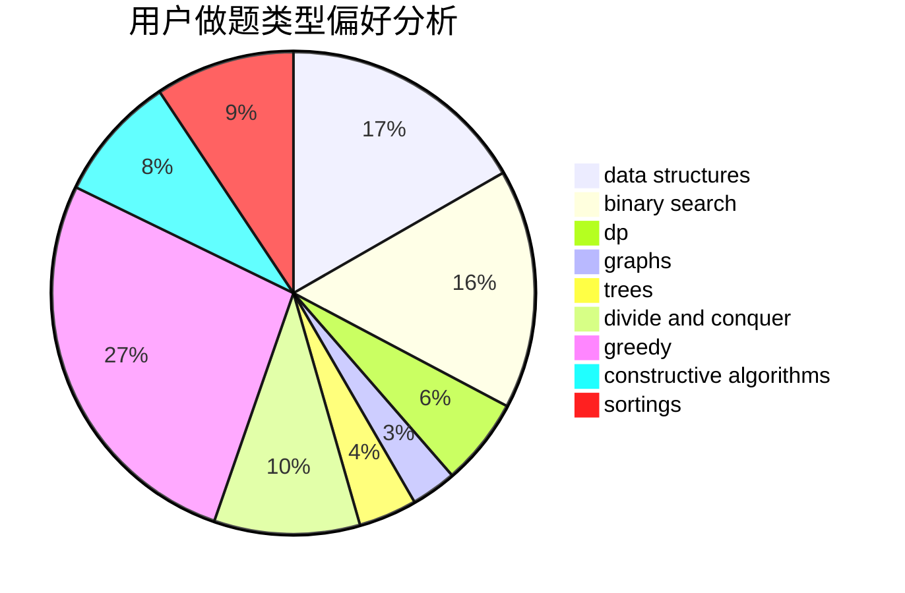
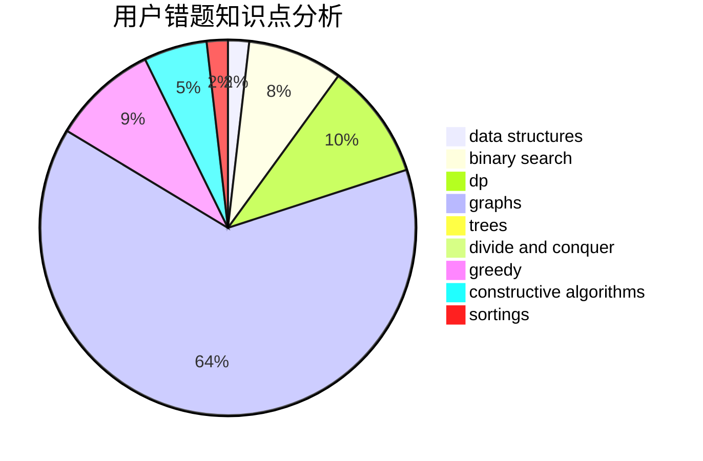

# Flash_plus
<!-- tabs:start -->
#### **用户提交结果分析**

#### **用户做题类型偏好分析**

#### **用户错题知识点分析**

<!-- tabs:end -->
# 推荐题目
[44E](http://codeforces.com/problemset/problem/44/E)		dp		  
[1030C](http://codeforces.com/problemset/problem/1030/C)		implementation		  
[1297A](http://codeforces.com/problemset/problem/1297/A)		*special problem,
                        implementation		  
[1450H2](http://codeforces.com/problemset/problem/1450/H2)		combinatorics,
                        implementation,
                        math		  
[1180C](https://codeforces.com/contest/1180/problem/C)		data structures,
                        implementation		  
[850A](http://codeforces.com/problemset/problem/850/A)		brute force,
                        geometry,
                        math		  
[571D](http://codeforces.com/problemset/problem/571/D)		binary search,
                        data structures,
                        dsu,
                        trees		  
[1335E2](http://codeforces.com/problemset/problem/1335/E2)		brute force,
                        data structures,
                        dp,
                        two pointers		  
[674D](https://codeforces.com/contest/674/problem/D)		nan		  
[797C](http://codeforces.com/problemset/problem/797/C)		data structures,
                        greedy,
                        strings		  
<!-- tabs:start -->
#### **data structures**
[1180C](https://codeforces.com/contest/1180/problem/C)		data structures,
                        implementation		  
[571D](http://codeforces.com/problemset/problem/571/D)		binary search,
                        data structures,
                        dsu,
                        trees		  
[1335E2](http://codeforces.com/problemset/problem/1335/E2)		brute force,
                        data structures,
                        dp,
                        two pointers		  
[797C](http://codeforces.com/problemset/problem/797/C)		data structures,
                        greedy,
                        strings		  
[793F](http://codeforces.com/problemset/problem/793/F)		data structures,
                        divide and conquer,
                        dp		  
[777B](http://codeforces.com/problemset/problem/777/B)		data structures,
                        dp,
                        greedy,
                        sortings		  
[1349A](http://codeforces.com/problemset/problem/1349/A)		data structures,
                        math,
                        number theory		  
[1492C](http://codeforces.com/problemset/problem/1492/C)		binary search,
                        data structures,
                        dp,
                        greedy,
                        two pointers		  
[1490G](http://codeforces.com/problemset/problem/1490/G)		binary search,
                        data structures,
                        math		  
[1479D](http://codeforces.com/problemset/problem/1479/D)		binary search,
                        bitmasks,
                        brute force,
                        data structures,
                        probabilities,
                        trees		  
#### **binary search**
[571D](http://codeforces.com/problemset/problem/571/D)		binary search,
                        data structures,
                        dsu,
                        trees		  
[701C](http://codeforces.com/problemset/problem/701/C)		binary search,
                        strings,
                        two pointers		  
[84C](http://codeforces.com/problemset/problem/84/C)		binary search,
                        implementation		  
[1011D](https://codeforces.com/contest/1011/problem/D)		binary search,
                        interactive		  
[1492C](http://codeforces.com/problemset/problem/1492/C)		binary search,
                        data structures,
                        dp,
                        greedy,
                        two pointers		  
[1463D](http://codeforces.com/problemset/problem/1463/D)		binary search,
                        constructive algorithms,
                        greedy,
                        two pointers		  
[1490G](http://codeforces.com/problemset/problem/1490/G)		binary search,
                        data structures,
                        math		  
[1479D](http://codeforces.com/problemset/problem/1479/D)		binary search,
                        bitmasks,
                        brute force,
                        data structures,
                        probabilities,
                        trees		  
[1436E](http://codeforces.com/problemset/problem/1436/E)		binary search,
                        data structures,
                        two pointers		  
[1461D](http://codeforces.com/problemset/problem/1461/D)		binary search,
                        brute force,
                        data structures,
                        divide and conquer,
                        implementation,
                        sortings		  
#### **dp**
[44E](http://codeforces.com/problemset/problem/44/E)		dp		  
[1335E2](http://codeforces.com/problemset/problem/1335/E2)		brute force,
                        data structures,
                        dp,
                        two pointers		  
[1207C](http://codeforces.com/problemset/problem/1207/C)		dp,
                        greedy		  
[793F](http://codeforces.com/problemset/problem/793/F)		data structures,
                        divide and conquer,
                        dp		  
[6D](http://codeforces.com/problemset/problem/6/D)		brute force,
                        dp		  
[777B](http://codeforces.com/problemset/problem/777/B)		data structures,
                        dp,
                        greedy,
                        sortings		  
[1194F](http://codeforces.com/problemset/problem/1194/F)		combinatorics,
                        dp,
                        number theory,
                        probabilities,
                        two pointers		  
[1492C](http://codeforces.com/problemset/problem/1492/C)		binary search,
                        data structures,
                        dp,
                        greedy,
                        two pointers		  
[1457C](https://codeforces.com/contest/1457/problem/C)		brute force,
                        dp,
                        implementation		  
[1491C](http://codeforces.com/problemset/problem/1491/C)		brute force,
                        data structures,
                        dp,
                        greedy,
                        implementation		  
#### **graph**
[1411C](http://codeforces.com/problemset/problem/1411/C)		dfs and similar,
                        dsu,
                        graphs		  
[76A](http://codeforces.com/problemset/problem/76/A)		dsu,
                        graphs,
                        sortings,
                        trees		  
[209C](http://codeforces.com/problemset/problem/209/C)		constructive algorithms,
                        dsu,
                        graphs,
                        greedy		  
[845G](http://codeforces.com/problemset/problem/845/G)		dfs and similar,
                        graphs,
                        math		  
[1487C](http://codeforces.com/problemset/problem/1487/C)		brute force,
                        constructive algorithms,
                        dfs and similar,
                        graphs,
                        greedy,
                        implementation,
                        math		  
[1437C](http://codeforces.com/problemset/problem/1437/C)		dp,
                        flows,
                        graph matchings,
                        greedy,
                        math,
                        sortings		  
[1470D](http://codeforces.com/problemset/problem/1470/D)		constructive algorithms,
                        dfs and similar,
                        graph matchings,
                        graphs,
                        greedy		  
[1476C](http://codeforces.com/problemset/problem/1476/C)		dp,
                        graphs,
                        greedy		  
[1304D](http://codeforces.com/problemset/problem/1304/D)		constructive algorithms,
                        graphs,
                        greedy,
                        two pointers		  
[1475C](http://codeforces.com/problemset/problem/1475/C)		combinatorics,
                        graphs,
                        math		  
#### **trees**
[571D](http://codeforces.com/problemset/problem/571/D)		binary search,
                        data structures,
                        dsu,
                        trees		  
[76A](http://codeforces.com/problemset/problem/76/A)		dsu,
                        graphs,
                        sortings,
                        trees		  
[1479D](http://codeforces.com/problemset/problem/1479/D)		binary search,
                        bitmasks,
                        brute force,
                        data structures,
                        probabilities,
                        trees		  
[1511C](http://codeforces.com/problemset/problem/1511/C)		brute force,
                        data structures,
                        implementation,
                        trees		  
[1499F](http://codeforces.com/problemset/problem/1499/F)		combinatorics,
                        dfs and similar,
                        dp,
                        trees		  
[1491E](http://codeforces.com/problemset/problem/1491/E)		brute force,
                        dfs and similar,
                        divide and conquer,
                        number theory,
                        trees		  
[1466D](http://codeforces.com/problemset/problem/1466/D)		data structures,
                        greedy,
                        sortings,
                        trees		  
[1495D](http://codeforces.com/problemset/problem/1495/D)		combinatorics,
                        dfs and similar,
                        graphs,
                        math,
                        shortest paths,
                        trees		  
[1303G](http://codeforces.com/problemset/problem/1303/G)		data structures,
                        divide and conquer,
                        geometry,
                        trees		  
[1454E](http://codeforces.com/problemset/problem/1454/E)		combinatorics,
                        dfs and similar,
                        graphs,
                        trees		  
#### **divide and conquer**
[1466G](http://codeforces.com/problemset/problem/1466/G)		combinatorics,
                        divide and conquer,
                        hashing,
                        math,
                        string suffix structures,
                        strings		  
[793F](http://codeforces.com/problemset/problem/793/F)		data structures,
                        divide and conquer,
                        dp		  
[1461D](http://codeforces.com/problemset/problem/1461/D)		binary search,
                        brute force,
                        data structures,
                        divide and conquer,
                        implementation,
                        sortings		  
[1466G](http://codeforces.com/problemset/problem/1466/G)		combinatorics,
                        divide and conquer,
                        hashing,
                        math,
                        string suffix structures,
                        strings		  
[1490D](http://codeforces.com/problemset/problem/1490/D)		dfs and similar,
                        divide and conquer,
                        implementation		  
[1483C](https://codeforces.com/contest/1483/problem/C)		data structures,
                        divide and conquer,
                        dp		  
[1491E](http://codeforces.com/problemset/problem/1491/E)		brute force,
                        dfs and similar,
                        divide and conquer,
                        number theory,
                        trees		  
[1303G](http://codeforces.com/problemset/problem/1303/G)		data structures,
                        divide and conquer,
                        geometry,
                        trees		  
[1494D](http://codeforces.com/problemset/problem/1494/D)		constructive algorithms,
                        data structures,
                        dfs and similar,
                        divide and conquer,
                        dsu,
                        greedy,
                        sortings,
                        trees		  
[1482E](http://codeforces.com/problemset/problem/1482/E)		data structures,
                        divide and conquer,
                        dp		  
#### **greedy**
[797C](http://codeforces.com/problemset/problem/797/C)		data structures,
                        greedy,
                        strings		  
[1207C](http://codeforces.com/problemset/problem/1207/C)		dp,
                        greedy		  
[1215C](http://codeforces.com/problemset/problem/1215/C)		constructive algorithms,
                        greedy		  
[777B](http://codeforces.com/problemset/problem/777/B)		data structures,
                        dp,
                        greedy,
                        sortings		  
[209C](http://codeforces.com/problemset/problem/209/C)		constructive algorithms,
                        dsu,
                        graphs,
                        greedy		  
[1291B](http://codeforces.com/problemset/problem/1291/B)		greedy,
                        implementation		  
[1492C](http://codeforces.com/problemset/problem/1492/C)		binary search,
                        data structures,
                        dp,
                        greedy,
                        two pointers		  
[1496C](https://codeforces.com/contest/1496/problem/C)		geometry,
                        greedy,
                        math,
                        sortings		  
[1493A](http://codeforces.com/problemset/problem/1493/A)		constructive algorithms,
                        greedy		  
[1463D](http://codeforces.com/problemset/problem/1463/D)		binary search,
                        constructive algorithms,
                        greedy,
                        two pointers		  
#### **constructive algorithms**
[1208C](http://codeforces.com/problemset/problem/1208/C)		constructive algorithms		  
[1215C](http://codeforces.com/problemset/problem/1215/C)		constructive algorithms,
                        greedy		  
[1342B](http://codeforces.com/problemset/problem/1342/B)		constructive algorithms,
                        strings		  
[209C](http://codeforces.com/problemset/problem/209/C)		constructive algorithms,
                        dsu,
                        graphs,
                        greedy		  
[1493A](http://codeforces.com/problemset/problem/1493/A)		constructive algorithms,
                        greedy		  
[1463D](http://codeforces.com/problemset/problem/1463/D)		binary search,
                        constructive algorithms,
                        greedy,
                        two pointers		  
[1456B](https://codeforces.com/contest/1456/problem/B)		bitmasks,
                        brute force,
                        constructive algorithms		  
[1492D](http://codeforces.com/problemset/problem/1492/D)		bitmasks,
                        constructive algorithms,
                        greedy,
                        math		  
[1504D](https://codeforces.com/contest/1504/problem/D)		constructive algorithms,
                        games,
                        interactive		  
[1483A](https://codeforces.com/contest/1483/problem/A)		brute force,
                        constructive algorithms,
                        greedy,
                        implementation		  
#### **sortings**
[777B](http://codeforces.com/problemset/problem/777/B)		data structures,
                        dp,
                        greedy,
                        sortings		  
[76A](http://codeforces.com/problemset/problem/76/A)		dsu,
                        graphs,
                        sortings,
                        trees		  
[1496C](https://codeforces.com/contest/1496/problem/C)		geometry,
                        greedy,
                        math,
                        sortings		  
[1495A](http://codeforces.com/problemset/problem/1495/A)		geometry,
                        greedy,
                        math,
                        sortings		  
[1497A](http://codeforces.com/problemset/problem/1497/A)		brute force,
                        data structures,
                        greedy,
                        sortings		  
[1427A](http://codeforces.com/problemset/problem/1427/A)		math,
                        sortings		  
[1461D](http://codeforces.com/problemset/problem/1461/D)		binary search,
                        brute force,
                        data structures,
                        divide and conquer,
                        implementation,
                        sortings		  
[1437C](http://codeforces.com/problemset/problem/1437/C)		dp,
                        flows,
                        graph matchings,
                        greedy,
                        math,
                        sortings		  
[1473A](http://codeforces.com/problemset/problem/1473/A)		greedy,
                        implementation,
                        math,
                        sortings		  
[1486B](http://codeforces.com/problemset/problem/1486/B)		binary search,
                        geometry,
                        shortest paths,
                        sortings		  
<!-- tabs:end -->
