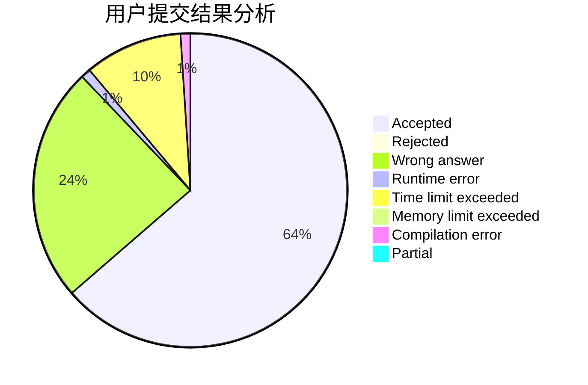
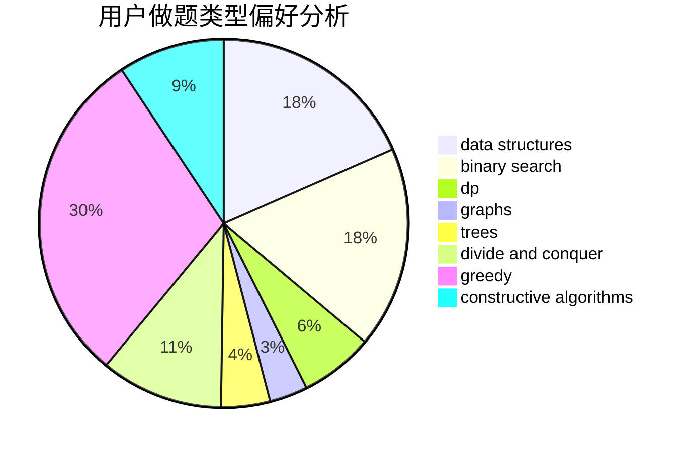
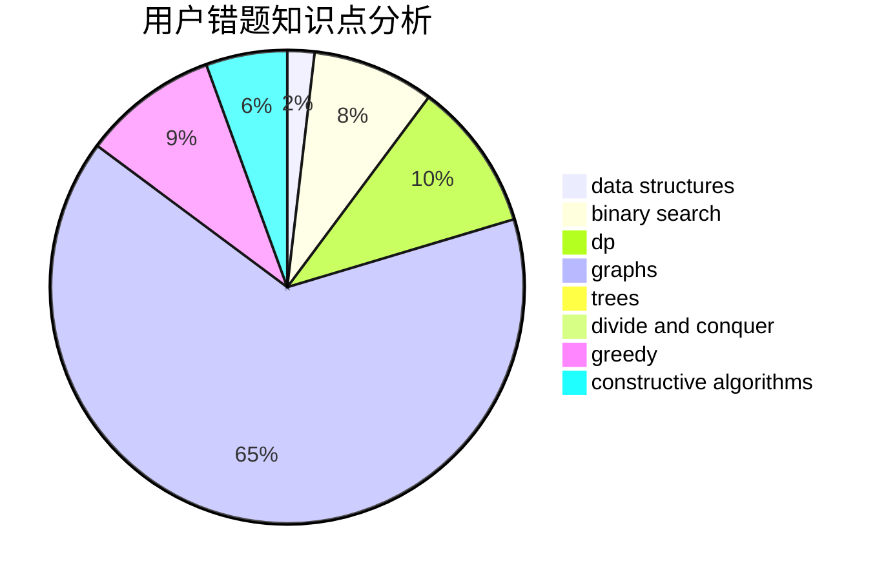

# Flash_plus
<!-- tabs:start -->
#### **用户提交结果分析**

#### **用户做题类型偏好分析**

#### **用户错题知识点分析**

<!-- tabs:end -->
# 推荐题目
[Anfisa the Monkey](http://codeforces.com/problemset/problem/44/E)		dp		  
[Vasya and Golden Ticket](http://codeforces.com/problemset/problem/1030/C)		implementation		  
[Likes Display](http://codeforces.com/problemset/problem/1297/A)		*special problem,
                        implementation		  
[Multithreading (Hard Version)](http://codeforces.com/problemset/problem/1450/H2)		combinatorics,
                        implementation,
                        math		  
[Valeriy and Deque](https://codeforces.com/contest/1180/problem/C)		data structures,
                        implementation		  
[Five Dimensional Points](http://codeforces.com/problemset/problem/850/A)		brute force,
                        geometry,
                        math		  
[Campus](http://codeforces.com/problemset/problem/571/D)		binary search,
                        data structures,
                        dsu,
                        trees		  
[Three Blocks Palindrome (hard version)](http://codeforces.com/problemset/problem/1335/E2)		brute force,
                        data structures,
                        dp,
                        two pointers		  
[Bearish Fanpages](https://codeforces.com/contest/674/problem/D)		nan		  
[Minimal string](http://codeforces.com/problemset/problem/797/C)		data structures,
                        greedy,
                        strings		  
<!-- tabs:start -->
#### **data structures**
[Anfisa the Monkey](https://codeforces.com/contest/1180/problem/C)		data structures,
                        implementation		  
[Vasya and Golden Ticket](http://codeforces.com/problemset/problem/571/D)		binary search,
                        data structures,
                        dsu,
                        trees		  
[Likes Display](http://codeforces.com/problemset/problem/1335/E2)		brute force,
                        data structures,
                        dp,
                        two pointers		  
[Multithreading (Hard Version)](http://codeforces.com/problemset/problem/797/C)		data structures,
                        greedy,
                        strings		  
[Valeriy and Deque](http://codeforces.com/problemset/problem/793/F)		data structures,
                        divide and conquer,
                        dp		  
[Five Dimensional Points](http://codeforces.com/problemset/problem/777/B)		data structures,
                        dp,
                        greedy,
                        sortings		  
[Campus](http://codeforces.com/problemset/problem/1349/A)		data structures,
                        math,
                        number theory		  
[Three Blocks Palindrome (hard version)](http://codeforces.com/problemset/problem/1492/C)		binary search,
                        data structures,
                        dp,
                        greedy,
                        two pointers		  
[Bearish Fanpages](http://codeforces.com/problemset/problem/1490/G)		binary search,
                        data structures,
                        math		  
[Minimal string](http://codeforces.com/problemset/problem/1479/D)		binary search,
                        bitmasks,
                        brute force,
                        data structures,
                        probabilities,
                        trees		  
#### **binary search**
[Anfisa the Monkey](http://codeforces.com/problemset/problem/571/D)		binary search,
                        data structures,
                        dsu,
                        trees		  
[Vasya and Golden Ticket](http://codeforces.com/problemset/problem/701/C)		binary search,
                        strings,
                        two pointers		  
[Likes Display](http://codeforces.com/problemset/problem/84/C)		binary search,
                        implementation		  
[Multithreading (Hard Version)](https://codeforces.com/contest/1011/problem/D)		binary search,
                        interactive		  
[Valeriy and Deque](http://codeforces.com/problemset/problem/1492/C)		binary search,
                        data structures,
                        dp,
                        greedy,
                        two pointers		  
[Five Dimensional Points](http://codeforces.com/problemset/problem/1463/D)		binary search,
                        constructive algorithms,
                        greedy,
                        two pointers		  
[Campus](http://codeforces.com/problemset/problem/1490/G)		binary search,
                        data structures,
                        math		  
[Three Blocks Palindrome (hard version)](http://codeforces.com/problemset/problem/1479/D)		binary search,
                        bitmasks,
                        brute force,
                        data structures,
                        probabilities,
                        trees		  
[Bearish Fanpages](http://codeforces.com/problemset/problem/1436/E)		binary search,
                        data structures,
                        two pointers		  
[Minimal string](http://codeforces.com/problemset/problem/1461/D)		binary search,
                        brute force,
                        data structures,
                        divide and conquer,
                        implementation,
                        sortings		  
#### **dp**
[Anfisa the Monkey](http://codeforces.com/problemset/problem/44/E)		dp		  
[Vasya and Golden Ticket](http://codeforces.com/problemset/problem/1335/E2)		brute force,
                        data structures,
                        dp,
                        two pointers		  
[Likes Display](http://codeforces.com/problemset/problem/1207/C)		dp,
                        greedy		  
[Multithreading (Hard Version)](http://codeforces.com/problemset/problem/793/F)		data structures,
                        divide and conquer,
                        dp		  
[Valeriy and Deque](http://codeforces.com/problemset/problem/6/D)		brute force,
                        dp		  
[Five Dimensional Points](http://codeforces.com/problemset/problem/777/B)		data structures,
                        dp,
                        greedy,
                        sortings		  
[Campus](http://codeforces.com/problemset/problem/1194/F)		combinatorics,
                        dp,
                        number theory,
                        probabilities,
                        two pointers		  
[Three Blocks Palindrome (hard version)](http://codeforces.com/problemset/problem/1492/C)		binary search,
                        data structures,
                        dp,
                        greedy,
                        two pointers		  
[Bearish Fanpages](https://codeforces.com/contest/1457/problem/C)		brute force,
                        dp,
                        implementation		  
[Minimal string](http://codeforces.com/problemset/problem/1491/C)		brute force,
                        data structures,
                        dp,
                        greedy,
                        implementation		  
#### **graph**
[Anfisa the Monkey](http://codeforces.com/problemset/problem/1411/C)		dfs and similar,
                        dsu,
                        graphs		  
[Vasya and Golden Ticket](http://codeforces.com/problemset/problem/76/A)		dsu,
                        graphs,
                        sortings,
                        trees		  
[Likes Display](http://codeforces.com/problemset/problem/209/C)		constructive algorithms,
                        dsu,
                        graphs,
                        greedy		  
[Multithreading (Hard Version)](http://codeforces.com/problemset/problem/845/G)		dfs and similar,
                        graphs,
                        math		  
[Valeriy and Deque](http://codeforces.com/problemset/problem/1487/C)		brute force,
                        constructive algorithms,
                        dfs and similar,
                        graphs,
                        greedy,
                        implementation,
                        math		  
[Five Dimensional Points](http://codeforces.com/problemset/problem/1437/C)		dp,
                        flows,
                        graph matchings,
                        greedy,
                        math,
                        sortings		  
[Campus](http://codeforces.com/problemset/problem/1470/D)		constructive algorithms,
                        dfs and similar,
                        graph matchings,
                        graphs,
                        greedy		  
[Three Blocks Palindrome (hard version)](http://codeforces.com/problemset/problem/1476/C)		dp,
                        graphs,
                        greedy		  
[Bearish Fanpages](http://codeforces.com/problemset/problem/1304/D)		constructive algorithms,
                        graphs,
                        greedy,
                        two pointers		  
[Minimal string](http://codeforces.com/problemset/problem/1475/C)		combinatorics,
                        graphs,
                        math		  
#### **trees**
[Anfisa the Monkey](http://codeforces.com/problemset/problem/571/D)		binary search,
                        data structures,
                        dsu,
                        trees		  
[Vasya and Golden Ticket](http://codeforces.com/problemset/problem/76/A)		dsu,
                        graphs,
                        sortings,
                        trees		  
[Likes Display](http://codeforces.com/problemset/problem/1479/D)		binary search,
                        bitmasks,
                        brute force,
                        data structures,
                        probabilities,
                        trees		  
[Multithreading (Hard Version)](http://codeforces.com/problemset/problem/1511/C)		brute force,
                        data structures,
                        implementation,
                        trees		  
[Valeriy and Deque](http://codeforces.com/problemset/problem/1499/F)		combinatorics,
                        dfs and similar,
                        dp,
                        trees		  
[Five Dimensional Points](http://codeforces.com/problemset/problem/1491/E)		brute force,
                        dfs and similar,
                        divide and conquer,
                        number theory,
                        trees		  
[Campus](http://codeforces.com/problemset/problem/1466/D)		data structures,
                        greedy,
                        sortings,
                        trees		  
[Three Blocks Palindrome (hard version)](http://codeforces.com/problemset/problem/1495/D)		combinatorics,
                        dfs and similar,
                        graphs,
                        math,
                        shortest paths,
                        trees		  
[Bearish Fanpages](http://codeforces.com/problemset/problem/1303/G)		data structures,
                        divide and conquer,
                        geometry,
                        trees		  
[Minimal string](http://codeforces.com/problemset/problem/1454/E)		combinatorics,
                        dfs and similar,
                        graphs,
                        trees		  
#### **divide and conquer**
[Anfisa the Monkey](http://codeforces.com/problemset/problem/1466/G)		combinatorics,
                        divide and conquer,
                        hashing,
                        math,
                        string suffix structures,
                        strings		  
[Vasya and Golden Ticket](http://codeforces.com/problemset/problem/793/F)		data structures,
                        divide and conquer,
                        dp		  
[Likes Display](http://codeforces.com/problemset/problem/1461/D)		binary search,
                        brute force,
                        data structures,
                        divide and conquer,
                        implementation,
                        sortings		  
[Multithreading (Hard Version)](http://codeforces.com/problemset/problem/1466/G)		combinatorics,
                        divide and conquer,
                        hashing,
                        math,
                        string suffix structures,
                        strings		  
[Valeriy and Deque](http://codeforces.com/problemset/problem/1490/D)		dfs and similar,
                        divide and conquer,
                        implementation		  
[Five Dimensional Points](https://codeforces.com/contest/1483/problem/C)		data structures,
                        divide and conquer,
                        dp		  
[Campus](http://codeforces.com/problemset/problem/1491/E)		brute force,
                        dfs and similar,
                        divide and conquer,
                        number theory,
                        trees		  
[Three Blocks Palindrome (hard version)](http://codeforces.com/problemset/problem/1303/G)		data structures,
                        divide and conquer,
                        geometry,
                        trees		  
[Bearish Fanpages](http://codeforces.com/problemset/problem/1494/D)		constructive algorithms,
                        data structures,
                        dfs and similar,
                        divide and conquer,
                        dsu,
                        greedy,
                        sortings,
                        trees		  
[Minimal string](http://codeforces.com/problemset/problem/1482/E)		data structures,
                        divide and conquer,
                        dp		  
#### **greedy**
[Anfisa the Monkey](http://codeforces.com/problemset/problem/797/C)		data structures,
                        greedy,
                        strings		  
[Vasya and Golden Ticket](http://codeforces.com/problemset/problem/1207/C)		dp,
                        greedy		  
[Likes Display](http://codeforces.com/problemset/problem/1215/C)		constructive algorithms,
                        greedy		  
[Multithreading (Hard Version)](http://codeforces.com/problemset/problem/777/B)		data structures,
                        dp,
                        greedy,
                        sortings		  
[Valeriy and Deque](http://codeforces.com/problemset/problem/209/C)		constructive algorithms,
                        dsu,
                        graphs,
                        greedy		  
[Five Dimensional Points](http://codeforces.com/problemset/problem/1291/B)		greedy,
                        implementation		  
[Campus](http://codeforces.com/problemset/problem/1492/C)		binary search,
                        data structures,
                        dp,
                        greedy,
                        two pointers		  
[Three Blocks Palindrome (hard version)](https://codeforces.com/contest/1496/problem/C)		geometry,
                        greedy,
                        math,
                        sortings		  
[Bearish Fanpages](http://codeforces.com/problemset/problem/1493/A)		constructive algorithms,
                        greedy		  
[Minimal string](http://codeforces.com/problemset/problem/1463/D)		binary search,
                        constructive algorithms,
                        greedy,
                        two pointers		  
#### **constructive algorithms**
[Anfisa the Monkey](http://codeforces.com/problemset/problem/1208/C)		constructive algorithms		  
[Vasya and Golden Ticket](http://codeforces.com/problemset/problem/1215/C)		constructive algorithms,
                        greedy		  
[Likes Display](http://codeforces.com/problemset/problem/1342/B)		constructive algorithms,
                        strings		  
[Multithreading (Hard Version)](http://codeforces.com/problemset/problem/209/C)		constructive algorithms,
                        dsu,
                        graphs,
                        greedy		  
[Valeriy and Deque](http://codeforces.com/problemset/problem/1493/A)		constructive algorithms,
                        greedy		  
[Five Dimensional Points](http://codeforces.com/problemset/problem/1463/D)		binary search,
                        constructive algorithms,
                        greedy,
                        two pointers		  
[Campus](https://codeforces.com/contest/1456/problem/B)		bitmasks,
                        brute force,
                        constructive algorithms		  
[Three Blocks Palindrome (hard version)](http://codeforces.com/problemset/problem/1492/D)		bitmasks,
                        constructive algorithms,
                        greedy,
                        math		  
[Bearish Fanpages](https://codeforces.com/contest/1504/problem/D)		constructive algorithms,
                        games,
                        interactive		  
[Minimal string](https://codeforces.com/contest/1483/problem/A)		brute force,
                        constructive algorithms,
                        greedy,
                        implementation		  
#### **sortings**
[Anfisa the Monkey](http://codeforces.com/problemset/problem/777/B)		data structures,
                        dp,
                        greedy,
                        sortings		  
[Vasya and Golden Ticket](http://codeforces.com/problemset/problem/76/A)		dsu,
                        graphs,
                        sortings,
                        trees		  
[Likes Display](https://codeforces.com/contest/1496/problem/C)		geometry,
                        greedy,
                        math,
                        sortings		  
[Multithreading (Hard Version)](http://codeforces.com/problemset/problem/1495/A)		geometry,
                        greedy,
                        math,
                        sortings		  
[Valeriy and Deque](http://codeforces.com/problemset/problem/1497/A)		brute force,
                        data structures,
                        greedy,
                        sortings		  
[Five Dimensional Points](http://codeforces.com/problemset/problem/1427/A)		math,
                        sortings		  
[Campus](http://codeforces.com/problemset/problem/1461/D)		binary search,
                        brute force,
                        data structures,
                        divide and conquer,
                        implementation,
                        sortings		  
[Three Blocks Palindrome (hard version)](http://codeforces.com/problemset/problem/1437/C)		dp,
                        flows,
                        graph matchings,
                        greedy,
                        math,
                        sortings		  
[Bearish Fanpages](http://codeforces.com/problemset/problem/1473/A)		greedy,
                        implementation,
                        math,
                        sortings		  
[Minimal string](http://codeforces.com/problemset/problem/1486/B)		binary search,
                        geometry,
                        shortest paths,
                        sortings		  
<!-- tabs:end -->
