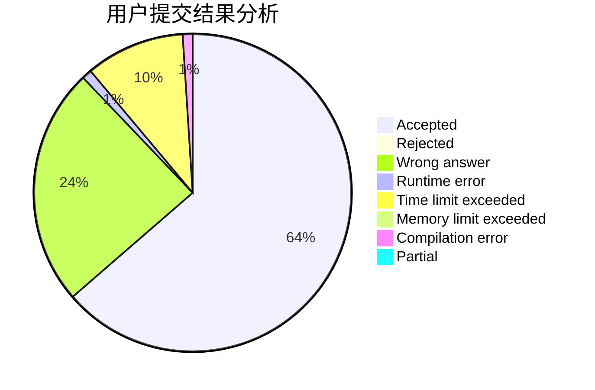
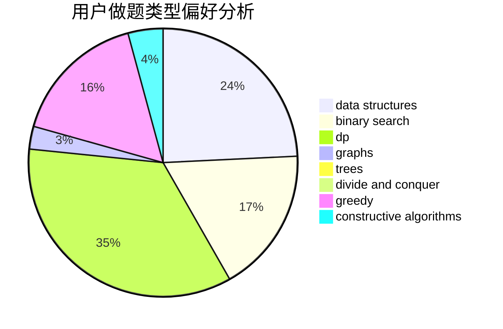
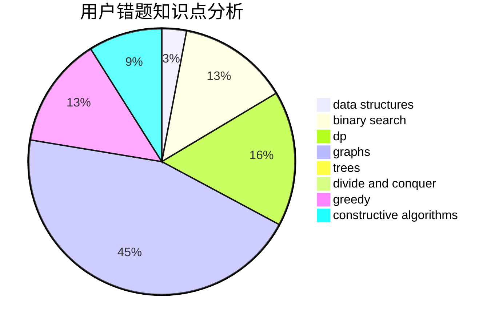

# Flash_plus

<!-- tabs:start -->

#### **用户提交结果分析**

#### **用户做题类型偏好分析**

#### **用户错题知识点分析**

<!-- tabs:end -->
# 推荐题目
[471D](https://codeforces.com/contest/471/problem/D)		string suffix structures,
                        strings		  
[592A](https://codeforces.com/contest/592/problem/A)		implementation		  
[1030G](https://codeforces.com/contest/1030/problem/G)		number theory		  
[1459F](https://codeforces.com/contest/1459/problem/F)		dsu,graphs,sortings,trees		  
[808G](https://codeforces.com/contest/808/problem/G)		dp,
                        strings		  
[1473G](https://codeforces.com/contest/1473/problem/G)		combinatorics,
                        dp,
                        fft,
                        math		  
[12131](https://codeforces.com/contest/1213/problem/1)		dsu,graphs,sortings,trees		  
[1087E](https://codeforces.com/contest/1087/problem/E)		dsu,graphs,sortings,trees		  
[699B](https://codeforces.com/contest/699/problem/B)		implementation		  
[811B](https://codeforces.com/contest/811/problem/B)		implementation,
                        sortings		  
