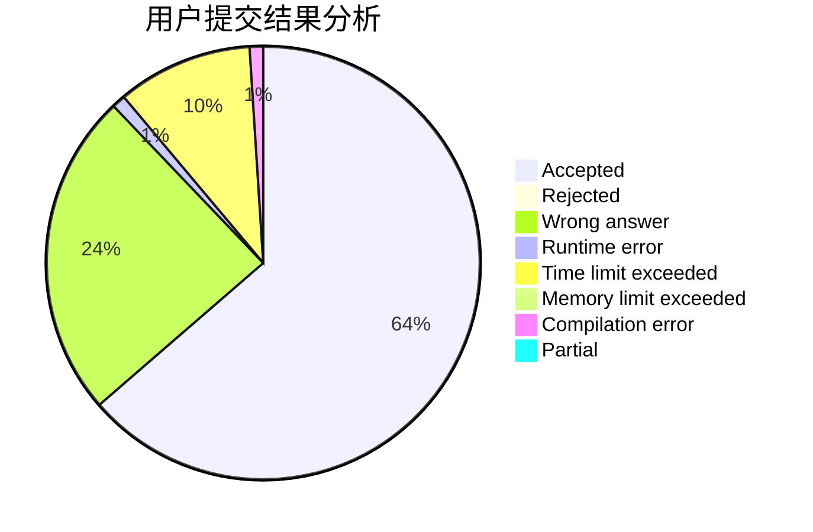
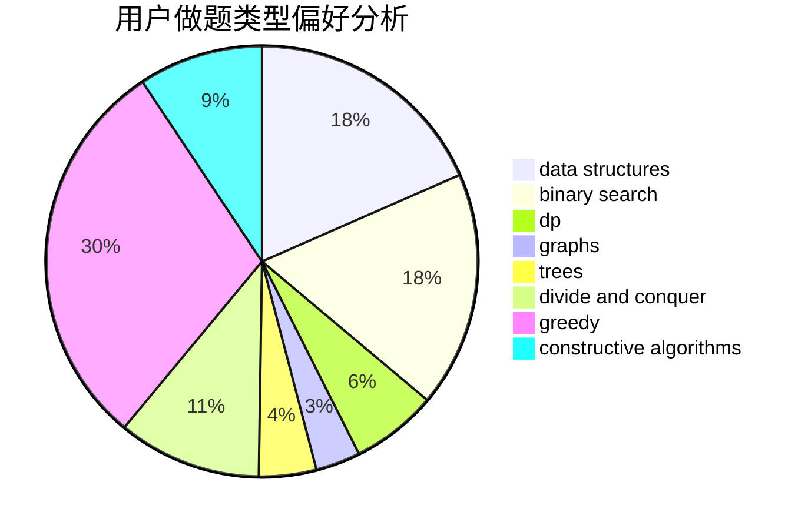
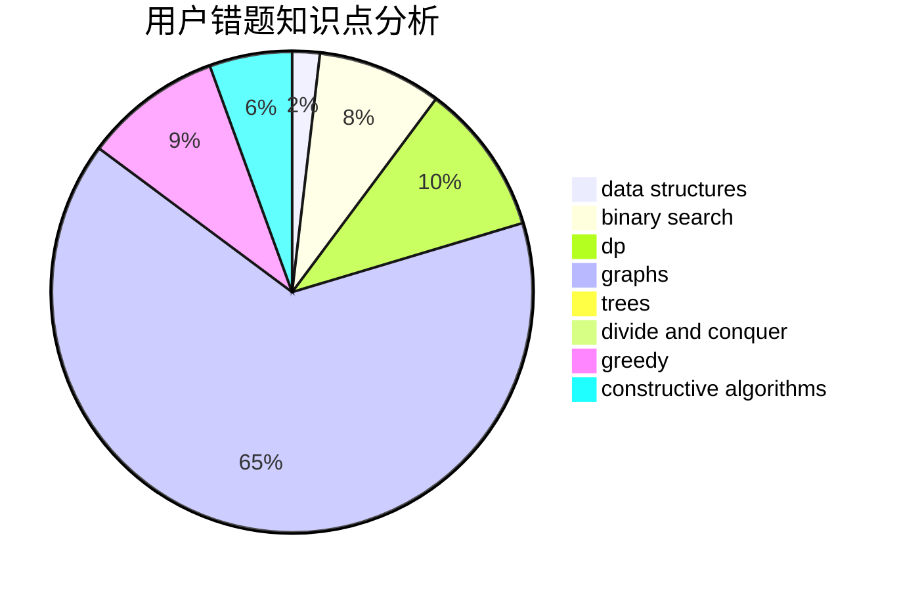

# Flash_plus

<!-- tabs:start -->

#### **用户提交结果分析**

#### **用户做题类型偏好分析**

#### **用户错题知识点分析**

<!-- tabs:end -->
# 推荐题目
[44E](https://codeforces.com/contest/44/problem/E)		dp		  
[571D](https://codeforces.com/contest/571/problem/D)		binary search,
                        data structures,
                        dsu,
                        trees		  
[1030C](https://codeforces.com/contest/1030/problem/C)		implementation		  
[1450H2](https://codeforces.com/contest/1450H/problem/2)		combinatorics,
                        implementation,
                        math		  
[793F](https://codeforces.com/contest/793/problem/F)		data structures,
                        divide and conquer,
                        dp		  
[1466G](https://codeforces.com/contest/1466/problem/G)		combinatorics,
                        divide and conquer,
                        hashing,
                        math,
                        string suffix structures,
                        strings		  
[1207C](https://codeforces.com/contest/1207/problem/C)		dp,
                        greedy		  
[1087B](https://codeforces.com/contest/1087/problem/B)		dsu,graphs,sortings,trees		  
[674D](https://codeforces.com/contest/674/problem/D)		dsu,graphs,sortings,trees		  
[797C](https://codeforces.com/contest/797/problem/C)		data structures,
                        greedy,
                        strings		  
