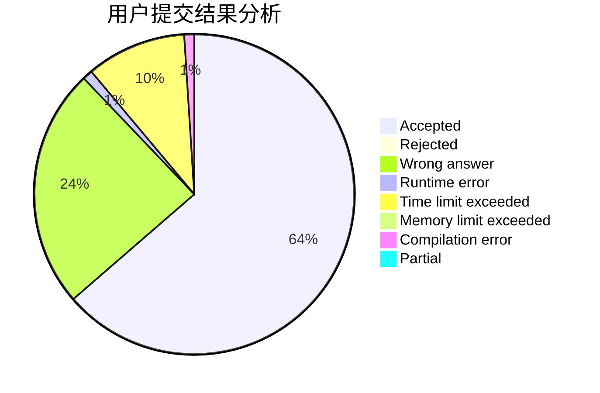
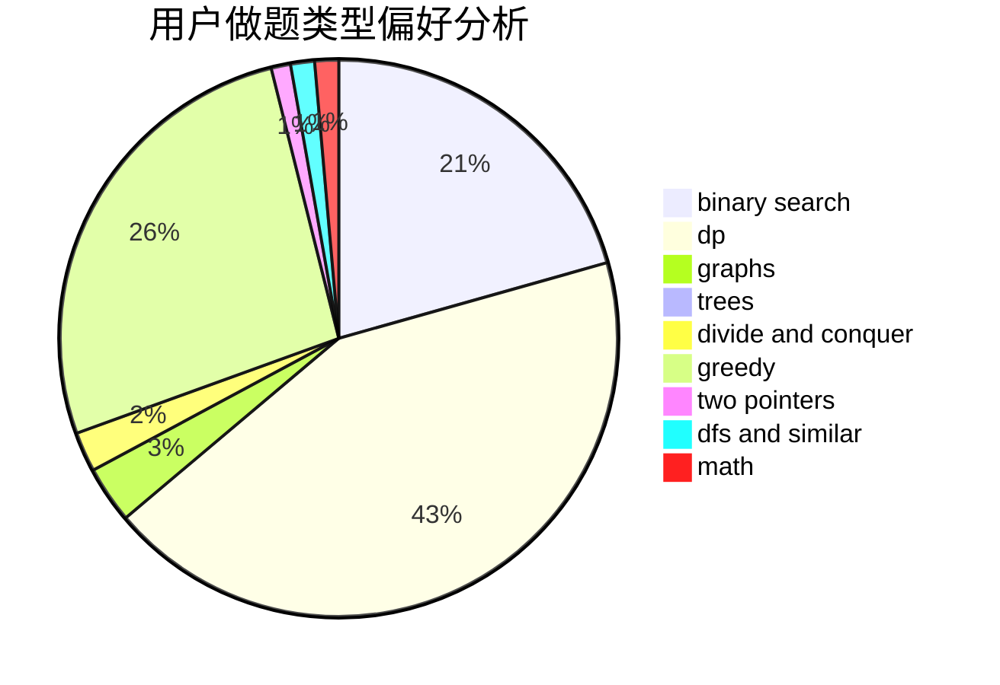

# Flash_plus

<!-- tabs:start -->

#### **用户提交结果分析**

#### **用户做题类型偏好分析**

<!-- tabs:end -->
# 推荐题目
[471D](https://codeforces.com/contest/471/problem/D)
[592A](https://codeforces.com/contest/592/problem/A)
[1030G](https://codeforces.com/contest/1030/problem/G)
[1459F](https://codeforces.com/contest/1459/problem/F)
[808G](https://codeforces.com/contest/808/problem/G)
[1473G](https://codeforces.com/contest/1473/problem/G)
[12131](https://codeforces.com/contest/1213/problem/1)
[1087E](https://codeforces.com/contest/1087/problem/E)
[699B](https://codeforces.com/contest/699/problem/B)
[811B](https://codeforces.com/contest/811/problem/B)
