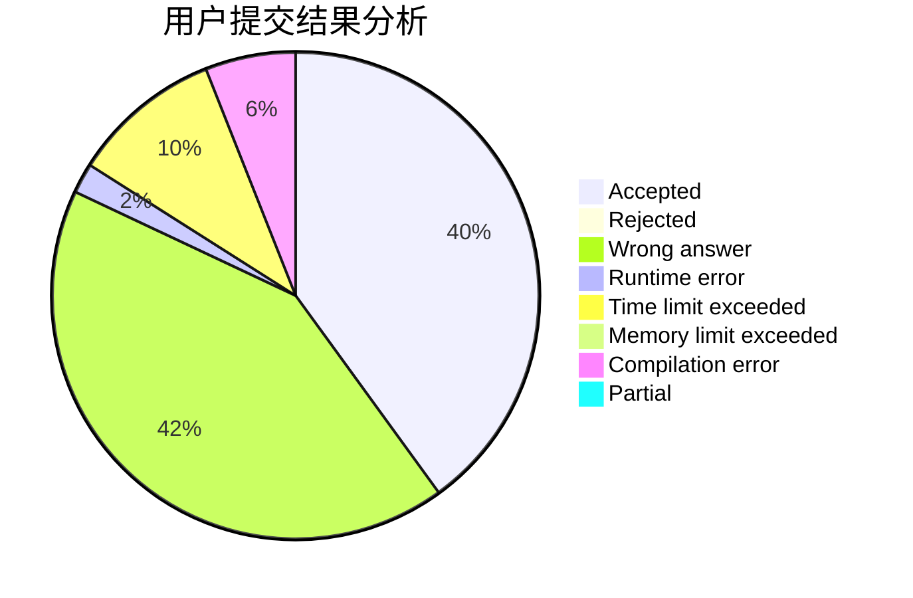
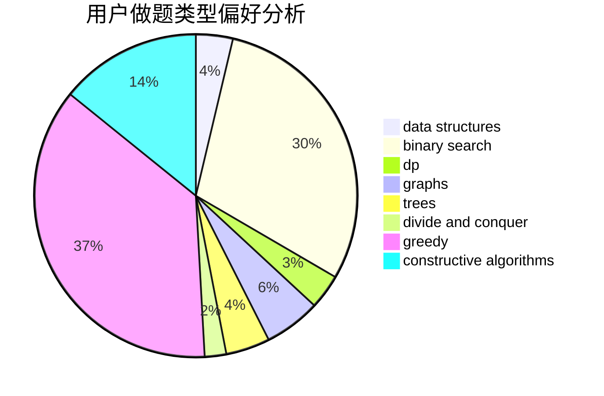
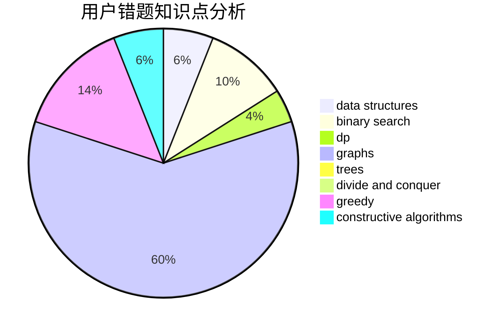

# FlowerBlack

<!-- tabs:start -->

#### **用户提交结果分析**

#### **用户做题类型偏好分析**

#### **用户错题知识点分析**

<!-- tabs:end -->
# 推荐题目
[1019C](https://codeforces.com/contest/1019/problem/C)		constructive algorithms,
                        graphs		  
[732E](https://codeforces.com/contest/732/problem/E)		greedy,
                        sortings		  
[744D](https://codeforces.com/contest/744/problem/D)		geometry		  
[869B](https://codeforces.com/contest/869/problem/B)		math		  
[1488F](https://codeforces.com/contest/1488/problem/F)		*special problem,
                        *special problem,
                        binary search,
                        data structures		  
[319C](https://codeforces.com/contest/319/problem/C)		dp,
                        geometry		  
[869C](https://codeforces.com/contest/869/problem/C)		combinatorics,
                        dp,
                        math		  
[869E](https://codeforces.com/contest/869/problem/E)		data structures,
                        hashing		  
[599A](https://codeforces.com/contest/599/problem/A)		implementation		  
[1013E](https://codeforces.com/contest/1013/problem/E)		dsu,graphs,sortings,trees		  
