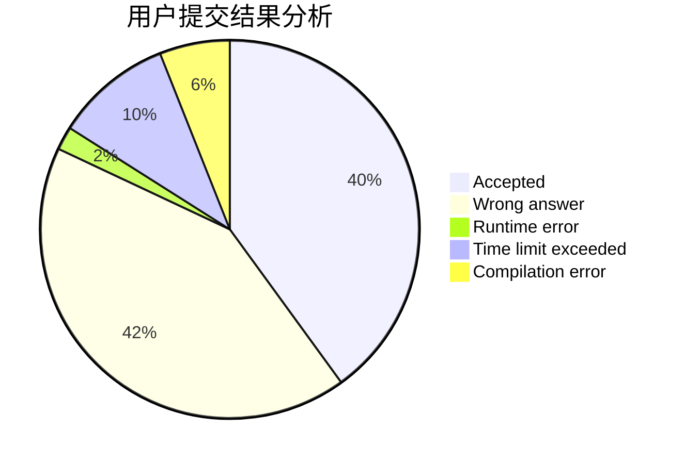
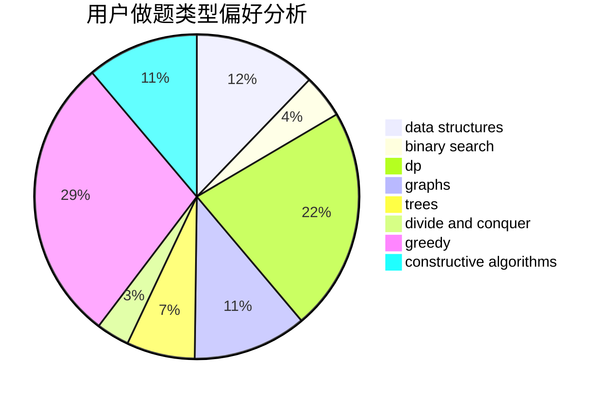
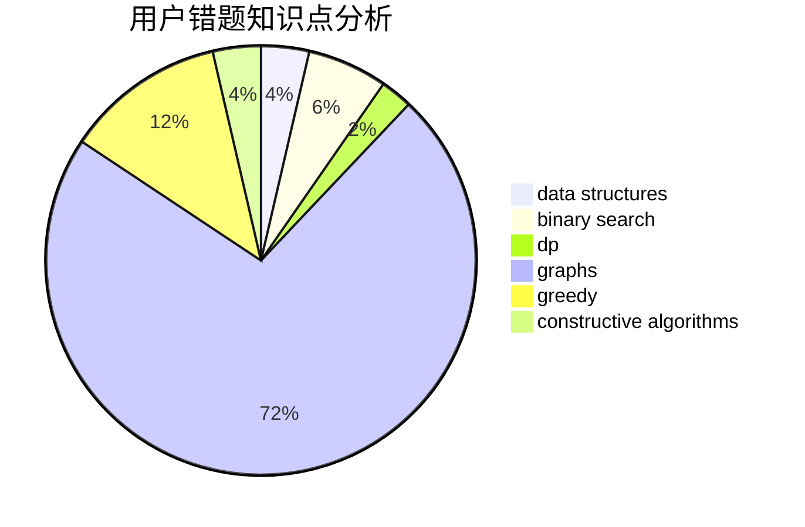

# FlowerBlack
<!-- tabs:start -->
#### **用户提交结果分析**

#### **用户做题类型偏好分析**

#### **用户错题知识点分析**

<!-- tabs:end -->
# 推荐题目
[Sonya Partymaker](http://codeforces.com/problemset/problem/713/E)		binary search,
                        dp		  
[Arpa and a game with Mojtaba](http://codeforces.com/problemset/problem/850/C)		bitmasks,
                        dp,
                        games		  
[Empire Strikes Back](http://codeforces.com/problemset/problem/300/E)		binary search,
                        math,
                        number theory		  
[Rainbow Balls](http://codeforces.com/problemset/problem/850/F)		math		  
[The Same Calendar](http://codeforces.com/problemset/problem/678/B)		implementation		  
[And](http://codeforces.com/problemset/problem/1013/B)		greedy		  
[Petr#](http://codeforces.com/problemset/problem/113/B)		brute force,
                        data structures,
                        hashing,
                        strings		  
[New Year and Snowy Grid](http://codeforces.com/problemset/problem/750/H)		dfs and similar,
                        dsu,
                        graphs,
                        interactive		  
[Showing Off](http://codeforces.com/problemset/problem/1416/F)		flows,
                        graph matchings,
                        greedy,
                        implementation		  
[Au Pont Rouge](https://codeforces.com/contest/1315/problem/F)		binary search,
                        dp,
                        strings		  
<!-- tabs:start -->
#### **data structures**
[Petr#](http://codeforces.com/problemset/problem/113/B)		brute force,
                        data structures,
                        hashing,
                        strings		  
[Pashmak and Parmida's problem](http://codeforces.com/problemset/problem/459/D)		data structures,
                        divide and conquer,
                        sortings		  
[Sum of Prefix Sums](http://codeforces.com/problemset/problem/1303/G)		data structures,
                        divide and conquer,
                        geometry,
                        trees		  
[Mahmoud and a xor trip](http://codeforces.com/problemset/problem/766/E)		bitmasks,
                        constructive algorithms,
                        data structures,
                        dfs and similar,
                        dp,
                        math,
                        trees		  
[Timetable](http://codeforces.com/problemset/problem/1039/A)		constructive algorithms,
                        data structures,
                        greedy,
                        math		  
[Water Balance](https://codeforces.com/contest/1300/problem/E)		data structures,
                        geometry,
                        greedy		  
[Watchmen](https://codeforces.com/contest/651/problem/C)		data structures,
                        geometry,
                        math		  
[NEKO's Maze Game](https://codeforces.com/contest/1293/problem/C)		data structures,
                        dsu,
                        implementation		  
[Modulo Sum](http://codeforces.com/problemset/problem/577/B)		combinatorics,
                        data structures,
                        dp,
                        two pointers		  
[Destiny](http://codeforces.com/problemset/problem/840/D)		data structures,
                        probabilities		  
#### **binary search**
[Sonya Partymaker](http://codeforces.com/problemset/problem/713/E)		binary search,
                        dp		  
[Empire Strikes Back](http://codeforces.com/problemset/problem/300/E)		binary search,
                        math,
                        number theory		  
[Au Pont Rouge](https://codeforces.com/contest/1315/problem/F)		binary search,
                        dp,
                        strings		  
[Skills](https://codeforces.com/contest/614/problem/D)		binary search,
                        brute force,
                        dp,
                        greedy,
                        sortings,
                        two pointers		  
[Simple Polygon Embedding](http://codeforces.com/problemset/problem/1354/C1)		binary search,
                        geometry,
                        math,
                        ternary search		  
[Weights Division (hard version)](http://codeforces.com/problemset/problem/1399/E2)		binary search,
                        dfs and similar,
                        greedy,
                        sortings,
                        trees,
                        two pointers		  
[Asterism (Hard Version)](http://codeforces.com/problemset/problem/1371/E2)		binary search,
                        combinatorics,
                        dp,
                        math,
                        number theory,
                        sortings		  
[Maximum width](http://codeforces.com/problemset/problem/1492/C)		binary search,
                        data structures,
                        dp,
                        greedy,
                        two pointers		  
[Pairs](http://codeforces.com/problemset/problem/1463/D)		binary search,
                        constructive algorithms,
                        greedy,
                        two pointers		  
[Old Floppy Drive](http://codeforces.com/problemset/problem/1490/G)		binary search,
                        data structures,
                        math		  
#### **dp**
[Sonya Partymaker](http://codeforces.com/problemset/problem/713/E)		binary search,
                        dp		  
[Arpa and a game with Mojtaba](http://codeforces.com/problemset/problem/850/C)		bitmasks,
                        dp,
                        games		  
[Au Pont Rouge](https://codeforces.com/contest/1315/problem/F)		binary search,
                        dp,
                        strings		  
[Captains Mode](http://codeforces.com/problemset/problem/377/C)		bitmasks,
                        dp,
                        games		  
[Skills](https://codeforces.com/contest/614/problem/D)		binary search,
                        brute force,
                        dp,
                        greedy,
                        sortings,
                        two pointers		  
[Basketball Team](http://codeforces.com/problemset/problem/107/B)		combinatorics,
                        dp,
                        math,
                        probabilities		  
[Mahmoud and a xor trip](http://codeforces.com/problemset/problem/766/E)		bitmasks,
                        constructive algorithms,
                        data structures,
                        dfs and similar,
                        dp,
                        math,
                        trees		  
[Tournament Construction](http://codeforces.com/problemset/problem/850/D)		constructive algorithms,
                        dp,
                        graphs,
                        greedy,
                        math		  
[Asterism (Hard Version)](http://codeforces.com/problemset/problem/1371/E2)		binary search,
                        combinatorics,
                        dp,
                        math,
                        number theory,
                        sortings		  
[Hyakugoku and Ladders](http://codeforces.com/problemset/problem/1245/E)		dp,
                        probabilities,
                        shortest paths		  
#### **graph**
[New Year and Snowy Grid](http://codeforces.com/problemset/problem/750/H)		dfs and similar,
                        dsu,
                        graphs,
                        interactive		  
[Showing Off](http://codeforces.com/problemset/problem/1416/F)		flows,
                        graph matchings,
                        greedy,
                        implementation		  
[Tournament Construction](http://codeforces.com/problemset/problem/850/D)		constructive algorithms,
                        dp,
                        graphs,
                        greedy,
                        math		  
[Shortest and Longest LIS](http://codeforces.com/problemset/problem/1304/D)		constructive algorithms,
                        graphs,
                        greedy,
                        two pointers		  
[The Tag Game](http://codeforces.com/problemset/problem/813/C)		dfs and similar,
                        graphs		  
[Upgrading Cities](http://codeforces.com/problemset/problem/1062/F)		dfs and similar,
                        graphs		  
[Anna, Svyatoslav and Maps](http://codeforces.com/problemset/problem/1204/C)		dp,
                        graphs,
                        greedy,
                        shortest paths		  
[Minimum Ties](http://codeforces.com/problemset/problem/1487/C)		brute force,
                        constructive algorithms,
                        dfs and similar,
                        graphs,
                        greedy,
                        implementation,
                        math		  
[Chef Monocarp](http://codeforces.com/problemset/problem/1437/C)		dp,
                        flows,
                        graph matchings,
                        greedy,
                        math,
                        sortings		  
[Strange Housing](http://codeforces.com/problemset/problem/1470/D)		constructive algorithms,
                        dfs and similar,
                        graph matchings,
                        graphs,
                        greedy		  
#### **trees**
[Sum of Prefix Sums](http://codeforces.com/problemset/problem/1303/G)		data structures,
                        divide and conquer,
                        geometry,
                        trees		  
[Mahmoud and a xor trip](http://codeforces.com/problemset/problem/766/E)		bitmasks,
                        constructive algorithms,
                        data structures,
                        dfs and similar,
                        dp,
                        math,
                        trees		  
[Weights Division (hard version)](http://codeforces.com/problemset/problem/1399/E2)		binary search,
                        dfs and similar,
                        greedy,
                        sortings,
                        trees,
                        two pointers		  
[Andrew and Chemistry](http://codeforces.com/problemset/problem/718/D)		dp,
                        hashing,
                        trees		  
[Close Vertices](http://codeforces.com/problemset/problem/293/E)		data structures,
                        divide and conquer,
                        trees		  
[Yet Another Card Deck](http://codeforces.com/problemset/problem/1511/C)		brute force,
                        data structures,
                        implementation,
                        trees		  
[Odd Mineral Resource](http://codeforces.com/problemset/problem/1479/D)		binary search,
                        bitmasks,
                        brute force,
                        data structures,
                        probabilities,
                        trees		  
[Diameter Cuts](http://codeforces.com/problemset/problem/1499/F)		combinatorics,
                        dfs and similar,
                        dp,
                        trees		  
[Fib-tree](http://codeforces.com/problemset/problem/1491/E)		brute force,
                        dfs and similar,
                        divide and conquer,
                        number theory,
                        trees		  
[13th Labour of Heracles](http://codeforces.com/problemset/problem/1466/D)		data structures,
                        greedy,
                        sortings,
                        trees		  
#### **divide and conquer**
[Pashmak and Parmida's problem](http://codeforces.com/problemset/problem/459/D)		data structures,
                        divide and conquer,
                        sortings		  
[Sum of Prefix Sums](http://codeforces.com/problemset/problem/1303/G)		data structures,
                        divide and conquer,
                        geometry,
                        trees		  
[Random Elections](http://codeforces.com/problemset/problem/850/E)		bitmasks,
                        brute force,
                        divide and conquer,
                        fft,
                        math		  
[Close Vertices](http://codeforces.com/problemset/problem/293/E)		data structures,
                        divide and conquer,
                        trees		  
[Divide and Summarize](http://codeforces.com/problemset/problem/1461/D)		binary search,
                        brute force,
                        data structures,
                        divide and conquer,
                        implementation,
                        sortings		  
[Song of the Sirens](http://codeforces.com/problemset/problem/1466/G)		combinatorics,
                        divide and conquer,
                        hashing,
                        math,
                        string suffix structures,
                        strings		  
[Permutation Transformation](http://codeforces.com/problemset/problem/1490/D)		dfs and similar,
                        divide and conquer,
                        implementation		  
[Skyline Photo](https://codeforces.com/contest/1483/problem/C)		data structures,
                        divide and conquer,
                        dp		  
[Fib-tree](http://codeforces.com/problemset/problem/1491/E)		brute force,
                        dfs and similar,
                        divide and conquer,
                        number theory,
                        trees		  
[Dogeforces](http://codeforces.com/problemset/problem/1494/D)		constructive algorithms,
                        data structures,
                        dfs and similar,
                        divide and conquer,
                        dsu,
                        greedy,
                        sortings,
                        trees		  
#### **greedy**
[And](http://codeforces.com/problemset/problem/1013/B)		greedy		  
[Showing Off](http://codeforces.com/problemset/problem/1416/F)		flows,
                        graph matchings,
                        greedy,
                        implementation		  
[Skills](https://codeforces.com/contest/614/problem/D)		binary search,
                        brute force,
                        dp,
                        greedy,
                        sortings,
                        two pointers		  
[Recover the String](https://codeforces.com/contest/709/problem/D)		constructive algorithms,
                        greedy,
                        implementation,
                        math		  
[Tournament Construction](http://codeforces.com/problemset/problem/850/D)		constructive algorithms,
                        dp,
                        graphs,
                        greedy,
                        math		  
[Shortest and Longest LIS](http://codeforces.com/problemset/problem/1304/D)		constructive algorithms,
                        graphs,
                        greedy,
                        two pointers		  
[Timetable](http://codeforces.com/problemset/problem/1039/A)		constructive algorithms,
                        data structures,
                        greedy,
                        math		  
[Weights Division (hard version)](http://codeforces.com/problemset/problem/1399/E2)		binary search,
                        dfs and similar,
                        greedy,
                        sortings,
                        trees,
                        two pointers		  
[The Light Square](http://codeforces.com/problemset/problem/1218/I)		2-sat,
                        dfs and similar,
                        greedy		  
[Paint the Numbers](http://codeforces.com/problemset/problem/1209/A)		greedy,
                        implementation,
                        math		  
#### **constructive algorithms**
[Recover the String](https://codeforces.com/contest/709/problem/D)		constructive algorithms,
                        greedy,
                        implementation,
                        math		  
[Divide Points](http://codeforces.com/problemset/problem/1270/E)		constructive algorithms,
                        geometry,
                        math		  
[Mahmoud and a xor trip](http://codeforces.com/problemset/problem/766/E)		bitmasks,
                        constructive algorithms,
                        data structures,
                        dfs and similar,
                        dp,
                        math,
                        trees		  
[Tournament Construction](http://codeforces.com/problemset/problem/850/D)		constructive algorithms,
                        dp,
                        graphs,
                        greedy,
                        math		  
[Shortest and Longest LIS](http://codeforces.com/problemset/problem/1304/D)		constructive algorithms,
                        graphs,
                        greedy,
                        two pointers		  
[Guess the Array](http://codeforces.com/problemset/problem/727/C)		constructive algorithms,
                        interactive,
                        math		  
[Timetable](http://codeforces.com/problemset/problem/1039/A)		constructive algorithms,
                        data structures,
                        greedy,
                        math		  
[Anti-knapsack](http://codeforces.com/problemset/problem/1493/A)		constructive algorithms,
                        greedy		  
[Pairs](http://codeforces.com/problemset/problem/1463/D)		binary search,
                        constructive algorithms,
                        greedy,
                        two pointers		  
[XOR-gun](https://codeforces.com/contest/1456/problem/B)		bitmasks,
                        brute force,
                        constructive algorithms		  
#### **sortings**
[Skills](https://codeforces.com/contest/614/problem/D)		binary search,
                        brute force,
                        dp,
                        greedy,
                        sortings,
                        two pointers		  
[Pashmak and Parmida's problem](http://codeforces.com/problemset/problem/459/D)		data structures,
                        divide and conquer,
                        sortings		  
[Weights Division (hard version)](http://codeforces.com/problemset/problem/1399/E2)		binary search,
                        dfs and similar,
                        greedy,
                        sortings,
                        trees,
                        two pointers		  
[Asterism (Hard Version)](http://codeforces.com/problemset/problem/1371/E2)		binary search,
                        combinatorics,
                        dp,
                        math,
                        number theory,
                        sortings		  
[The Great Hero](http://codeforces.com/problemset/problem/1480/B)		greedy,
                        implementation,
                        sortings		  
[Three Friends](http://codeforces.com/problemset/problem/1272/A)		brute force,
                        greedy,
                        math,
                        sortings		  
[Diamond Miner](https://codeforces.com/contest/1496/problem/C)		geometry,
                        greedy,
                        math,
                        sortings		  
[Meximization](http://codeforces.com/problemset/problem/1497/A)		brute force,
                        data structures,
                        greedy,
                        sortings		  
[Avoiding Zero](http://codeforces.com/problemset/problem/1427/A)		math,
                        sortings		  
[Divide and Summarize](http://codeforces.com/problemset/problem/1461/D)		binary search,
                        brute force,
                        data structures,
                        divide and conquer,
                        implementation,
                        sortings		  
<!-- tabs:end -->
