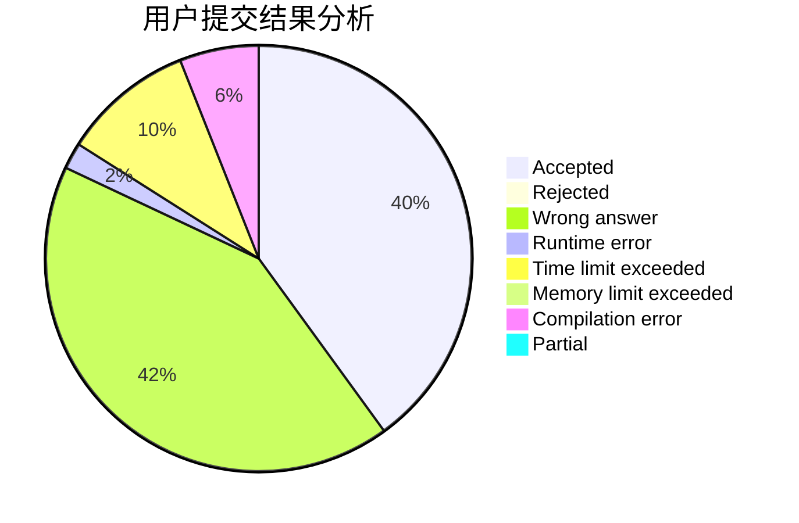
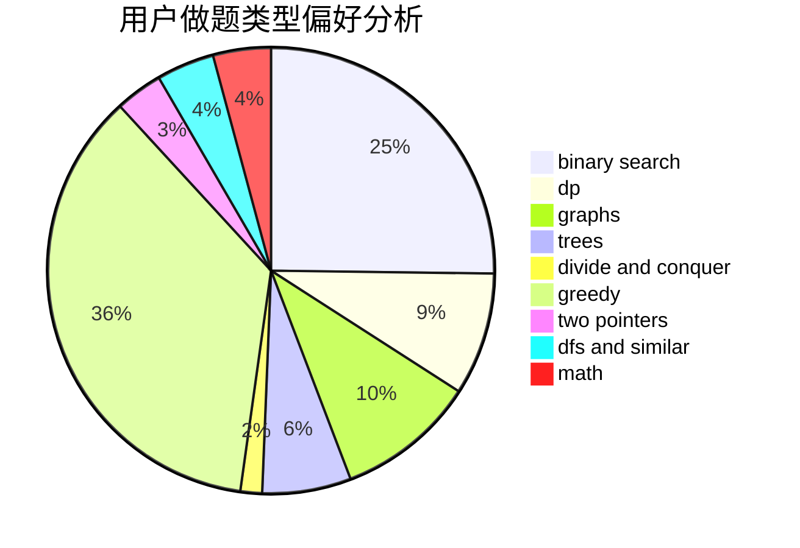

# FlowerBlack

<!-- tabs:start -->

#### **用户提交结果分析**

#### **用户做题类型偏好分析**

<!-- tabs:end -->
# 推荐题目
[1019C](https://codeforces.com/contest/1019/problem/C)
[732E](https://codeforces.com/contest/732/problem/E)
[744D](https://codeforces.com/contest/744/problem/D)
[869B](https://codeforces.com/contest/869/problem/B)
[1488F](https://codeforces.com/contest/1488/problem/F)
[319C](https://codeforces.com/contest/319/problem/C)
[869C](https://codeforces.com/contest/869/problem/C)
[869E](https://codeforces.com/contest/869/problem/E)
[599A](https://codeforces.com/contest/599/problem/A)
[1013E](https://codeforces.com/contest/1013/problem/E)
