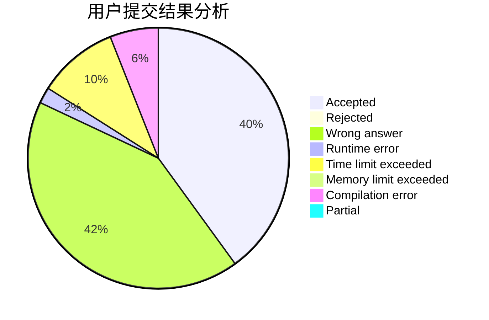
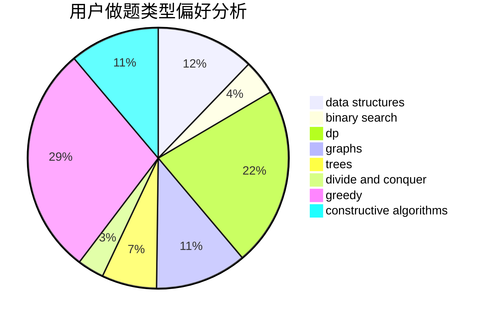
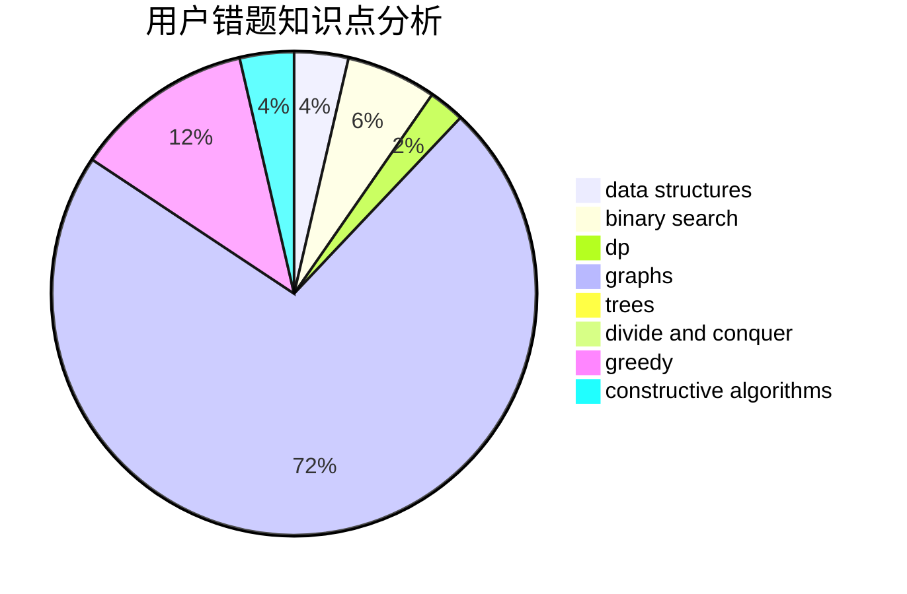

# FlowerBlack

<!-- tabs:start -->

#### **用户提交结果分析**

#### **用户做题类型偏好分析**

#### **用户错题知识点分析**

<!-- tabs:end -->
# 推荐题目
[1017F](https://codeforces.com/contest/1017/problem/F)		brute force,
                        math		  
[713E](https://codeforces.com/contest/713/problem/E)		binary search,
                        dp		  
[727C](https://codeforces.com/contest/727/problem/C)		constructive algorithms,
                        interactive,
                        math		  
[850C](https://codeforces.com/contest/850/problem/C)		bitmasks,
                        dp,
                        games		  
[1480B](https://codeforces.com/contest/1480/problem/B)		greedy,
                        implementation,
                        sortings		  
[300E](https://codeforces.com/contest/300/problem/E)		binary search,
                        math,
                        number theory		  
[850D](https://codeforces.com/contest/850/problem/D)		constructive algorithms,
                        dp,
                        graphs,
                        greedy,
                        math		  
[850F](https://codeforces.com/contest/850/problem/F)		math		  
[577B](https://codeforces.com/contest/577/problem/B)		combinatorics,
                        data structures,
                        dp,
                        two pointers		  
[1013B](https://codeforces.com/contest/1013/problem/B)		greedy		  
