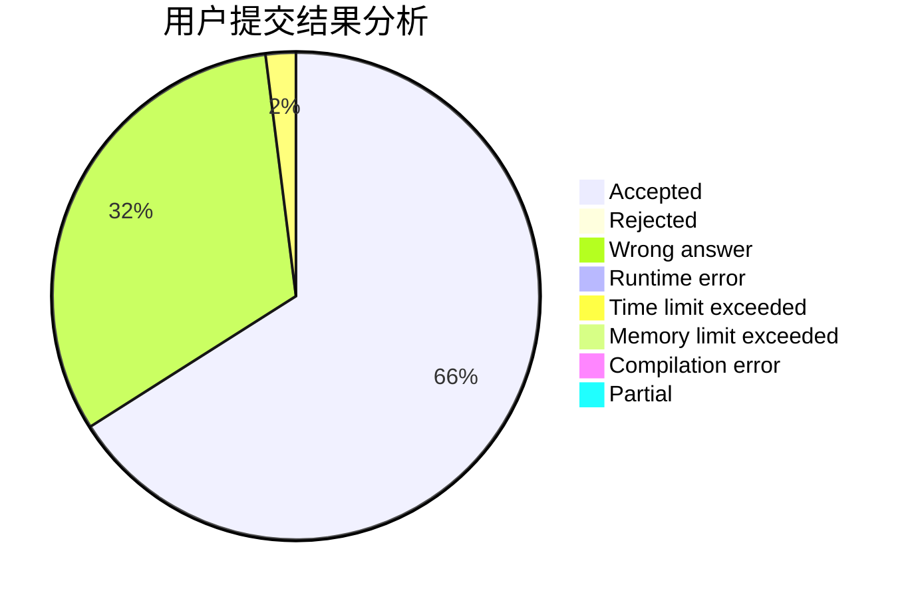
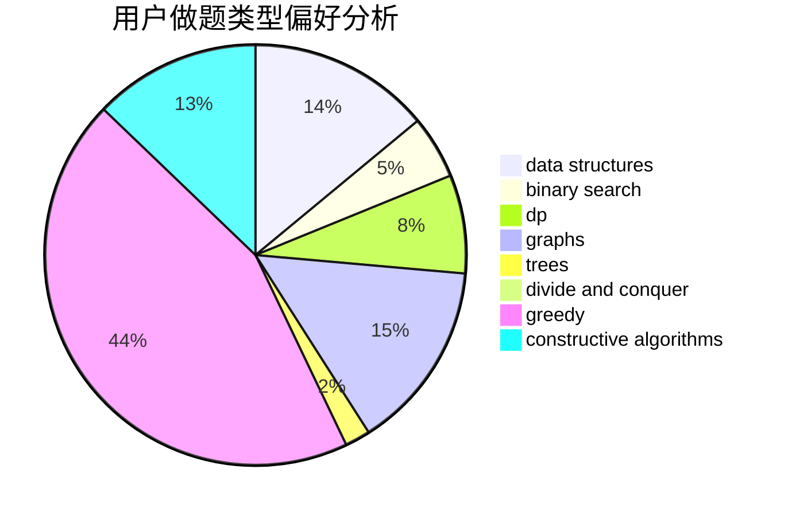
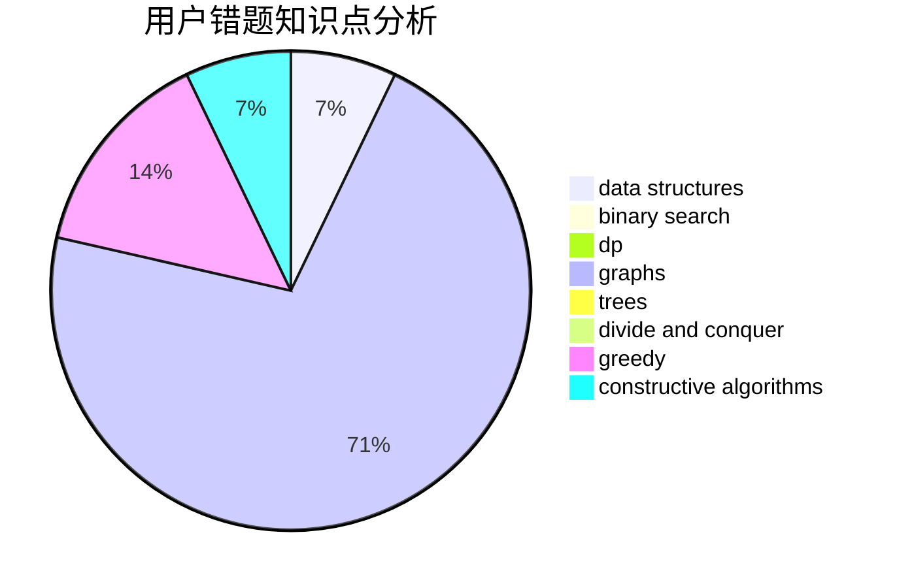

# 2018gtyz10

<!-- tabs:start -->

#### **用户提交结果分析**

#### **用户做题类型偏好分析**

#### **用户错题知识点分析**

<!-- tabs:end -->
# 推荐题目
[1272E](https://codeforces.com/contest/1272/problem/E)		dfs and similar,
                        graphs,
                        shortest paths		  
[1271E](https://codeforces.com/contest/1271/problem/E)		binary search,
                        combinatorics,
                        dp,
                        math		  
[126B](https://codeforces.com/contest/126/problem/B)		binary search,
                        dp,
                        hashing,
                        string suffix structures,
                        strings		  
[1271F](https://codeforces.com/contest/1271/problem/F)		brute force		  
[1081D](https://codeforces.com/contest/1081/problem/D)		dsu,
                        graphs,
                        shortest paths,
                        sortings		  
[1078D](https://codeforces.com/contest/1078/problem/D)		dsu,graphs,sortings,trees		  
[1269D](https://codeforces.com/contest/1269/problem/D)		dsu,graphs,sortings,trees		  
[1272F](https://codeforces.com/contest/1272/problem/F)		dp,
                        strings,
                        two pointers		  
[1270F](https://codeforces.com/contest/1270/problem/F)		math,
                        strings		  
[1269B](https://codeforces.com/contest/1269/problem/B)		brute force,
                        sortings		  
