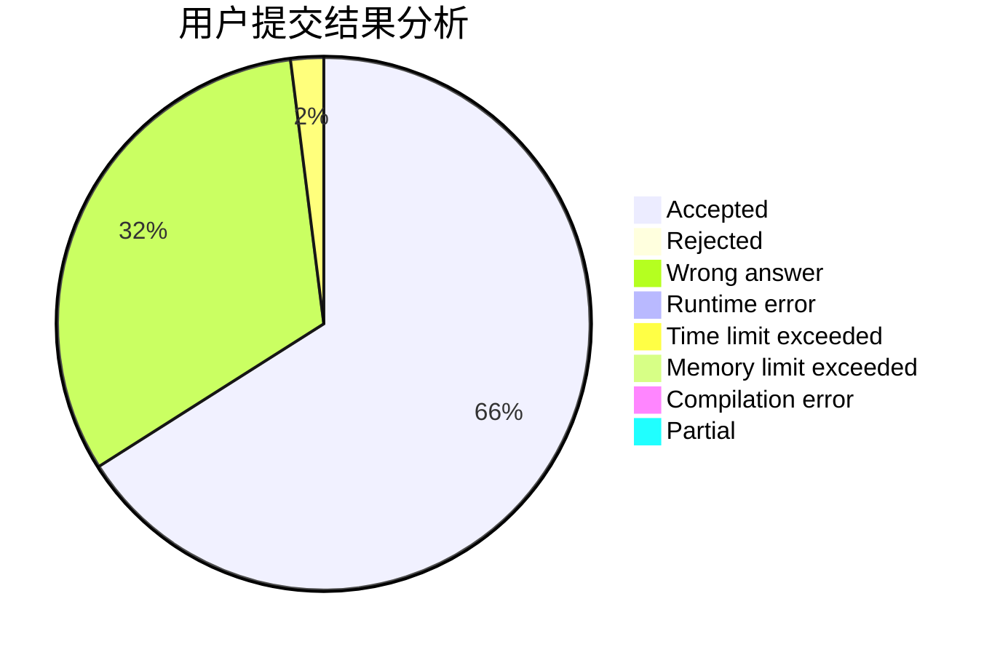
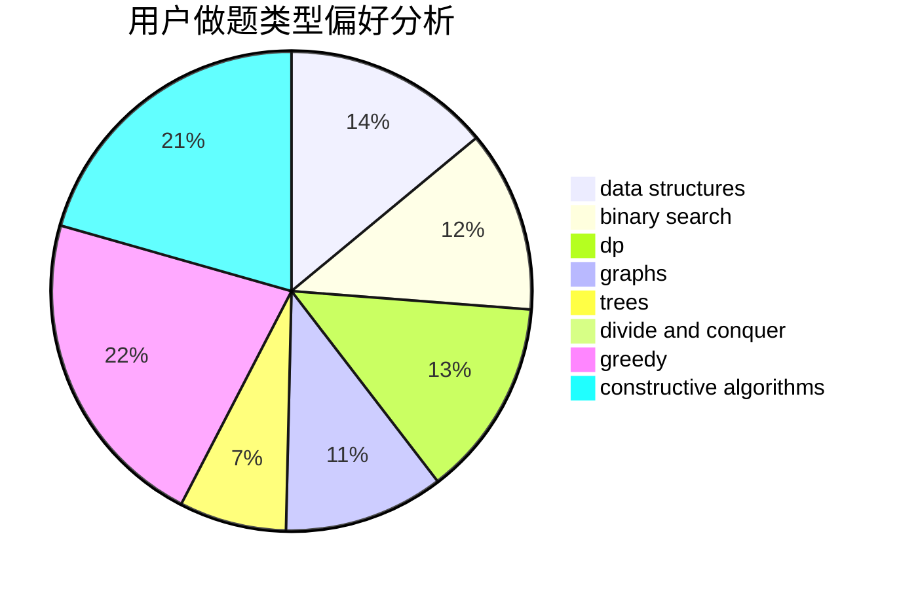
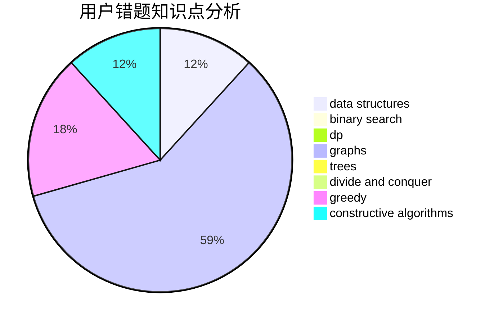

# 2018gtyz10

<!-- tabs:start -->

#### **用户提交结果分析**

#### **用户做题类型偏好分析**

#### **用户错题知识点分析**

<!-- tabs:end -->
# 推荐题目
[1267B](https://codeforces.com/contest/1267/problem/B)		nan		  
[1266D](https://codeforces.com/contest/1266/problem/D)		constructive algorithms,
                        data structures,
                        graphs,
                        greedy,
                        implementation,
                        math,
                        two pointers		  
[1264B](https://codeforces.com/contest/1264/problem/B)		brute force,
                        constructive algorithms,
                        greedy		  
[1266E](https://codeforces.com/contest/1266/problem/E)		data structures,
                        greedy,
                        implementation		  
[1081A](https://codeforces.com/contest/1081/problem/A)		constructive algorithms,
                        math		  
[1078A](https://codeforces.com/contest/1078/problem/A)		dsu,graphs,sortings,trees		  
[1263F](https://codeforces.com/contest/1263/problem/F)		data structures,
                        dfs and similar,
                        dp,
                        flows,
                        graphs,
                        trees		  
[1267C](https://codeforces.com/contest/1267/problem/C)		constructive algorithms		  
[1265A](https://codeforces.com/contest/1265/problem/A)		constructive algorithms,
                        greedy		  
[1263D](https://codeforces.com/contest/1263/problem/D)		dfs and similar,
                        dsu,
                        graphs		  
