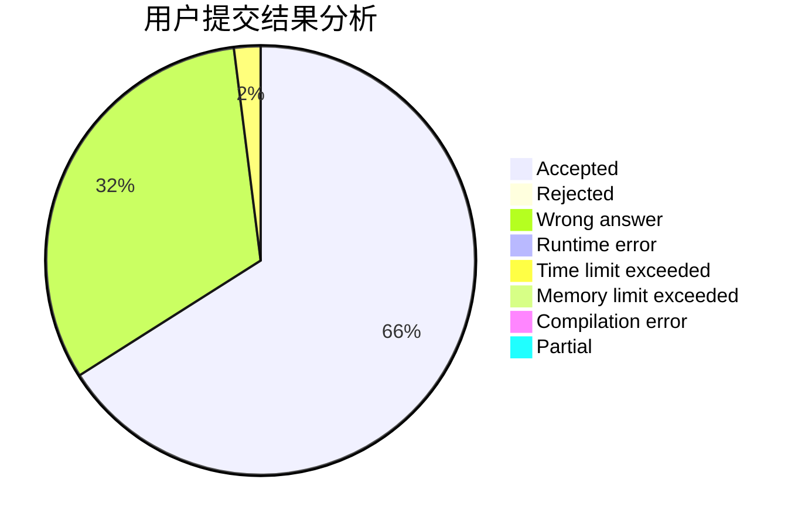
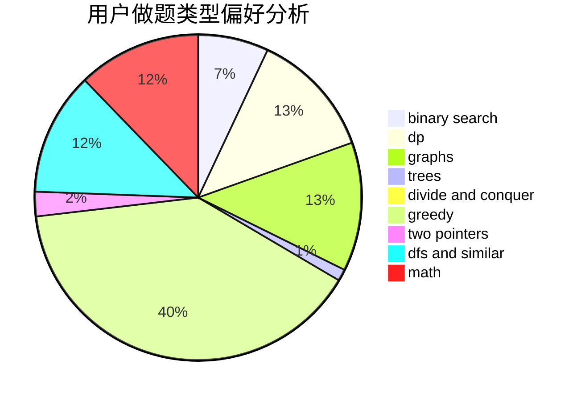

# 2018gtyz10

<!-- tabs:start -->

#### **用户提交结果分析**

#### **用户做题类型偏好分析**

<!-- tabs:end -->
# 推荐题目
[1272E](https://codeforces.com/contest/1272/problem/E)
[1271E](https://codeforces.com/contest/1271/problem/E)
[126B](https://codeforces.com/contest/126/problem/B)
[1271F](https://codeforces.com/contest/1271/problem/F)
[1081D](https://codeforces.com/contest/1081/problem/D)
[1078D](https://codeforces.com/contest/1078/problem/D)
[1269D](https://codeforces.com/contest/1269/problem/D)
[1272F](https://codeforces.com/contest/1272/problem/F)
[1270F](https://codeforces.com/contest/1270/problem/F)
[1269B](https://codeforces.com/contest/1269/problem/B)
