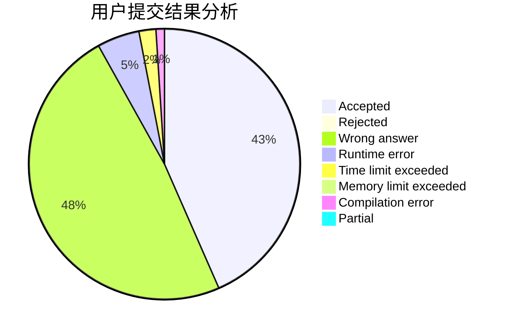
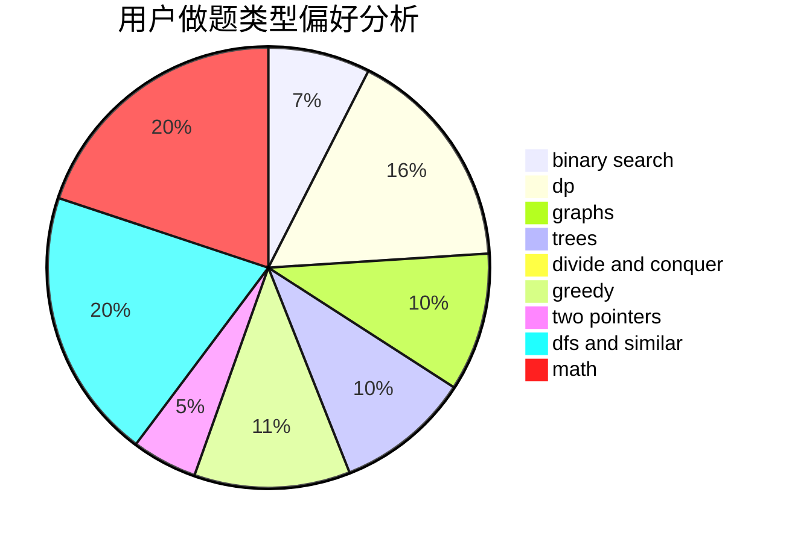

# FluffyBunny

<!-- tabs:start -->

#### **用户提交结果分析**

#### **用户做题类型偏好分析**

<!-- tabs:end -->
# 推荐题目
[1401E](https://codeforces.com/contest/1401/problem/E)
[674G](https://codeforces.com/contest/674/problem/G)
[1500E](https://codeforces.com/contest/1500/problem/E)
[558A](https://codeforces.com/contest/558/problem/A)
[44G](https://codeforces.com/contest/44/problem/G)
[1089A](https://codeforces.com/contest/1089/problem/A)
[86C](https://codeforces.com/contest/86/problem/C)
[50E](https://codeforces.com/contest/50/problem/E)
[86B](https://codeforces.com/contest/86/problem/B)
[134B](https://codeforces.com/contest/134/problem/B)
